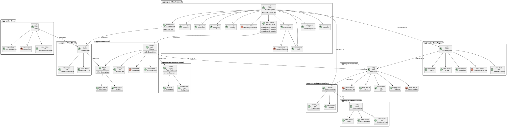

# Planning and Technical Documentation

## 1. Planning

### 1.1. Project Objectives
The **Shodrone** project aims to develop a back-office support system for Shodrone, a company specialized in creating customized multimedia drone shows.

The system will provide the following functionalities:

- **Customer management**, including registration and data updates.
- **Customer request management**, supporting creation, analysis, validation, acceptance/rejection, and cancellation of requests, as well as handling figure exclusivity periods.
- **Management of the figure/sequence library**, where each figure contains drone-specific scripts described in a DSL (Domain-Specific Language). This DSL code is generated externally and imported into the system.
- **Simulation of individual figures**, checking for potential drone collisions using a 3D time-based simulation grid (e.g., 1m³ per cell with discrete time steps).
- **Simulation of full shows**, composed of multiple figures/sequences, with coordination via a central orchestrator (or "maestro") server. The orchestrator triggers figure execution and collects feedback from drones upon completion.
- **Scalable simulation**, to support large-scale shows with hundreds of drones. The airspace can be partitioned into multiple subareas, each simulated by a dedicated server. The system must handle drone movement between areas seamlessly.

This system aims to prepare Shodrone for large, highly customized drone shows, positioning the company as a leader in the drone-based entertainment industry.

### 1.2 Sprints

| Sprint   | Dates                    |
|----------|--------------------------|
| Sprint 1 | 2025-03-17 to 2025-04-06 |
| Sprint 2 | 2025-04-07 to 2025-05-18 |
| Sprint 3 | 2025-05-19 to 2025-06-15 |

### 1.3 Team

| Number  | Name           |
|---------|----------------|
| 1231046 | Daniel Silva   |
| 1230487 | David Vieira   |
| 1230543 | Igor Coutinho  |
| 1230544 | Rafael Barbosa |
| 1211252 | Rui Vieira     |

### 1.4 User stories

- ##### Sprint 1:

| ID     | Priority   | Estimated Time  | Description                                                                                                                                             |
|--------|------------|-----------------|---------------------------------------------------------------------------------------------------------------------------------------------------------|
| US101  | Medium     | 6 hours         | As Project Manager, I want the team to follow the technical constraints and concerns of the project.                                                    |
| US102  | High       | 1 hours         | As Project Manager, I want the team to use the defined project repository in GitHub and setup a GitHub tool for project management.                     |
| US103  | Medium     | 3 hours         | As Project Manager, I want the team to configure the project structure to facilitate/accelerate the development of upcoming user stories.               |
| US104  | Medium     | 5 hours         | As Project Manager, I want the team to setup a continuous integration server.                                                                           |
| US105  | Medium     | 3 hours         | As Project Manager, I want the team to add to the project the necessary scripts, so that build/executions/deployments/... can be executed effortlessly. |
| US110  | Medium     | 10 hours        | As Project Manager, I want the team to elaborate a Domain Model using DDD.                                                                              |

---

## 2. Technical Documentation

### 2.1 Architecture

The application follows a typical layered approach

    UI -> Controller -+-> Domain
                      |     ^
                      |     |
                      +-> Repositories

### 2.2 System Layer Communication

### 2.3 Technologies Used
- **Programming Languages**: Java, C and ANTLR
- **Database**: ...
- **Framework**: Eapli Framework
- **Tests**: JUnit

### 2.4 Domain Model

