# US 210 - Authentication and Authorization

## 1. Context

US 210 focuses on implementing authentication and authorization in the system. This is the first time this task is being
developed and it is essential to ensure security and access control to system resources. Since this functionality is
not the main business focus, we will use existing frameworks to implement it efficiently.

### 1.1 List of issues

Analysis:
- Define authentication and authorization requirements
- Identify user profiles and permission levels
- See which framework is appropriate for the implementation

Design:
- Design authentication flows (login, logout, change password)
- Define class structure for role-based authorization
- Integrate design with the rest of the application

Implement:
- Configure authentication and authorization framework
- Implement session management system
- Develop role-based access controls

Test:
- Test authentication flows
- Verify authorization rules for different profiles

## 2. Requirements

**US 210:** As a Project Manager, I want the system to support and apply authentication and authorization for all its users and functionalities.

**Acceptance Criteria:**

- *US210.1:* The system shall allow users to authenticate using credentials (email and password)
- *US210.2:* The system shall ensure that the password has at least one digit, one uppercase letter and 6 characters in length
- *US210.3:* The system shall protect sensitive data such as passwords through secure hashing techniques
- *US210.4:* The system shall allow users to log out of their sessions
- *US210.5:* The system shall implement role-based access control
- *US210.6:* The system shall allow users to reset their passwords
- *US210.7:* The system shall lock accounts after 3 failed login attempts

**Dependencies/References:**

*Regarding this requirement we understand that it relates to system security and user management.
This US serves as base infrastructure for all other functionalities that require user-specific access control.
As recommended, we will leverage existing authentication frameworks rather than building these security features
from scratch, allowing the team to focus on business-specific functionality.*

## 3. Analysis

### 3.1. Use Case Diagram

Shows that the system handles the login, logout, password change, and ensuring an authenticated user.

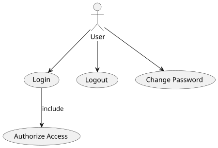

### 3.2. Domain Model

Defines the main entities related to authentication and authorization.

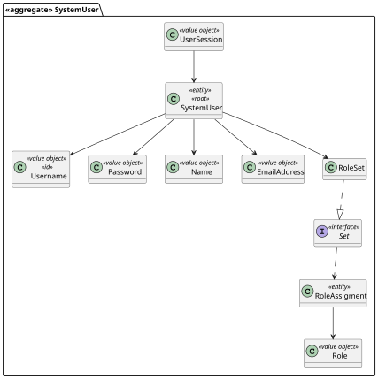

### 3.3. Sequence System Diagrams (SSD)

The SSDs represent the high-level interactions between the **User** (actor) and the **System**, focusing on the
messages exchanged without detailing internal components.

**Login:** Interaction showing how a user requests to login.

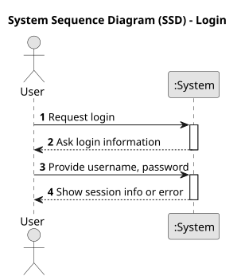

**Logout:** Interaction showing how a user initiates logout.

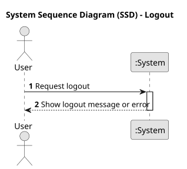

**Change Password:** Interaction showing how a user changes their password.

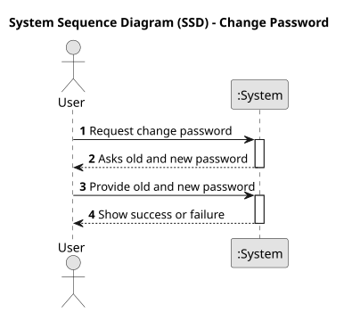

## 4. Design

### 4.1. Class Diagram (CD)

The following class diagrams define the structure and responsibilities of the classes involved in the use cases.
They represent the internal static design of the authentication and authorization functionalities.

**Login:** Class structure responsible for handling user authentication.

  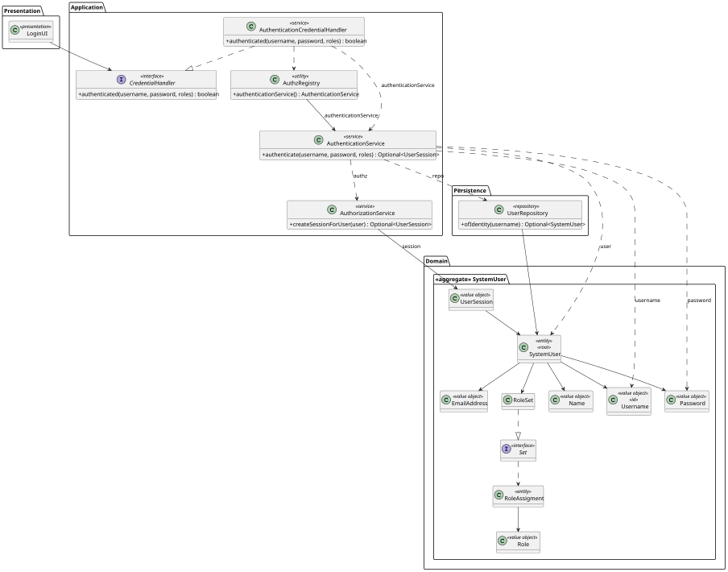

**Logout:** Class structure responsible for ending user sessions.

  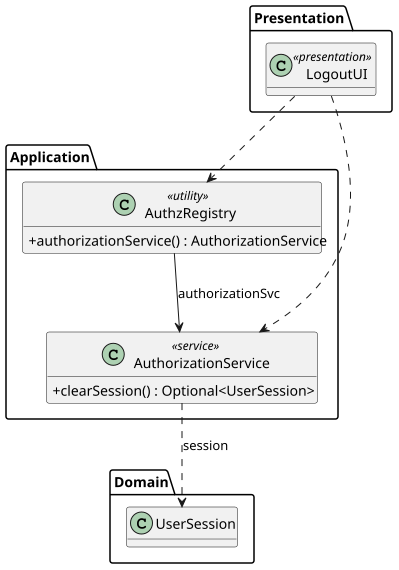

**Change Password:** Class structure responsible for validating and updating user passwords.

  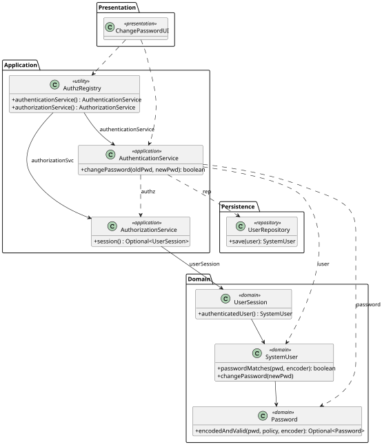

**Ensure Authenticated User:** Class structure responsible for checking and enforcing user authentication roles.

  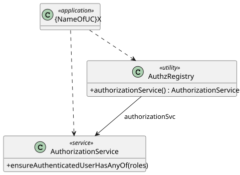

### 4.2. Sequence Diagram (SD)

The SDs present the detailed dynamic behavior of the system during the execution of each use case. Unlike SSDs,
they include the internal interactions between system components or objects.

**Login:** How the system authenticates a user.

  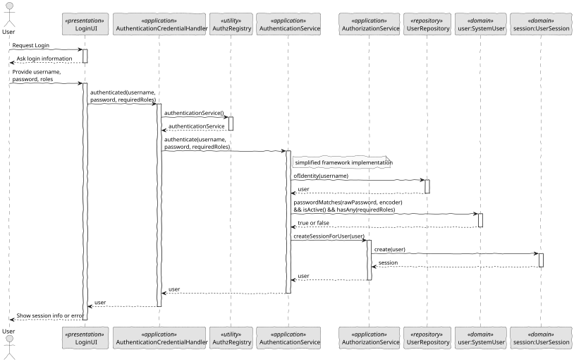

**Logout:** How the system logs out a user.

  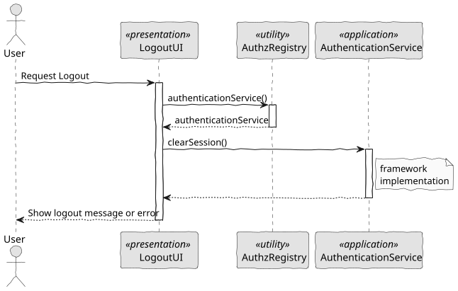

**Change Password:** How the system handles changing a user's password.

  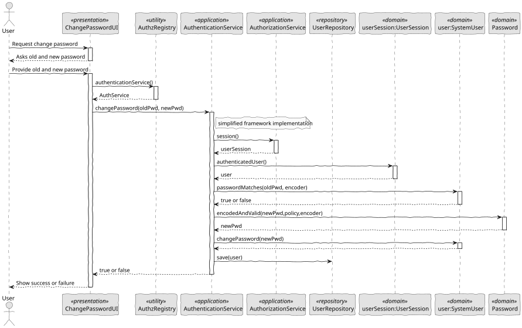

**Ensure Authenticated User:** How the system ensures that a user is authenticated before allowing access to protected resources.

  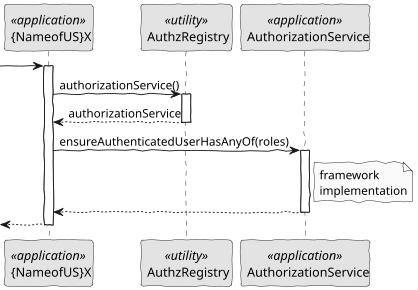

### 4.3. Applied Patterns

- MVC (Model-View-Controller): Separates user interface, application logic, and domain model.
- Repository Pattern: Used to abstract persistence logic in ShodroneUserRepository.
- Domain-Driven Design (DDD): Aggregates like ShodroneUser ensure consistency and encapsulate business rules.
- Authorization Check: Applied before critical operations through AuthorizationService.

### 4.4. Acceptance Tests

*A significant part of the implementation uses native features of the framework, which already has comprehensive tests.
Therefore, we did not develop additional automatic tests for acceptance criteria covered by the framework,
focusing our efforts on testing only the integrations and customizations specific to our application.*

**Test 1:** *Password must have at least one digit, one capital letter, and be at least 6 characters long.*

**Refers to Acceptance Criteria:** US210.2

```
    private final ShodronePasswordPolicy subject = new ShodronePasswordPolicy();

    @Test
    void ensurePasswordHasAtLeastOneDigitOneCapitalAnd6CharactersLong() {
        assertTrue(subject.isSatisfiedBy("abCfefgh1"));
    }
````

**Test 2:** *Password shorter than 6 characters is not allowed.*

**Refers to Acceptance Criteria:** US210.2

```
    private final ShodronePasswordPolicy subject = new ShodronePasswordPolicy();

    @Test
    void ensurePasswordsSmallerThan6CharactersAreNotAllowed() {
        assertFalse(subject.isSatisfiedBy("ab1c"));
    }
````

**Test 3:** *Password without digits is not allowed.*

**Refers to Acceptance Criteria:** US210.2

```
    private final ShodronePasswordPolicy subject = new ShodronePasswordPolicy();

    @Test
    void ensurePasswordsWithoutDigitsAreNotAllowed() {
        assertFalse(subject.isSatisfiedBy("abcefghi"));
    }
````

**Test 4:** *Password without capital letters is not allowed.*

**Refers to Acceptance Criteria:** US210.2

```
    private final ShodronePasswordPolicy subject = new ShodronePasswordPolicy();

    @Test
    void ensurePasswordsWithoutCapitalLetterAreNotAllowed() {
        assertFalse(subject.isSatisfiedBy("abcefghi1"));
    }
````

## 5. Implementation

```
public class AuthenticationCredentialHandler implements CredentialHandler {
	private final Authenticator authenticationService = AuthzRegistry.authenticationService();

	@Override
	public boolean authenticated(String username, String password, Role onlyWithThis) {
		return authenticationService.authenticate(username, password, onlyWithThis).isPresent();
	}
}
````
```
@Component
public class AuthenticationService implements Authenticator {
    private final UserRepository repo;
    private final AuthorizationService authz;
    private final PasswordPolicy policy;
    private final PasswordEncoder encoder;

    @Autowired
    public AuthenticationService(final UserRepository repo, final AuthorizationService authz, final PasswordPolicy policy, final PasswordEncoder encoder) {
        Preconditions.noneNull(new Object[]{repo, authz, encoder});
        this.repo = repo;
        this.authz = authz;
        this.policy = policy;
        this.encoder = encoder;
    }

    public Optional<UserSession> authenticate(final String username, final String rawPassword, final Role... requiredRoles) {
        Preconditions.nonEmpty(username, "a username must be provided");
        Preconditions.nonEmpty(rawPassword, "a password must be provided");
        SystemUser newSession = (SystemUser)this.retrieveUser(username).filter((u) -> {
            return u.passwordMatches(rawPassword, this.encoder) && u.isActive() && (this.noActionRightsToValidate(requiredRoles) || u.hasAny(requiredRoles));
        }).orElse((Object)null);
        return this.authz.createSessionForUser(newSession);
    }

    private boolean noActionRightsToValidate(final Role... onlyWithThis) {
        return onlyWithThis.length == 0 || onlyWithThis.length == 1 && onlyWithThis[0] == null;
    }

    private Optional<SystemUser> retrieveUser(final String username) {
        return this.repo.ofIdentity(Username.valueOf(username));
    }

    public Optional<SystemUser> changePassword(final SystemUser user, final String oldPassword, final String newPassword) {
        return user.passwordMatches(oldPassword, this.encoder) ? Password.encodedAndValid(newPassword, this.policy, this.encoder).map((p) -> {
            user.changePassword(p);
            return (SystemUser)this.repo.save(user);
        }) : Optional.empty();
    }

    public boolean changePassword(final String oldPassword, final String newPassword) {
        return (Boolean)this.authz.session().map((u) -> {
            return this.changePassword(u.authenticatedUser(), oldPassword, newPassword);
        }).map((u) -> {
            return true;
        }).orElse(false);
    }

    public String resetPassword(final SystemUser user) {
        String token = user.resetPassword();
        this.repo.save(user);
        return token;
    }

    public Optional<SystemUser> confirmResetPassword(final SystemUser user, final String token, final Password newPass) {
        return user.confirmResetPassword(token, newPass) ? Optional.of((SystemUser)this.repo.save(user)) : Optional.empty();
    }
}
````
```
public class ShodronePasswordPolicy implements PasswordPolicy {
	@Override
	public boolean isSatisfiedBy(final String rawPassword) {

		// at least 6 characters long
		// at least one digit
		if (StringPredicates.isNullOrEmpty(rawPassword) || (rawPassword.length() < 6) || !StringPredicates.containsDigit(rawPassword)) {
			return false;
		}

		// at least one capital letter
		return StringPredicates.containsCapital(rawPassword);
	}
}
````

## 6. Integration/Demonstration

This functionality is observed right at the beginning of the application, so just run the script *./run-backoffice* (if there are no registered users yet, you must first run *./run-bootstrap*)

## 7. Observations

*We consider this feature to be successful and useful as a solid foundation for the remaining features.*