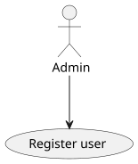
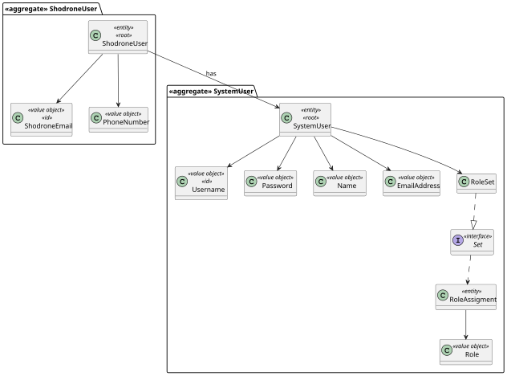
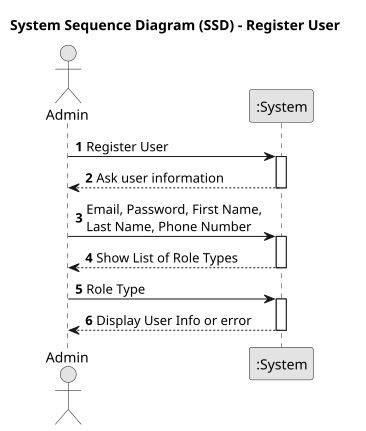
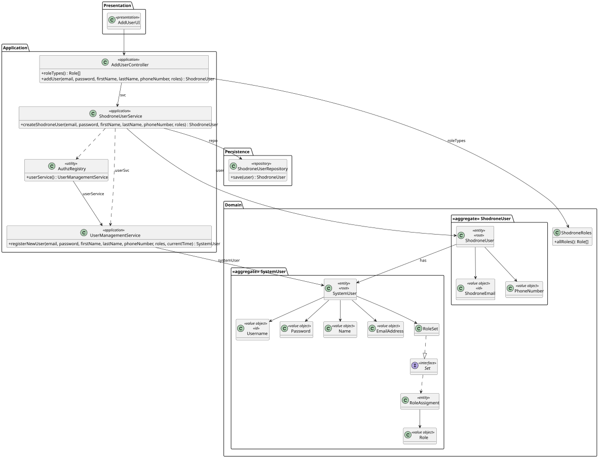
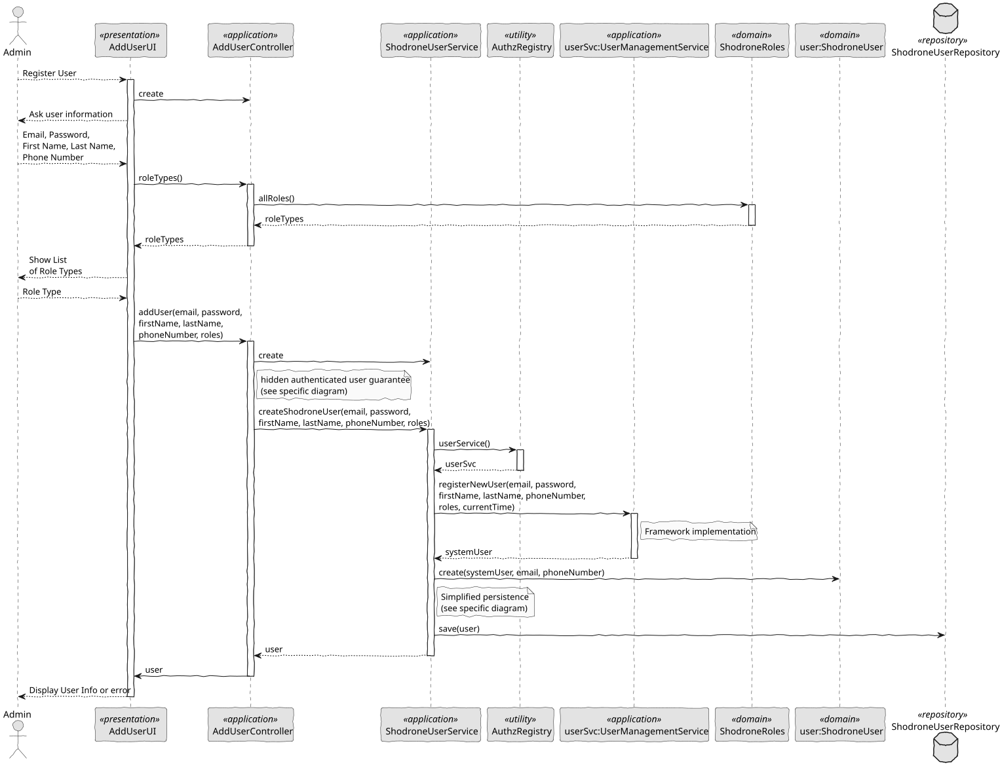

# US 211 - Register Users

## 1. Context

US 211 aims to implement the user registration functionality in the backoffice, a key task to enable access management in the system.  
User registration can be performed either manually via the backoffice or automatically through a bootstrap process, ensuring that the system starts with essential accounts.

### 1.1 List of Issues

**Analysis:**
- Identify the mandatory attributes of a user in Shodrone
- Define the allowed user roles in the backoffice

**Design:**
- Define the domain model for users
- Define the class structure and integrate with the framework
- Integrate the design with the rest of the application

**Implementation:**
- Implement user creation logic
- Create bootstrap service for automatic user registration
- Develop role-based access controls

**Test:**
- Validate creation of valid users
- Test rejection of users with invalid attributes
- Test automatic creation via bootstrap

## 2. Requirements

**US 211:** As an Administrator, I want to be able to register users of the backoffice.

**Acceptance Criteria:**

- *US211.1:* The system shall allow administrators to manually register users.
- *US211.2:* The system shall automatically register predefined users during the bootstrap process.
- *US211.3:* The system shall validate that the email identifies the user.
- *US211.4:* The system shall prevent registration of users with duplicate identifiers (email).
- *US211.5:* The system shall validate that required fields are present.
- *US211.6:* The system shall validate that the phone number follows the allowed European format.
- *US211.7:* The system shall validate that the email belongs to the Shodrone domain.

**Dependencies/References:**

*This functionality provides the foundation for the user management system.  
Although it does not involve authentication, it supplies the base data that can be used later for that purpose,
hence its dependency on US210.*

## 3. Analysis

### 3.1. Use Case Diagram



### 3.2. Domain Model

The domain model includes the `ShodroneUser` entity with `ShodroneEmail` and `PhoneNumber` attributes,
and a relationship with `SystemUser`, which is implemented by the framework.



### 3.3. Sequence System Diagrams (SSD)

Shows the main interactions between the administrator and the system during user registration.



## 4. Design

### 4.1. Class Diagram (CD)

The following class diagrams define the structure and responsibilities of the classes involved in the use cases.
The classes include SystemUser, ShodroneUser, ShodroneUserRepository, UserManagementService, ShodroneUserService, AddUserController and AddUserUI.

  

### 4.2. Sequence Diagram (SD)

Presents the detailed dynamic behavior of the system during user creation.

  

### 4.3. Applied Patterns

- MVC (Model-View-Controller): Separates user interface, application logic, and domain model.
- Repository Pattern: Used to abstract persistence logic in ShodroneUserRepository.
- Domain-Driven Design (DDD): Aggregates like ShodroneUser ensure consistency and encapsulate business rules.
- Authorization Check: Applied before critical operations through AuthorizationService.

### 4.4. Acceptance Tests

*A significant part of the implementation uses native features of the framework, which already has comprehensive tests.
Therefore, we did not develop additional automatic tests for acceptance criteria covered by the framework,
focusing our efforts on testing only the integrations and customizations specific to our application.*

**Test 1:** *Invalid Email Cases*

**Refers to Acceptance Criteria:** US211.7

```
    @Test
    void ensureValidEmailIsAccepted() {
        final var instance = new ShodroneEmail(VALID_EMAIL);
        assertEquals(VALID_EMAIL, instance.toString());
    }

    @Test
    void ensureEmailMustNotBeNull() {
        assertThrows(IllegalArgumentException.class, () -> new ShodroneEmail(NULL_EMAIL));
    }

    @Test
    void ensureEmailMustNotBeEmpty() {
        assertThrows(IllegalArgumentException.class, () -> new ShodroneEmail(EMPTY_EMAIL));
    }

    @Test
    void ensureEmailMustBeValidFormat() {
        assertThrows(IllegalArgumentException.class, () -> new ShodroneEmail(INVALID_EMAIL_NO_DOMAIN));
    }

    @Test
    void ensureEmailMustHaveValidShodroneDomain() {
        assertThrows(IllegalArgumentException.class, () -> new ShodroneEmail(INVALID_EMAIL_WRONG_DOMAIN));
    }

    @Test
    void ensureValueOfReturnsSameAsConstructor() {
        final var fromConstructor = new ShodroneEmail(VALID_EMAIL);
        final var fromValueOf = ShodroneEmail.valueOf(VALID_EMAIL);
        assertEquals(fromConstructor, fromValueOf);
    }

    @Test
    void ensureCompareToWorksCorrectly() {
        final var email1 = new ShodroneEmail("a@showdrone.com");
        final var email2 = new ShodroneEmail("b@showdrone.com");
        assertEquals(-1, email1.compareTo(email2));
        assertEquals(1, email2.compareTo(email1));
        assertEquals(0, email1.compareTo(email1));
    }
````

**Test 2:** *Invalid Phone Numbers*

**Refers to Acceptance Criteria:** US211.6

```
    @Test
    void ensureValidPhoneWithPlusIsAccepted() {
        final var instance = new PhoneNumber(VALID_PHONE_WITH_PLUS);
        assertEquals(VALID_PHONE_WITH_PLUS, instance.toString());
    }

    @Test
    void ensureValidPhoneWithoutPlusIsAccepted() {
        final var instance = new PhoneNumber(VALID_PHONE_NO_PLUS);
        assertEquals(VALID_PHONE_NO_PLUS, instance.toString());
    }

    @Test
    void ensurePhoneMustNotBeNull() {
        assertThrows(IllegalArgumentException.class, () -> new PhoneNumber(NULL_PHONE));
    }

    @Test
    void ensurePhoneMustNotBeEmpty() {
        assertThrows(IllegalArgumentException.class, () -> new PhoneNumber(EMPTY_PHONE));
    }

    @Test
    void ensurePhoneMustHaveValidLength() {
        assertThrows(IllegalArgumentException.class, () -> new PhoneNumber(INVALID_PHONE_TOO_SHORT));
        assertThrows(IllegalArgumentException.class, () -> new PhoneNumber(INVALID_PHONE_TOO_LONG));
    }

    @Test
    void ensurePhoneMustContainOnlyDigits() {
        assertThrows(IllegalArgumentException.class, () -> new PhoneNumber(INVALID_PHONE_LETTERS));
    }

    @Test
    void ensureValueOfReturnsSameAsConstructor() {
        final var fromConstructor = new PhoneNumber(VALID_PHONE_NO_PLUS);
        final var fromValueOf = PhoneNumber.valueOf(VALID_PHONE_NO_PLUS);
        assertEquals(fromConstructor, fromValueOf);
    }
````

**Test 3:** *User Creation with Null Arguments is Rejected*

**Refers to Acceptance Criteria:** US211.5

```
    @Test
    void ensureFailsIfAnyArgumentIsNull() {
        final var systemUser = ShodroneUserTestUtil.newDummyUser();

        assertThrows(IllegalArgumentException.class, () -> new ShodroneUser(null, email1, phone));
        assertThrows(IllegalArgumentException.class, () -> new ShodroneUser(systemUser, null, phone));
        assertThrows(IllegalArgumentException.class, () -> new ShodroneUser(systemUser, email1, null));
    }
````

**Test 4:** *Email is Used as Identity*

**Refers to Acceptance Criteria:** US211.3 / US211.4

```
    @Test
    void ensureIdentityReturnsEmail() {
        final var user = ShodroneUserTestUtil.dummyShodroneUser(email1);

        assertEquals(user.email(), user.identity());
    }

    @Test
    void ensureShodroneUserEqualsPassesForSameEmail() {
        final var user1 = ShodroneUserTestUtil.dummyShodroneUser(email1);
        final var user2 = ShodroneUserTestUtil.dummyShodroneUser(email1);

        assertEquals(user1, user2);
    }

    @Test
    void ensureShodroneUserEqualsFailsForDifferentEmails() {
        final var user1 = ShodroneUserTestUtil.dummyShodroneUser(email1);
        final var user2 = ShodroneUserTestUtil.dummyShodroneUser(email2);

        assertNotEquals(user1, user2);
    }

    @Test
    void ensureShodroneUserEqualsSameInstance() {
        final var user = ShodroneUserTestUtil.dummyShodroneUser(email1);

        assertEquals(user, user);
    }

    @Test
    void ensureShodroneUserEqualsFailsForDifferentObjectType() {
        final var user = ShodroneUserTestUtil.dummyShodroneUser(email1);

        assertNotEquals(user, ShodroneUserTestUtil.newDummyUser());
    }

    @Test
    void ensureSameAsIsTrueForSameInstance() {
        final var user = ShodroneUserTestUtil.dummyShodroneUser(email1);

        assertTrue(user.sameAs(user));
    }

    @Test
    void ensureSameAsFailsForDifferentUsers() {
        final var user1 = ShodroneUserTestUtil.dummyShodroneUser(email1);
        final var user2 = ShodroneUserTestUtil.dummyShodroneUser(email2);

        assertFalse(user1.sameAs(user2));
    }
````

**Test 5:** *Successful User Creation*

**Refers to Acceptance Criteria:** US211.1

```
    @Test
    void createUserSuccessfully() {
        SystemUser systemUser = ShodroneUserTestUtil.dummyUser(email, password, firstName, lastName, ShodroneRoles.ADMIN);
        when(userSvc.registerNewUser(any(), any(), any(), any(), (Set<Role>) any(), any())).thenReturn(systemUser);
        when(repo.save(any(ShodroneUser.class))).thenAnswer(invocation -> invocation.getArgument(0));

        ShodroneUser user = subject.createShodroneUser(email, password, firstName, lastName, phone, roles);

        assertNotNull(user);
        assertEquals(email, user.email().toString());
        assertEquals(firstName, user.user().name().firstName());
        assertEquals(lastName, user.user().name().lastName());
        assertEquals(phone, user.phoneNumber().toString());
        verify(repo).save(any(ShodroneUser.class));
    }
````

**Test 6:** *Duplicate Email is Not Allowed*

**Refers to Acceptance Criteria:** US211.4

```
    @Test
    void whenUserAlreadyExistsThenAnExceptionIsThrown() {
        SystemUser systemUser = ShodroneUserTestUtil.dummyUser(email, password, firstName, lastName, ShodroneRoles.ADMIN);
        when(userSvc.registerNewUser(any(), any(), any(), any(), (Set<Role>) any(), any())).thenReturn(systemUser);
        when(repo.save(any(ShodroneUser.class))).thenThrow(new IntegrityViolationException("Duplicate"));

        assertThrows(IntegrityViolationException.class, () -> {
            subject.createShodroneUser(email, password, firstName, lastName, phone, roles);
        });
    }
````

## 5. Implementation

```
@UseCaseController
public class AddUserController {

    private final AuthorizationService authz = AuthzRegistry.authorizationService();
    private final ShodroneUserService svc = new ShodroneUserService();

    public Role[] roleTypes() {
        return ShodroneRoles.allRoles();
    }

    public ShodroneUser addUser(final String email, final String password, final String firstName,
            final String lastName, final String phoneNumber, final Set<Role> roles) {
        authz.ensureAuthenticatedUserHasAnyOf(ShodroneRoles.POWER_USER, ShodroneRoles.ADMIN);
        return svc.createShodroneUser(email, password, firstName, lastName, phoneNumber, roles);
    }
}
````
```
public ShodroneUser createShodroneUser(final String email, final String password, final String firstName,
                                           final String lastName, final String phoneNumber, final Set<Role> roles) {

    ShodroneEmail shodroneEmail = ShodroneEmail.valueOf(email);
    PhoneNumber phone = PhoneNumber.valueOf(phoneNumber);

    SystemUser systemUser = userSvc.registerNewUser(email, password, firstName,
                lastName, roles, CurrentTimeCalendars.now());

    ShodroneUser newUser = new ShodroneUser(systemUser, shodroneEmail, phone);

    return repo.save(newUser);
}
````

## 6. Integration/Demonstration

- To test the bootstrap process, simply run the script: *./run-bootstrap*
- To manually register a user, you must run the script *./run-backoffice*, log in with a user who is an Administrator,
and click on the Register User option.

## 7. Observations

*This feature establishes the basis for user management, allowing accounts to be created in a secure and structured manner,
either manually or automatically. Integration with future authentication features will be straightforward,
since the users will already be available in the system.*