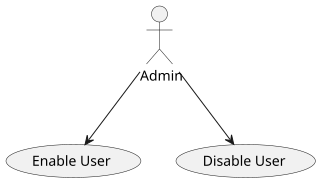
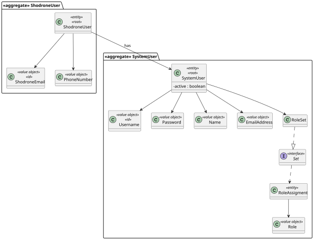
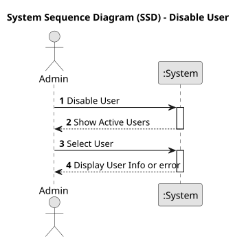
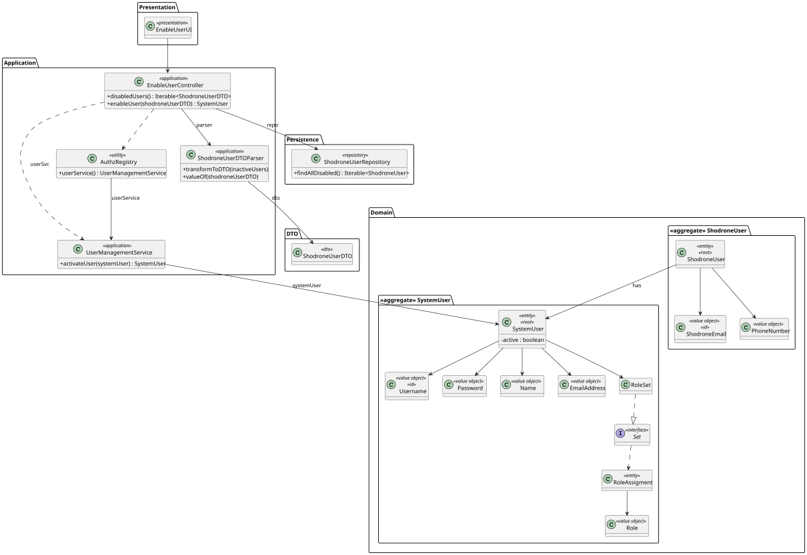
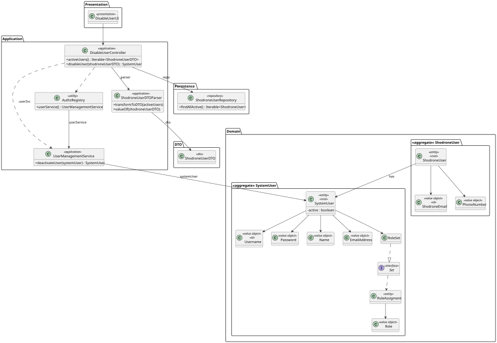
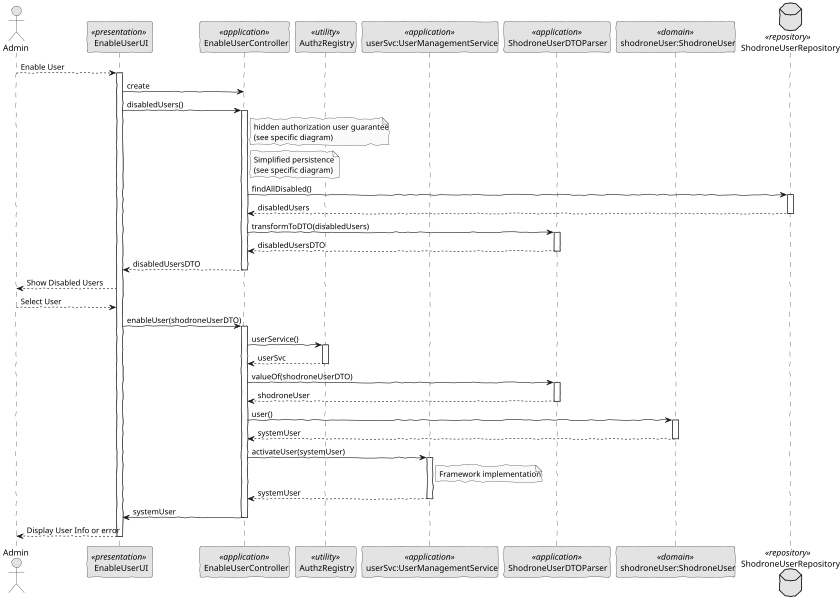
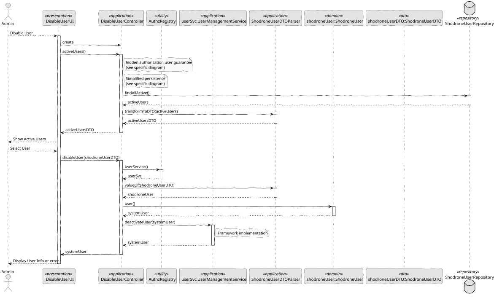

# US 212 - Disable/enable users

## 1. Context

US 212 aims to implement the ability to enable or disable users in the backoffice,
a key task for maintaining active user control and enforcing security policies in the system.
This feature assumes that user accounts already exist in the system — whether registered manually via the
backoffice or automatically through a bootstrap process (covered by US 211) — and focuses on controlling their active status.

### 1.1 List of Issues

**Analysis:**
- Identify how user status affects system access and visibility
- Define role permissions for performing enable/disable actions

**Design:**
- Adapt the service layer to support status updates

**Implementation:**
- Implement logic to enable and disable users
- Secure these actions behind appropriate roles (e.g., ADMIN)
- Ensure proper persistence and retrieval of status

**Test:**
- Validate status transitions from active to disabled and vice-versa
- Test visibility and access of users based on status

## 2. Requirements

**US 212:** As an Administrator, I want to be able to disable/enable users of the backoffice.

**Acceptance Criteria:**

- *US212.1:* The system shall allow administrators to view active and disabled users separately.
- *US212.2:* The system shall allow administrators to disable an active user.
- *US212.3:* The system shall allow administrators to enable a disabled user.
- *US212.4:* The system shall enforce role-based access control, allowing only users with appropriate privileges to perform these actions.

**Dependencies/References:**

*This feature builds on the user registration functionality from US 211 and assumes that users have already been added to the system.*

## 3. Analysis

### 3.1. Use Case Diagram



### 3.2. Domain Model

The domain model includes the `ShodroneUser` entity and a relationship with `SystemUser`, which is implemented by the framework.



### 3.3. Sequence System Diagrams (SSD)

Shows the main interactions between the administrator and the system.

**Enable User:** Interaction showing how an admin enables a user.


**Disable User:** Interaction showing how an admin disables a user.



## 4. Design

### 4.1. Class Diagram (CD)

Classes such as `UserManagementService`, and `ShodroneUserRepository` now include support for enabling/disabling users.

**Enable User:**



**Disable User:**



### 4.2. Sequence Diagram (SD)

Details of how the system handles the status change actions.

**Enable User:**



**Disable User:**



### 4.3. Applied Patterns

- MVC (Model-View-Controller): Separates user interface, application logic, and domain model.
- Repository Pattern: Used to abstract persistence logic in ShodroneUserRepository.
- Domain-Driven Design (DDD): Aggregates like ShodroneUser ensure consistency and encapsulate business rules.
- Authorization Check: Applied before critical operations through AuthorizationService.

### 4.4. Acceptance Tests

*A significant part of the implementation uses native features of the framework, which already has comprehensive tests.
Therefore, we did not develop additional automatic tests for acceptance criteria covered by the framework,
focusing our efforts on testing only the integrations and customizations specific to our application.*

**Test 1:** *Authorization Enforcement*

**Refers to Acceptance Criteria:** US212.4

```
    @Test
    void allUsersRequiresAuthorization() {
        doThrow(UnauthorizedException.class).when(authz).ensureAuthenticatedUserHasAnyOf(any());

        assertThrows(UnauthorizedException.class, () -> subject.disabledUsers());
    }
````
```
    @Test
    void allUsersRequiresAuthorization() {
        doThrow(UnauthorizedException.class).when(authz).ensureAuthenticatedUserHasAnyOf(any());

        assertThrows(UnauthorizedException.class, () -> subject.activeUsers());
    }
````

## 5. Implementation

```
    public Iterable<ShodroneUserDTO> disabledUsers() {
        authz.ensureAuthenticatedUserHasAnyOf(ShodroneRoles.POWER_USER, ShodroneRoles.ADMIN);

        final Iterable<ShodroneUser> users = repo.findAllDisabled();
        return ShodroneUserDTOParser.transformToDTO(users);
    }

    public SystemUser enableUser(final ShodroneUserDTO shodroneUserDTO) {
        authz.ensureAuthenticatedUserHasAnyOf(ShodroneRoles.POWER_USER, ShodroneRoles.ADMIN);

        ShodroneUser shodroneUser = new ShodroneUserDTOParser(repo).valueOf(shodroneUserDTO);
        return userSvc.activateUser(shodroneUser.user());
    }
````
```
    public Iterable<ShodroneUserDTO> activeUsers() {
        authz.ensureAuthenticatedUserHasAnyOf(ShodroneRoles.POWER_USER, ShodroneRoles.ADMIN);

        final Iterable<ShodroneUser> users = repo.findAllActive();
        return ShodroneUserDTOParser.transformToDTO(users);
    }

    public SystemUser disableUser(final ShodroneUserDTO shodroneUserDTO) {
        authz.ensureAuthenticatedUserHasAnyOf(ShodroneRoles.POWER_USER, ShodroneRoles.ADMIN);

        ShodroneUser shodroneUser = new ShodroneUserDTOParser(repo).valueOf(shodroneUserDTO);
        return userSvc.deactivateUser(shodroneUser.user());
    }
````

## 6. Integration/Demonstration

- Launch the system via *./run-backoffice*
- Log in as an Administrator 
- Navigate to the user management area to enable or disable users

## 7. Observations

*This feature completes the core user lifecycle control for the backoffice.
By supporting disabling and enabling of accounts, it helps maintain system integrity and user access security,
paving the way for fine-grained access control and auditing.*