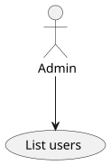
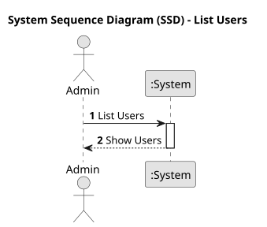
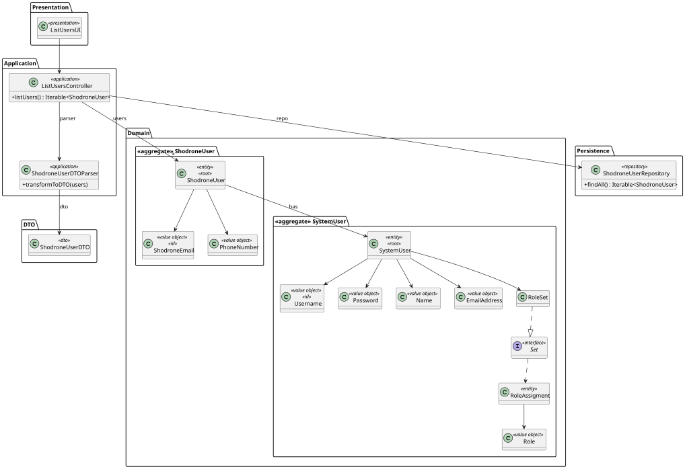
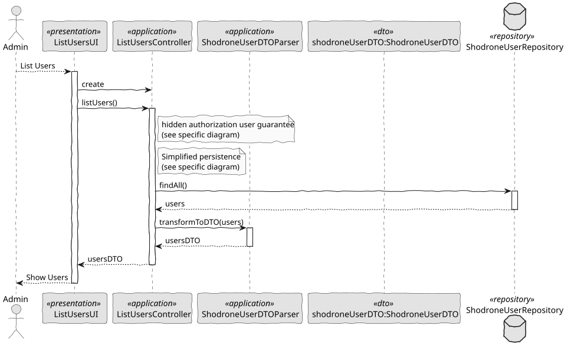

# US 213 - List Users

## 1. Context

US 213 aims to implement the functionality to list users of the backoffice, including their status,
which is essential for administrators to manage the system's user base effectively.

### 1.1 List of Issues

**Analysis:**
- Identify mandatory user attributes relevant for listing
- Define roles that have access to this listing functionality

**Design:**
- Adapt the service layer to support user listing

**Implementation:**
- Implement the functionality to retrieve and present the list of users
- Integrate role-based access to ensure only authorized users can access the list

**Test:**
- Validate that only authorized roles can access the user list
- Confirm correct retrieval of users with accurate statuses
- Test automatic creation via bootstrap

## 2. Requirements

**US 213:** As an Administrator, I want to be able to list the users of the backoffice, including their status.

**Acceptance Criteria:**

- *US213.1:* The system shall allow an Administrator to view a list of all registered users.
- *US213.2:* The list shall include the current status of each user (e.g., enable, disabled).
- *US213.3:* The system shall restrict access to this functionality to authorized roles (e.g., Administrator).
- *US213.4:* The system shall present user information in a structured and readable format.

**Dependencies/References:**

*This functionality depends on the existence of a populated user base, created through other USs such as US 211.*

## 3. Analysis

### 3.1. Use Case Diagram



### 3.2. Domain Model

The domain model includes the `ShodroneUser` entity and a relationship with `SystemUser`, which is implemented by the framework.


### 3.3. Sequence System Diagrams (SSD)

This SSD illustrates the interaction between the Administrator and the system for retrieving the list of users.



## 4. Design

### 4.1. Class Diagram (CD)

The following class diagrams define the structure and responsibilities of the classes involved in the use cases.
The classes include SystemUser, ShodroneUser, ShodroneUserRepository, ShodroneUserService, ListUsersController and ListUserUsI.

  

### 4.2. Sequence Diagram (SD)

Shows the dynamic flow for listing users with appropriate access control.

  

### 4.3. Applied Patterns

- MVC (Model-View-Controller): Separates user interface, application logic, and domain model.
- Repository Pattern: Used to abstract persistence logic in ShodroneUserRepository.
- Domain-Driven Design (DDD): Aggregates like ShodroneUser ensure consistency and encapsulate business rules.
- Authorization Check: Applied before critical operations through AuthorizationService.

### 4.4. Acceptance Tests

**Test 1:** *Unauthorized Access*

**Refers to Acceptance Criteria:** US213.3

```
    @Test
    void allUsersRequiresAuthorization() {
        doThrow(UnauthorizedException.class).when(authz).ensureAuthenticatedUserHasAnyOf(any());

        assertThrows(UnauthorizedException.class, () -> subject.allUsers());
        assertThrows(UnauthorizedException.class, () -> subject.findUser(email));
        assertThrows(UnauthorizedException.class, () -> subject.activeUsers());
        assertThrows(UnauthorizedException.class, () -> subject.disabledUsers());
    }
````

**Test 2:** *User Listing with Data*

**Refers to Acceptance Criteria:** US213.1

```
    @Test
    void allUsersReturnsData() {
        List<ShodroneUser> users = List.of(mock(ShodroneUser.class));
        when(repo.findAll()).thenReturn(users);

        Iterable<ShodroneUser> result = subject.allUsers();

        assertEquals(users, result);
    }
````

## 5. Implementation

```
    public Iterable<ShodroneUserDTO> listUsers() {
        authz.ensureAuthenticatedUserHasAnyOf(ShodroneRoles.POWER_USER, ShodroneRoles.ADMIN);

        final Iterable<ShodroneUser> users = repo.findAll();
        return ShodroneUserDTOParser.transformToDTO(users);
    }
````

## 6. Integration/Demonstration

- Launch the backoffice with *./run-backoffice*
- Log in as an Administrator
- Select the "List Users" option to see all users and their statuses

## 7. Observations

*This user story allows system administrators to monitor and manage users more effectively,
laying groundwork for further user and role management features.*