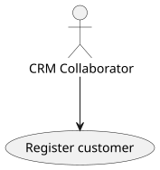
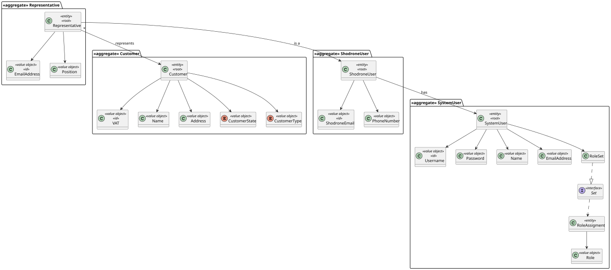
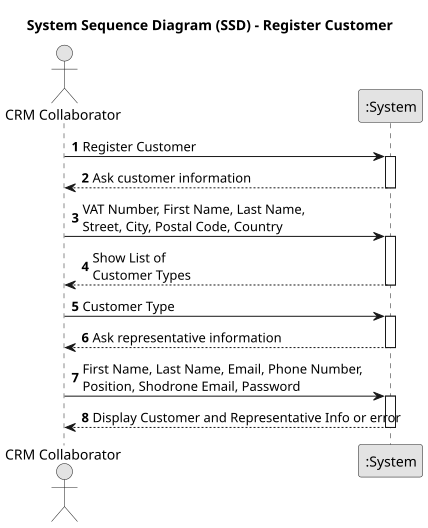
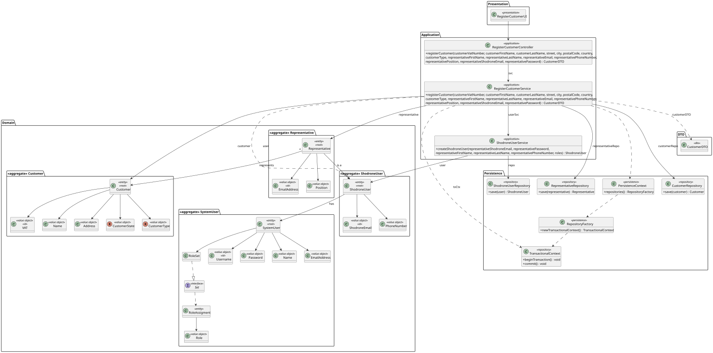
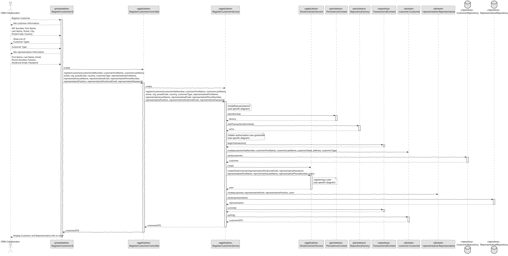

# US 220 - Register Customer

## 1. Context

US 220 aims to implement the customer registration functionality in the system,
which automatically creates a customer representative user account during the process.  
Customer registration can be performed either manually via the backoffice or automatically through a bootstrap process,
ensuring that essential customer accounts are properly configured with their representatives.

### 1.1 List of Issues

**Analysis:**
- Identify the mandatory attributes of a customer in Shodrone
- Define the relationship between customers and their representatives
- Determine the automatic user creation requirements for representatives

**Design:**
- Define the domain model for customers and representatives
- Integrate the design with the existing user management system

**Implementation:**
- Implement customer registration logic
- Develop automatic representative account creation
- Create bootstrap service for automatic customer registration

**Test:**
- Validate creation of valid customer records
- Verify automatic representative account creation
- Test rejection of invalid customer data
- Test automatic creation via bootstrap

## 2. Requirements

**US 220:** As a CRM Collaborator, I want to register a customer, and that the system automatically creates a costumer representation for that customer.

**Acceptance Criteria:**

- *US220.1:* The system shall allow CRM collaborators to register new customers
- *US220.2:* The system shall automatically create a representative user account for each registered customer
- *US220.3:* The system shall automatically register predefined customers during the bootstrap process
- *US220.4:* The system shall validate all required customer fields
- *US220.5:* The system shall validate all required representative fields
- *US220.6:* The system shall validate that the VAT identifies the customer
- *US220.7:* The system shall prevent registration of customers with duplicate VAT numbers
- *US220.8:* The system shall validate that the email identifies the representative
- *US220.9:* The system shall ensure the representative's email is unique
- *US220.10:* The system shall validate that the VAT number follows the allowed European format
- *US220.11:* The system must ensure that the address contains street, city, postal code and country
- *US220.12:* The system shall enforce role-based access control, allowing only users with appropriate privileges to perform these actions
- *US220.13:* The system must ensure that the customer is created with the state Created

**Dependencies/References:**

*Depends on user management functionality (US 211)*

## 3. Analysis

### 3.1. Use Case Diagram



### 3.2. Domain Model

The domain model includes:
- Customer entity with VAT, Name, Address, State and Type attributes
- Representative entity linked to both Customer and ShodroneUser
- ShodroneUser entity for system authentication



### 3.3. Sequence System Diagrams (SSD)

Shows the interactions between the CRM collaborator and the system during customer registration.



## 4. Design

### 4.1. Class Diagram (CD)

The following class diagrams define the structure and responsibilities of the classes involved in the use cases.
The classes include SystemUser, ShodroneUser, ShodroneUserRepository, UserManagementService, ShodroneUserService, AddUserController and AddUserUI.

  

### 4.2. Sequence Diagram (SD)

The class diagram includes:
- CustomerRepository and RepresentativeRepository
- RegisterCustomerService and ShodroneUserService
- RegisterCustomerController and RegisterCustomerUI

  

### 4.3. Applied Patterns

- MVC (Model-View-Controller): Separates user interface, application logic, and domain model.
- Repository Pattern: Used to abstract persistence logic in CustomerRepository.
- Domain-Driven Design (DDD): Aggregates like Customer ensure consistency and encapsulate business rules.
- Authorization Check: Applied before critical operations through AuthorizationService.

### 4.4. Acceptance Tests

*The implementation involving the creation of the representative as a system user has already been tested at US211*

**Test 1:** *Address format*

**Refers to Acceptance Criteria:** US220.11

```
    @Test
    void ensureValidAddressIsAccepted() {
        final var address = new Address(VALID_STREET, VALID_CITY, VALID_POSTAL_CODE, VALID_COUNTRY);
        assertEquals("Rua das Flores, Porto, 4000-123, Portugal", address.toString());
    }

    @Test
    void ensureStreetMustNotBeNullOrEmpty() {
        assertThrows(IllegalArgumentException.class, () -> new Address(NULL, VALID_CITY, VALID_POSTAL_CODE, VALID_COUNTRY));
        assertThrows(IllegalArgumentException.class, () -> new Address(EMPTY, VALID_CITY, VALID_POSTAL_CODE, VALID_COUNTRY));
    }

    @Test
    void ensureCityMustNotBeNullOrEmpty() {
        assertThrows(IllegalArgumentException.class, () -> new Address(VALID_STREET, NULL, VALID_POSTAL_CODE, VALID_COUNTRY));
        assertThrows(IllegalArgumentException.class, () -> new Address(VALID_STREET, EMPTY, VALID_POSTAL_CODE, VALID_COUNTRY));
    }

    @Test
    void ensurePostalCodeMustNotBeNullOrEmpty() {
        assertThrows(IllegalArgumentException.class, () -> new Address(VALID_STREET, VALID_CITY, NULL, VALID_COUNTRY));
        assertThrows(IllegalArgumentException.class, () -> new Address(VALID_STREET, VALID_CITY, EMPTY, VALID_COUNTRY));
    }

    @Test
    void ensureCountryMustNotBeNullOrEmpty() {
        assertThrows(IllegalArgumentException.class, () -> new Address(VALID_STREET, VALID_CITY, VALID_POSTAL_CODE, NULL));
        assertThrows(IllegalArgumentException.class, () -> new Address(VALID_STREET, VALID_CITY, VALID_POSTAL_CODE, EMPTY));
    }

    @Test
    void ensureValueOfReturnsSameAsConstructor() {
        final var fromConstructor = new Address(VALID_STREET, VALID_CITY, VALID_POSTAL_CODE, VALID_COUNTRY);
        final var fromValueOf = Address.valueOf(VALID_STREET, VALID_CITY, VALID_POSTAL_CODE, VALID_COUNTRY);
        assertEquals(fromConstructor, fromValueOf);
    }
````

**Test 2:** *VAT format*

**Refers to Acceptance Criteria:** US220.10

```
    @Test
    void ensureValidVATShortIsAccepted() {
        final var instance = new VAT(VALID_VAT_SHORT);
        assertEquals(VALID_VAT_SHORT, instance.toString());
    }

    @Test
    void ensureValidVATLongIsAccepted() {
        final var instance = new VAT(VALID_VAT_LONG);
        assertEquals(VALID_VAT_LONG, instance.toString());
    }

    @Test
    void ensureVATMustNotBeNull() {
        assertThrows(IllegalArgumentException.class, () -> new VAT(NULL_VAT));
    }

    @Test
    void ensureVATMustNotBeEmpty() {
        assertThrows(IllegalArgumentException.class, () -> new VAT(EMPTY_VAT));
    }

    @Test
    void ensureVATMustFollowFormat() {
        assertThrows(IllegalArgumentException.class, () -> new VAT(INVALID_VAT_NO__CODE));
        assertThrows(IllegalArgumentException.class, () -> new VAT(INVALID_VAT_TOO_SHORT));
        assertThrows(IllegalArgumentException.class, () -> new VAT(INVALID_VAT_TOO_LONG));
        assertThrows(IllegalArgumentException.class, () -> new VAT(INVALID_VAT_WRONG_FORMAT));
        assertThrows(IllegalArgumentException.class, () -> new VAT(INVALID_VAT_LOWERCASE));
    }

    @Test
    void ensureValueOfReturnsSameAsConstructor() {
        final var fromConstructor = new VAT(VALID_VAT_SHORT);
        final var fromValueOf = VAT.valueOf(VALID_VAT_SHORT);
        assertEquals(fromConstructor, fromValueOf);
    }

    @Test
    void ensureCompareToWorksProperly() {
        VAT vat1 = new VAT("PT123456789");
        VAT vat2 = new VAT("PT223456789");
        assertTrue(vat1.compareTo(vat2) < 0);
        assertTrue(vat2.compareTo(vat1) > 0);
        assertEquals(0, vat1.compareTo(new VAT("PT123456789")));
    }
````

**Test 3:** *Customer Creation with Null Arguments is Rejected*

**Refers to Acceptance Criteria:** US220.4

```
    @Test
    void ensureFailsIfAnyArgumentIsNull() {
        assertThrows(IllegalArgumentException.class,
                () -> new Customer(null, name, address, state, type));
        assertThrows(IllegalArgumentException.class,
                () -> new Customer(vat1, null, address, state, type));
        assertThrows(IllegalArgumentException.class,
                () -> new Customer(vat1, name, null, state, type));
        assertThrows(IllegalArgumentException.class,
                () -> new Customer(vat1, name, address, null, type));
        assertThrows(IllegalArgumentException.class,
                () -> new Customer(vat1, name, address, state, null));
    }
````

**Test 4:** *VAT is Used as Identity in Customer*

**Refers to Acceptance Criteria:** US220.6

```
    @Test
    void ensureIdentityReturnsVat() {
        final var customer = CustomerTestUtil.dummyCustomer(vat1);

        assertEquals(customer.VAT(), customer.identity());
    }
````

**Test 5:** *Duplicate VAT is Not Allowed*

**Refers to Acceptance Criteria:** US220.7

```
    @Test
    void ensureCustomerEqualsPassesForSameVat() {
        final var cust1 = CustomerTestUtil.dummyCustomer(vat1);
        final var cust2 = CustomerTestUtil.dummyCustomer(vat1);

        assertEquals(cust1, cust2);
    }

    @Test
    void ensureCustomerEqualsFailsForDifferentVats() {
        final var cust1 = CustomerTestUtil.dummyCustomer(vat1);
        final var cust2 = CustomerTestUtil.dummyCustomer(vat2);

        assertNotEquals(cust1, cust2);
    }

    @Test
    void ensureSameAsIsTrueForSameInstance() {
        final var cust = CustomerTestUtil.dummyCustomer(vat1);

        assertTrue(cust.sameAs(cust));
    }

    @Test
    void ensureSameAsFailsForDifferentVats() {
        final var cust1 = CustomerTestUtil.dummyCustomer(vat1);
        final var cust2 = CustomerTestUtil.dummyCustomer(vat2);

        assertFalse(cust1.sameAs(cust2));
    }
````

**Test 6:** *Representative Creation with Null Arguments is Rejected*

**Refers to Acceptance Criteria:** US220.5

```
    @Test
    void ensureFailsIfAnyArgumentIsNull() {
        final var customer = CustomerTestUtil.dummyCustomer();

        assertThrows(IllegalArgumentException.class,
                () -> new Representative(null, customer, user, position));
        assertThrows(IllegalArgumentException.class,
                () -> new Representative(email1, null, user, position));
        assertThrows(IllegalArgumentException.class,
                () -> new Representative(email1, customer, null, position));
        assertThrows(IllegalArgumentException.class,
                () -> new Representative(email1, customer, user, null));
    }
````

**Test 7:** *Email is Used as Identity in Representative*

**Refers to Acceptance Criteria:** US220.8

```
    @Test
    void ensureIdentityReturnsEmail() {
        final var representative = RepresentativeTestUtil.dummyRepresentative(email1);

        assertEquals(representative.email(), representative.identity());
    }
````

**Test 8:** *Duplicate Email is Not Allowed*

**Refers to Acceptance Criteria:** US220.9

```
    @Test
    void ensureRepresentativeEqualsPassesForSameEmail() {
        final var rep1 = RepresentativeTestUtil.dummyRepresentative(email1);
        final var rep2 = RepresentativeTestUtil.dummyRepresentative(email1);

        assertEquals(rep1, rep2);
    }

    @Test
    void ensureRepresentativeEqualsFailsForDifferentEmails() {
        final var rep1 = RepresentativeTestUtil.dummyRepresentative(email1);
        final var rep2 = RepresentativeTestUtil.dummyRepresentative(email2);

        assertNotEquals(rep1, rep2);
    }

    @Test
    void ensureSameAsIsTrueForSameInstance() {
        final var rep = RepresentativeTestUtil.dummyRepresentative(email1);

        assertTrue(rep.sameAs(rep));
    }

    @Test
    void ensureSameAsFailsForDifferentEmails() {
        final var rep1 = RepresentativeTestUtil.dummyRepresentative(email1);
        final var rep2 = RepresentativeTestUtil.dummyRepresentative(email2);

        assertFalse(rep1.sameAs(rep2));
    }
````
**Test 9:** *Successful Customer Registration with Representative Creation*

**Refers to Acceptance Criteria:** US220.1

```
    @Test
    void registerCustomerSuccessfully() {
        SystemUser systemUser = ShodroneUserTestUtil.dummyUser(representativeShodroneEmail, representativePassword,
                representativeFirstName, representativeLastName, ShodroneRoles.REPRESENTATIVE);
        ShodroneUser representativeUser = ShodroneUserTestUtil.dummyShodroneUser(ShodroneEmail.valueOf(representativeShodroneEmail),
                PhoneNumber.valueOf(representativePhoneNumber), systemUser);
        Customer customer = CustomerTestUtil.dummyCustomer(customerVatNumber, customerFirstName, customerLastName,
                street, city, postalCode, country, CustomerState.CREATED, customerType);
        Representative representative = RepresentativeTestUtil.dummyRepresentative(representativeEmail, customer,
                representativeUser, representativePosition);

        when(userSvc.createShodroneUser(any(), any(), any(), any(), any(), any())).thenReturn(representativeUser);
        when(customerRepo.save(any(Customer.class))).thenAnswer(invocation -> invocation.getArgument(0));
        when(representativeRepo.save(any(Representative.class))).thenAnswer(invocation -> invocation.getArgument(0));

        CustomerDTO result = subject.registerCustomer(
                customerVatNumber, customerFirstName, customerLastName,
                street, city, postalCode, country,
                customerType, representativeFirstName,
                representativeLastName, representativeEmail,
                representativePhoneNumber, representativePosition,
                representativeShodroneEmail, representativePassword);

        assertNotNull(result);

        verify(customerRepo).save(customer);
        verify(representativeRepo).save(representative);
    }
````

**Test 10:** *Customer created with status - Created*

**Refers to Acceptance Criteria:** US220.13

```
    @Test
    void registerCustomerReturnsCreatedState() {
        SystemUser systemUser = ShodroneUserTestUtil.dummyUser(representativeShodroneEmail, representativePassword,
                representativeFirstName, representativeLastName, ShodroneRoles.REPRESENTATIVE);
        ShodroneUser representativeUser = ShodroneUserTestUtil.dummyShodroneUser(ShodroneEmail.valueOf(representativeShodroneEmail),
                PhoneNumber.valueOf(representativePhoneNumber), systemUser);

        when(userSvc.createShodroneUser(any(), any(), any(), any(), any(), any())).thenReturn(representativeUser);
        when(customerRepo.save(any(Customer.class))).thenAnswer(invocation -> invocation.getArgument(0));
        when(representativeRepo.save(any(Representative.class))).thenAnswer(invocation -> invocation.getArgument(0));

        CustomerDTO result = subject.registerCustomer(
                customerVatNumber, customerFirstName, customerLastName,
                street, city, postalCode, country,
                customerType, representativeFirstName,
                representativeLastName, representativeEmail,
                representativePhoneNumber, representativePosition,
                representativeShodroneEmail, representativePassword);

        assertEquals(CustomerState.CREATED.toString(), result.getState());
    }
````

**Test 11:** *Reject Duplicate Customer VAT*

**Refers to Acceptance Criteria:** US220.7

```
    @Test
    void whenCustomerAlreadyExistsThenAnExceptionIsThrown() {
        when(customerRepo.save(any(Customer.class))).thenThrow(new IntegrityViolationException("Duplicate"));

        assertThrows(IntegrityViolationException.class, () -> {
            subject.registerCustomer(
                    customerVatNumber, customerFirstName, customerLastName,
                    street, city, postalCode, country,
                    customerType, representativeFirstName,
                    representativeLastName, representativeEmail,
                    representativePhoneNumber, representativePosition,
                    representativeShodroneEmail, representativePassword
            );
        });
    }
````

**Test 12:** *Authorization Check*

**Refers to Acceptance Criteria:** US220.12

```
    @Test
    void registerCustomerRequiresAuthorization() {
        doThrow(UnauthorizedException.class).when(authz).ensureAuthenticatedUserHasAnyOf(any());

        assertThrows(UnauthorizedException.class, () -> subject.registerCustomer(
                customerVatNumber, customerFirstName, customerLastName,
                street, city, postalCode, country,
                customerType, representativeFirstName,
                representativeLastName, representativeEmail,
                representativePhoneNumber, representativePosition,
                representativeShodroneEmail, representativePassword
        ));
    }
````

## 5. Implementation

```
    public CustomerDTO registerCustomer(final String customerVatNumber, final String customerFirstName, final String customerLastName,
                                        final String street, final String city, final String postalCode, final String country,
                                        final CustomerType customerType, final String representativeFirstName,
                                        final String representativeLastName, final String representativeEmail,
                                        final String representativePhoneNumber, final String representativePosition,
                                        final String representativeShodroneEmail, final String representativePassword) {

        authz.ensureAuthenticatedUserHasAnyOf(ShodroneRoles.POWER_USER, ShodroneRoles.CRM_COLLABORATOR);

        txCtx.beginTransaction();

        Customer customer = createCustomer(customerVatNumber, customerFirstName, customerLastName, customerType,
                street, city, postalCode, country);

        ShodroneUser user = createRepresentativeUser(representativeShodroneEmail, representativePassword,
                representativeFirstName, representativeLastName, representativePhoneNumber);

        createRepresentative(customer, representativeEmail, representativePosition, user);

        txCtx.commit();

        return customer.toDTO();
    }

    private Customer createCustomer(final String vatNumber, final String firstName, final String lastName, final CustomerType type,
                                    final String street, final String city, final String postalCode, final String country) {

        Customer customer = new Customer(VAT.valueOf(vatNumber), Name.valueOf(firstName, lastName),
                Address.valueOf(street, city, postalCode, country), CustomerState.CREATED, type);

        return customerRepo.save(customer);
    }

    private ShodroneUser createRepresentativeUser(final String email, final String password,
                                                  final String firstName, final String lastName, final String phoneNumber) {
        final Set<Role> roles = new HashSet<>();
        roles.add(ShodroneRoles.REPRESENTATIVE);

        return userSvc.createShodroneUser(email, password, firstName, lastName, phoneNumber, roles);
    }

    private Representative createRepresentative(final Customer customer, final String email,
                                                final String position, final ShodroneUser user) {

        Representative representative = new Representative(EmailAddress.valueOf(email), customer, user, Designation.valueOf(position));
        return representativeRepo.save(representative);
    }
````

## 6. Integration/Demonstration

- To test the bootstrap process, simply run the script: *./run-bootstrap*
- To manually register a user, you must run the script *./run-backoffice*, log in with a user who is an CRM Collaborator,
and click on the Register Customer option.

## 7. Observations

*This feature establishes the complete customer registration process, including the automatic creation of representative accounts.
The integration with the user management system ensures representatives can immediately access the system. *