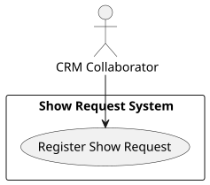
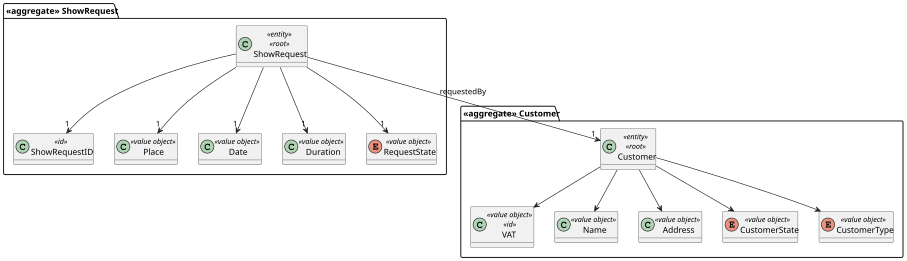
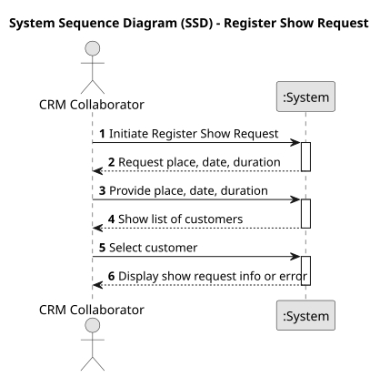
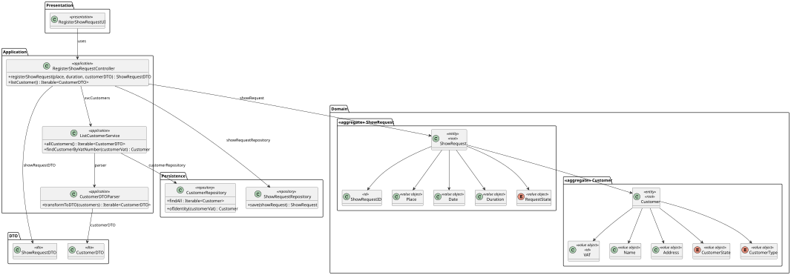
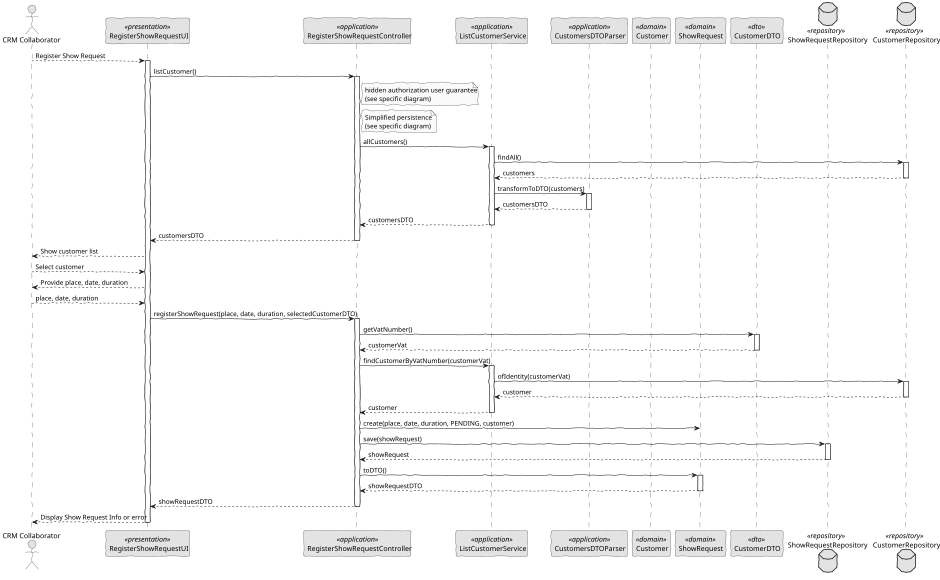

# US 230 - Register Show Request

## 1. Context

*This task involves implementing the feature described in the user story where a CRM Collaborator can register a show request. It is the first time this feature is being developed and is part of the initial implementation for the workflow of show management. This task is foundational for enabling further processing by other roles within the system.*

### 1.1 List of issues

**Analysis:**
- Identify the fields required for the form and their validation rules.
- Determine the data model for storing show requests in the database.

**Design:**
- Create wireframes for the form interface.
- Plan data flow from form submission to storage.

**Implement:**
- Develop the backoffice form for show request creation.
- Implement backend logic for data validation and persistence.

**Test:**
- Validate all input fields for proper functioning.
- Ensure database entries are created as expected.
- Test error handling for invalid input and duplicate requests.


## 2. Requirements

**US 230:** As a CRM Collaborator, I want to register a show request.

**Acceptance Criteria:**

- *US230.1:* The system must provide a form in the backoffice for creating a new show request.
- *US230.2:* The form must include fields for customer details, desired show date/time, location, estimated number of drones, and optional comments/requirements.
- *US230.3:* Input validation must be enforced (e.g., required fields, valid date/time, positive number of drones).
- *US230.4:* The request must be saved and made accessible for further processing by other roles (e.g., Show Managers).
- *US230.5:* The system must provide confirmation feedback upon successful submission.
- *US230.6:* Duplicate or overlapping requests must be prevented or flagged.

**Dependencies/References:**

* This requirement is a standalone feature but connects to other modules such as user management and show scheduling.
* References include the system’s design documentation and the database schema.

## 3. Analysis

### 3.1. Use Case Diagram



### 3.2. Domain Model

The domain model includes the ShowRequest aggregate, composed of value objects such as place, date, duration, and a reference to a Customer, which is essential for establishing who made the request. The ShowRequest entity contains state management and change methods, and is persisted through the ShowRequestRepository. The Customer entity is referenced but managed externally.



### 3.3. Sequence System Diagrams (SSD)

Shows the main interactions between a CRM Collaborator and the system during a show request registration process. It abstracts the internal logic and focuses on the flow of input and feedback to the user.



## 4. Design

### 4.1. Class Diagram (CD)

The class diagram defines the structure and responsibilities of the main classes involved in the Register Show Request use case. These include:
 
- RegisterShowRequestUI: Handles user interaction.
- RegisterShowRequestController: Coordinates the application logic.
- RegisterShowRequestService (implicitly in controller): Manages show request creation.
- ShowRequest: The domain entity representing the request.
- Customer: The user entity making the request.
- ShowRequestRepository: Responsible for persisting the ShowRequest.

The diagram also includes supporting services such as AuthorizationService and the domain enumeration ShowRequestState.



### 4.2. Sequence Diagram (SD)

Presents the detailed dynamic behavior of the system during the registration of a show request. It includes the interactions between UI, Controller, Domain services, and Repositories, capturing the creation flow of a ShowRequest, selection of a Customer, and system validation/authorization.



### 4.3. Applied Patterns

- MVC (Model-View-Controller): Separates user interface, application logic, and domain model.
- Repository Pattern: Used to abstract persistence logic in ShowRequestRepository.
- Domain-Driven Design (DDD): Aggregates like ShowRequest ensure consistency and encapsulate business rules.
- Authorization Check: Applied before critical operations through AuthorizationService.

### 4.4. Acceptance Tests

```
@Test
    void ensurePlaceCanBeChanged() {
        final var showRequest = new ShowRequest(VALID_PLACE, VALID_DATE, VALID_DURATION, VALID_STATE, VALID_CUSTOMER);
        showRequest.changePlaceTo(NEW_PLACE);
        assertEquals(NEW_PLACE.toString(), showRequest.toDTO().getPlace().toString());
    }

    @Test
    void ensureDateCanBeChanged() {
        final var showRequest = new ShowRequest(VALID_PLACE, VALID_DATE, VALID_DURATION, VALID_STATE, VALID_CUSTOMER);
        showRequest.changeDateTo(NEW_DATE);
        assertEquals(NEW_DATE.toString(), showRequest.toDTO().getDate().toString());
    }

    @Test
    void ensureDurationCanBeChanged() {
        final var showRequest = new ShowRequest(VALID_PLACE, VALID_DATE, VALID_DURATION, VALID_STATE, VALID_CUSTOMER);
        showRequest.changeDurationTo(NEW_DURATION);
        assertEquals(NEW_DURATION.toString(), showRequest.toDTO().getDuration().toString());
    }
````

## 5. Implementation

```
public class RegisterShowRequestController {

    private final AuthorizationService authz;
    private final ShowRequestRepository showRequestRepository;
    private final ListCustomerService svcCustomers;

    public RegisterShowRequestController() {
        this.authz = AuthzRegistry.authorizationService();
        this.showRequestRepository = PersistenceContext.repositories().showRequests();
        this.svcCustomers = new ListCustomerService();
    }

    public ShowRequestDTO registerShowRequest(String place, Date date, int duration, CustomerDTO customerDTO) {
        authz.ensureAuthenticatedUserHasAnyOf(ShodroneRoles.POWER_USER, ShodroneRoles.CRM_COLLABORATOR);

        final Customer customer = svcCustomers.findCustomerByVatNumber(customerDTO.getVatNumber());
        ShowRequest showRequest = new ShowRequest(Place.valueOf(place), date, Duration.valueOf(duration),ShowRequestState.PENDING, customer);
        return showRequestRepository.save(showRequest).toDTO();
    }

    public Iterable<CustomerDTO> listCustomer() {
        return svcCustomers.allCustomers();
    }

}
````
```
public class ListCustomerService {

    private final CustomerRepository customerRepository = PersistenceContext.repositories().customers();

    public Iterable<CustomerDTO> allCustomers() {
        final Iterable<Customer> customers = customerRepository.findAll();
        return CustomerDTOParser.transformToDTO(customers);
    }

    public Customer findCustomerByVatNumber(final String vatNumber) {
        return customerRepository.ofIdentity(VAT.valueOf(vatNumber))
                .orElseThrow(() -> new IllegalArgumentException("Unknown customer: " + vatNumber));
    }

}
````


## 6. Integration/Demonstration

- To test the bootstrap process, simply run the script: ./run-bootstrap
- To manually register a show request, you must run the script ./run-backoffice, log in with a user who has the role CRM Collaborator or Power User, and click on the Register Show Request option.

## 7. Observations

This feature provides a structured and secure mechanism for registering new show requests into the system. It ensures only authorized users can create requests, enforces data consistency through the domain model, and sets the foundation for future workflows such as scheduling or approval of show requests.