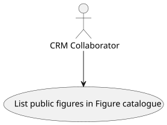
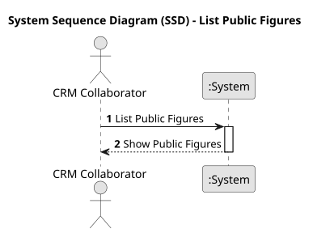
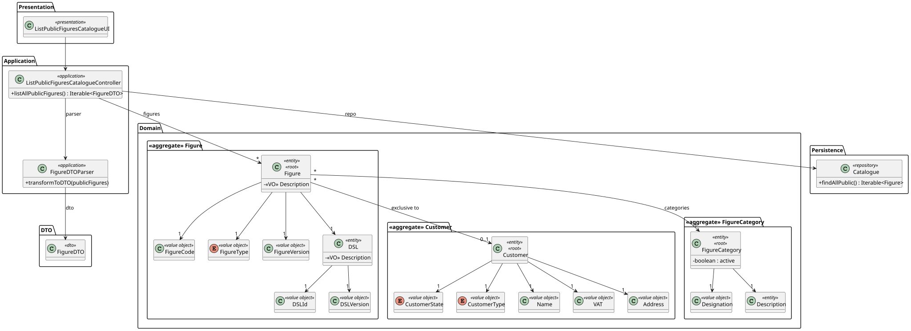
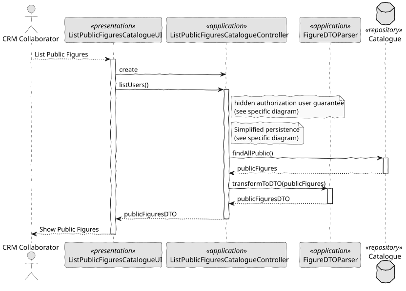

# US 231 - List public figures in Figure catalogue

## 1. Context

*This task implements the feature allowing CRM Collaborators to browse and select public figures when composing a show proposal. It is part of the show-creation workflow and provides the catalogue backbone that other roles (Show Managers, Drone Operators) will rely on to preview and incorporate figure designs into proposals.*

### 1.1 List of issues

**Analysis:**
- Identify which figure attributes must be exposed (name, category, duration, drone count, preview URL).
- Define access rules so only public figures appear.
- Establish metadata formats and preview media types.

**Design:**
- Draft wireframes for catalogue browsing (grid or list view with thumbnails).
- Specify filtering/search UX (by name, category).
- Design API contract for retrieving figure data and thumbnails.

**Implement:**
- Build back-office UI component for the public‐figure catalogue.
- Implement REST endpoint(s) that return only public figures with full metadata and preview links.
- Integrate search and filter parameters into the endpoint and UI.
- Wire selection logic so that chosen figures can be passed to the show proposal workflow.

**Test:**
- Verify the UI lists only public figures, excludes private/restricted ones.
- Test that each figure entry shows correct metadata and loads its preview.
- Validate search and filter return the expected subset.
- Ensure selection emits the correct figure identifiers for downstream proposal creation.


## 2. Requirements

**US 231:** As a CRM Collaborator, I want to list all public figures in the catalogue so that I can select them during a show request proposal.

**Acceptance Criteria:**

- *US231.1:* The CRM Collaborator can view a paginated list of all public figures.
- *US231.2:* Each entry displays name, category/type, estimated duration, and required number of drones.
- *US231.3:* A visual preview (image thumbnail or short animation) is shown.
- *US231.4:* Only public figures are included; private or restricted figures are omitted.
- *US231.5:* The list supports filtering and searching by name and category.
- *US231.6:* Figures can be selected and added to the active show proposal.

**Dependencies/References:**

* Relies on the existing Figure domain model and its visibility flag.
* Integrates with the Show Proposal UI and service layer.
* Uses media‐storage service for preview thumbnails.
* Follows API conventions defined in the system’s design documentation.

## 3. Analysis

### 3.1. Use Case Diagram



### 3.2. Domain Model

The domain model includes the Figure aggregate, which contains several value objects such as FigureCode, FigureType, and FigureVersion. Each Figure is also associated with a DSL, a Customer (if exclusive), and a FigureCategory. This aggregate ensures the encapsulation of information and business rules about the figures, including their classification and access control via the public visibility flag.


### 3.3. Sequence System Diagrams (SSD)

This diagram demonstrates the interactions between a CRM Collaborator and the system when browsing the catalogue of public figures. It abstracts the internal logic and highlights the flow of requests and responses, focusing on listing available public figures and enabling their selection.



## 4. Design

### 4.1. Class Diagram (CD)

The class diagram shows the main classes involved in the use case of listing public figures:

- ListPublicFiguresCatalogueUI: Responsible for displaying the figure list to the user.
- ListPublicFiguresCatalogueController: Coordinates the application logic.
- Catalogue: Repository interface that allows retrieving public figures.
- FigureDTOParser: Transforms domain Figure objects into FigureDTO for presentation.
- FigureDTO: Data transfer object with the relevant data for the UI (name, category, duration, number of drones, and preview link).

The controller invokes the repository to fetch only public figures and uses the parser to return them in DTO format.



### 4.2. Sequence Diagram (SD)

The sequence diagram illustrates the step-by-step interaction that occurs when a CRM Collaborator requests the list of public figures. Initially, the user interface triggers the listAllPublicFigures() method in the controller. In response, the controller calls the Catalogue repository to retrieve all public figures from the system. Once retrieved, these figure entities are transformed into data transfer objects (DTOs) by the FigureDTOParser. Finally, the controller returns the list of DTOs to the UI, which then displays them to the user.



### 4.3. Applied Patterns

- MVC (Model-View-Controller): The logic is split into UI, Controller, and Domain layers.
- Repository Pattern: Used by the Catalogue to abstract access to figure data.
- DTO (Data Transfer Object): Used to transfer necessary figure data to the UI.
- Domain-Driven Design (DDD): Aggregates such as Figure, FigureCategory, and Customer define business logic boundaries.

### 4.4. Acceptance Tests

```
@Test
    void ensureFigureWithoutClientIsNotExclusive() {
        final var figureWithoutClient = new Figure(
                VALID_DESCRIPTION,
                VALID_DSL,
                VALID_CODE,
                VALID_TYPE,
                VALID_VERSION,
                null,
                VALID_CATEGORY,
                VALID_KEYWORDS
        );
        assertFalse(figureWithoutClient.isExclusive());
    }
````

## 5. Implementation

```
public class ListPublicFiguresCatalogueController {

    private final Catalogue repo;
    private final AuthorizationService authz;

    public ListPublicFiguresCatalogueController() {
        this.repo = PersistenceContext.repositories().catalogue();
        this.authz = AuthzRegistry.authorizationService();
    }

    public Iterable<FigureDTO> listAllPublicFigures() {
        authz.ensureAuthenticatedUserHasAnyOf(ShodroneRoles.POWER_USER, ShodroneRoles.CRM_COLLABORATOR);
        final Iterable<Figure> publicFigures = repo.findAllPublic();
        return FigureDTOParser.transformToDTO(publicFigures);
    }

}
````

## 6. Integration/Demonstration

- Run the backoffice using the command ./run-backoffice.
- Log in as a CRM Collaborator.
- Access the “List Public Figures in Catalogue” feature.
- Verify that the UI displays only public figures, along with metadata and preview thumbnails.
- Use filters by name and category, and validate the expected behavior.

## 7. Observations

This use case is crucial to ensuring that CRM Collaborators can compose show proposals using only validated and authorized public figures. The separation of responsibilities and use of DTOs facilitates a scalable and maintainable approach. The implemented filtering and search capabilities also enhance user experience and operational efficiency.