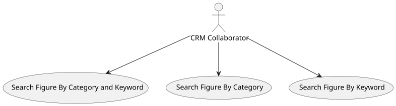
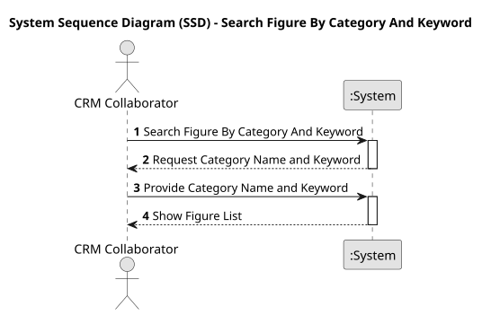
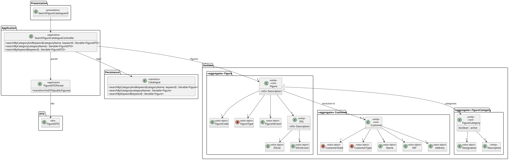
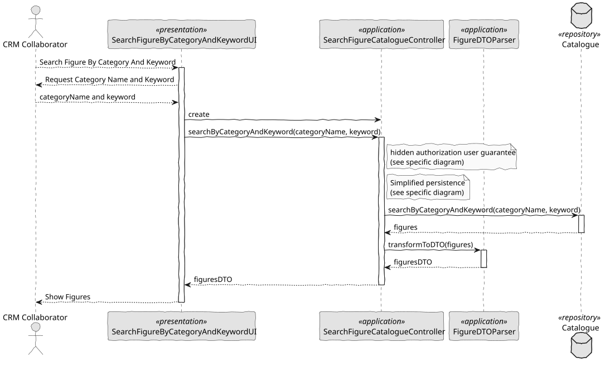

# US 232 - Search Figure catalogue

## 1. Context

*This task implements keyword and category search within the public figure catalogue, enhancing CRM Collaborators’ ability to quickly locate appropriate figures for show proposals. It builds on the existing catalogue browsing feature and improves usability through accent- and case-insensitive matching.*

### 1.1 List of issues

**Analysis:**
- Determine how to normalize text for accent-insensitive comparisons (e.g., Unicode NFD + strip diacritics).
- Define which fields are searchable (name, description, category).
- Decide whether search executes on the client, server, or via a dedicated search index.

**Design:**
- Extend the catalogue UI with a text input and category dropdown.
- Plan real-time vs. on-submit search behavior.
- Specify API parameters for keyword and category filters and expected response format.

**Implement:**
- Add frontend controls for keyword entry and category selection.
- Update backend endpoints or repository methods to perform case- and accent-insensitive filtering.
- Integrate search invocation in the UI (e.g., debounce for real-time updates or form submission).

**Test:**
- Verify that searches like “STAR”, “star”, and “StÁr” all match a figure named “Star”.
- Test accent insensitivity: “coracao” matches “coração”, “acao” matches “ação”.
- Confirm combination of keyword + category returns correct subsets.
- Ensure empty‐result scenario displays “No figures found.”

## 2. Requirements

**US 232:** As a CRM Collaborator, I want to search the figure catalogue by category and/or keyword. The search should ignore accents and shouldn’t be case sensitive.

**Acceptance Criteria:**

- *US232.1:* CRM user can enter a free-text keyword and/or choose a category to filter figures.
- *US232.2:* Keyword matching ignores case (e.g., “STAR” matches “Star”).
- *US232.3:* Keyword matching ignores accents (e.g., “coracao” matches “coração”).
- *US232.4:* Results update either in real time or upon form submission, showing only matching entries.
- *US232.5:* When no matches exist, display a message “No figures found.”
- *US232.6:* Keyword and category filters can be applied simultaneously.

**Dependencies/References:**

* Builds on existing public-figure catalogue endpoint and UI.
* Relies on text-normalization utilities for accent removal.
* May integrate with database or search index that supports case- and accent-insensitive queries.

## 3. Analysis

### 3.1. Use Case Diagram



### 3.2. Domain Model


### 3.3. Sequence System Diagrams (SSD)




## 4. Design

### 4.1. Class Diagram (CD)




### 4.2. Sequence Diagram (SD)




### 4.3. Applied Patterns

...

### 4.4. Acceptance Tests

```

````

## 5. Implementation

```
public class SearchFigureCatalogueController {

    private final Catalogue repo;
    private final AuthorizationService authz;

    public SearchFigureCatalogueController() {
        this.repo = PersistenceContext.repositories().catalogue();
        this.authz = AuthzRegistry.authorizationService();
    }

    public Iterable<FigureDTO> searchByCategoryAndKeyword(String categoryName, String keyword) {
        authz.ensureAuthenticatedUserHasAnyOf(ShodroneRoles.POWER_USER, ShodroneRoles.CRM_COLLABORATOR);
        final Iterable<Figure> figures = repo.searchByCategoryAndKeyword(categoryName, keyword);
        return FigureDTOParser.transformToDTO(figures);
    }

    public Iterable<FigureDTO> searchByCategory(String categoryName) {
        authz.ensureAuthenticatedUserHasAnyOf(ShodroneRoles.POWER_USER, ShodroneRoles.CRM_COLLABORATOR);
        final Iterable<Figure> figures = repo.searchByCategory(categoryName);
        return FigureDTOParser.transformToDTO(figures);
    }

    public Iterable<FigureDTO> searchByKeyword(String keyword) {
        authz.ensureAuthenticatedUserHasAnyOf(ShodroneRoles.POWER_USER, ShodroneRoles.CRM_COLLABORATOR);
        final Iterable<Figure> figures = repo.searchByKeyword(keyword);
        return FigureDTOParser.transformToDTO(figures);
    }

}
````

## 6. Integration/Demonstration

...

## 7. Observations

...