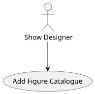
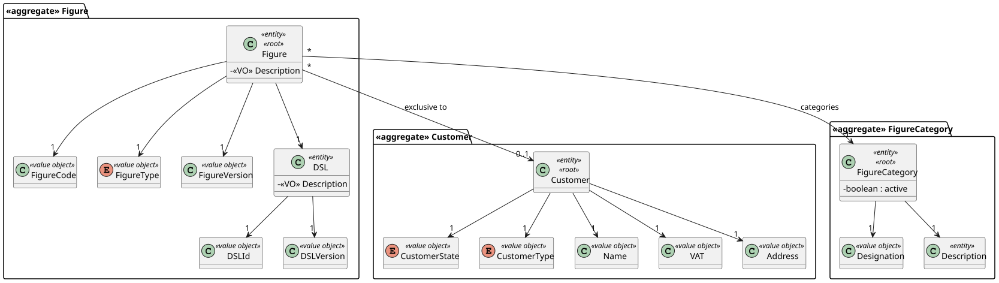
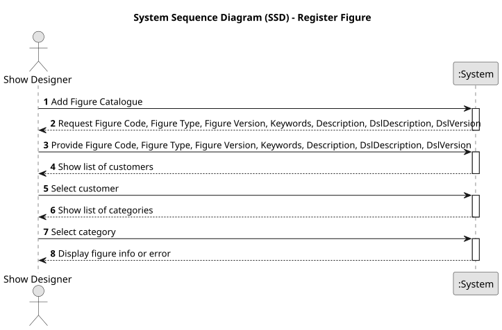
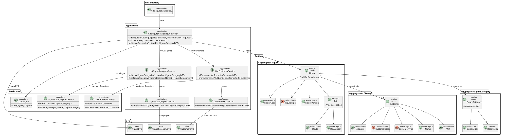
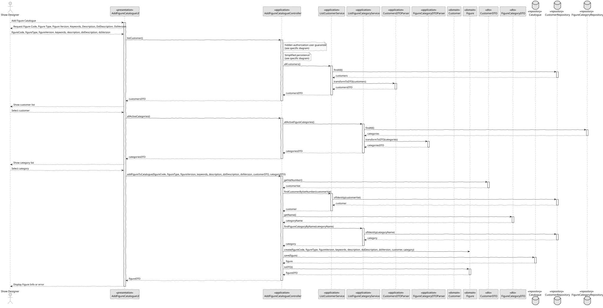

# US 233 - Add Figure to the catalogue

## 1. Context

*This task adds the “Add Figure” capability for Show Designers, enabling them to enrich the public and customer-specific catalogues with new drone‐show figures. It underpins proposal creation by ensuring a robust repository of shapes, logos, animations, and patterns, with fine-grained control over figure visibility.*

### 1.1 List of issues

**Analysis:**
- Determine the figure metadata schema (name, category, keywords, duration, drone count, visibility, optional customer ID).
- Specify validation rules for each field and the preview artifact format (image or animation file).

**Design:**
- Design wireframes for the “Add Figure” form, including file upload and preview area.
- Define API endpoints and payload structure for figure creation.

**Implement:**
- Build the back-office form for Show Designers with inputs for all required metadata and preview.
- Implement backend services and repositories to persist figure data, handle visibility flags, and link private figures to a customer.
- Integrate file-storage or media-service for preview uploads.

**Test:**
- Unit-test validation logic for required fields, keyword format, and visibility conditions.
- Integration-test the end-to-end creation flow, including preview upload, public/private flag, and customer association.
- UI-test that private figures do not appear in the general catalogue and only in that customer’s context.

## 2. Requirements

**US 233:** As a Show Designer, I want to add a figure to the public catalogue.

**Acceptance Criteria:**

- *US233.1:* Show Designers can open a form to upload or define a new figure.
- *US233.2:* The form includes fields for name, category, keywords (comma-separated), duration, number of drones, and a public/private toggle.
- *US233.3:* If marked private, the form requires selecting an associated customer.
- *US233.4:* Upon success, public figures become visible in the general catalogue.
- *US233.5:* Private figures are excluded from the general catalogue and only appear when browsing that customer’s figures.
- *US233.6:* All inputs are validated (non-empty name, valid category, positive duration and drone count, at least one keyword).
- *US233.7:* A client-side preview of the uploaded image/animation is displayed before submission.

**Dependencies/References:**

* Relies on the existing Figure domain model and FigureRepository.
* Integrates with customer management to associate private figures.
* Uses the system’s media storage service for preview files.

## 3. Analysis

### 3.1. Use Case Diagram



### 3.2. Domain Model

The domain model defines the structure of the entities involved in the "Add Figure to Catalogue" use case. The central entity is Figure, which is composed of several value objects and references other aggregates such as Customer and FigureCategory. A Figure has a unique FigureCode, a FigureType, and a FigureVersion. It also references a DSL entity, which itself contains a description and version. Figures may be exclusive to a Customer and must be associated with a FigureCategory.



### 3.3. Sequence System Diagrams (SSD)

The UI initiates the process by invoking the addFigureToCatalogue() method from the AddFigureCatalogueController, providing all necessary information. The controller delegates customer and category lookups to their respective services. Once validated, a new Figure is created and persisted in the Catalogue repository. A DTO is returned to the UI to confirm successful creation.



## 4. Design

### 4.1. Class Diagram (CD)

The class diagram details the relationships among UI, application services, DTOs, domain entities, and repositories. The main UI component uses the AddFigureCatalogueController, which depends on ListCustomerService and ListFigureCategoryService to retrieve necessary data. The controller handles the orchestration of creating and saving the Figure entity using the Catalogue repository.



### 4.2. Sequence Diagram (SD)

The sequence diagram shows the chronological flow of method calls during the execution of this use case. It begins with the UI invoking the controller method. The controller ensures proper authorization, retrieves required entities (customer and category), constructs the DSL and Figure entities, and saves the new figure in the catalogue repository. Finally, a FigureDTO is returned.



### 4.3. Applied Patterns

- DTO Pattern: Used to transfer data between layers (e.g., FigureDTO, CustomerDTO, FigureCategoryDTO).
- Repository Pattern: Repositories like Catalogue, CustomerRepository, and FigureCategoryRepository abstract data access.
- Service Layer Pattern: ListCustomerService and ListFigureCategoryService encapsulate business logic for retrieving domain data.
- Authorization Pattern: Ensures that only authorized users (Power Users or Show Designers) can execute the use case.

### 4.4. Acceptance Tests

```
@Test
    void ensureAllParametersAreRequired() {
        assertThrows(IllegalArgumentException.class, () -> new Figure(null, VALID_DSL, VALID_CODE, VALID_TYPE, VALID_VERSION, VALID_CUSTOMER, VALID_CATEGORY, VALID_KEYWORDS));
        assertThrows(IllegalArgumentException.class, () -> new Figure(VALID_DESCRIPTION, null, VALID_CODE, VALID_TYPE, VALID_VERSION, VALID_CUSTOMER, VALID_CATEGORY, VALID_KEYWORDS));
        assertThrows(IllegalArgumentException.class, () -> new Figure(VALID_DESCRIPTION, VALID_DSL, null, VALID_TYPE, VALID_VERSION, VALID_CUSTOMER, VALID_CATEGORY, VALID_KEYWORDS));
        assertThrows(IllegalArgumentException.class, () -> new Figure(VALID_DESCRIPTION, VALID_DSL, VALID_CODE, null, VALID_VERSION, VALID_CUSTOMER, VALID_CATEGORY, VALID_KEYWORDS));
        assertThrows(IllegalArgumentException.class, () -> new Figure(VALID_DESCRIPTION, VALID_DSL, VALID_CODE, VALID_TYPE, null, VALID_CUSTOMER, VALID_CATEGORY, VALID_KEYWORDS));
        assertThrows(IllegalArgumentException.class, () -> new Figure(VALID_DESCRIPTION, VALID_DSL, VALID_CODE, VALID_TYPE, VALID_VERSION, VALID_CUSTOMER, null, VALID_KEYWORDS));
        assertThrows(IllegalArgumentException.class, () -> new Figure(VALID_DESCRIPTION, VALID_DSL, VALID_CODE, VALID_TYPE, VALID_VERSION, VALID_CUSTOMER, VALID_CATEGORY, null));
    }

@Test
    void ensureValidFigureIsCreated() {
        final var figure = new Figure(VALID_DESCRIPTION, VALID_DSL, VALID_CODE, VALID_TYPE, VALID_VERSION, VALID_CUSTOMER, VALID_CATEGORY, VALID_KEYWORDS);
        assertNotNull(figure);
        assertEquals(VALID_DESCRIPTION.toString(), figure.toDTO().getDescription().toString());
        assertEquals(VALID_CODE.toString(), figure.toDTO().getCode().toString());
        assertEquals(VALID_VERSION.toString(), figure.toDTO().getFigureVersion().toString());
        assertEquals(VALID_CUSTOMER.identity().toString(), figure.toDTO().getCustomer().toString());
        assertEquals(VALID_CATEGORY.identity().toString(), figure.toDTO().getFigureCategory().toString());
        assertEquals(VALID_KEYWORDS.toString(), figure.toDTO().getKeywords().toString());
        assertEquals(VALID_TYPE.toString(), figure.toDTO().getType().toString());
        assertTrue(figure.isExclusive());
    }

@Test
    void ensureIdentityReturnsCode() {
        final var figure = new Figure(VALID_DESCRIPTION, VALID_DSL, VALID_CODE, VALID_TYPE, VALID_VERSION, VALID_CUSTOMER, VALID_CATEGORY, VALID_KEYWORDS);
        assertEquals(VALID_CODE, figure.identity());
    }
````

## 5. Implementation

```
public AddFigureCatalogueController() {
        this.catalogueRepo = PersistenceContext.repositories().catalogue();
        this.customerSvc = new ListCustomerService();
        this.categorySvc = new ListFigureCategoryService();
        this.authz = AuthzRegistry.authorizationService();
    }

    public FigureDTO addFigureToCatalogue(String descriptionString, String dslDescriptionString, String dslVersionString, String code,
                                          String figureTypeString, String figureVersionString, CustomerDTO customerDTO, FigureCategoryDTO figureCategoryDTO, Set<String> keywords) {
        authz.ensureAuthenticatedUserHasAnyOf(ShodroneRoles.POWER_USER, ShodroneRoles.SHOW_DESIGNER);

        final Description description = Description.valueOf(descriptionString);
        final FigureCode figureCode = FigureCode.valueOf(code);
        final FigureVersion figureVersion = FigureVersion.valueOf(figureVersionString);
        final FigureType figureType = FigureType.valueOf(figureTypeString.toUpperCase());
        final Description dslDescription = Description.valueOf(dslDescriptionString);
        final DSLVersion dslVersion = DSLVersion.valueOf(dslVersionString);
        Customer customer = null;
        if (customerDTO != null) {
            customer = customerSvc.findCustomerByVatNumber(customerDTO.getVatNumber());
        }
        final FigureCategory figureCategory = categorySvc.findFigureCategoryByName(figureCategoryDTO.getName());
        final DSL dsl = new DSL(dslDescription, dslVersion);
        final Figure figure = new Figure(description, dsl, figureCode, figureType, figureVersion, customer, figureCategory, keywords);

        return catalogueRepo.save(figure).toDTO();
    }

    public Iterable<CustomerDTO> allCustomers() {
        authz.ensureAuthenticatedUserHasAnyOf(ShodroneRoles.POWER_USER, ShodroneRoles.SHOW_DESIGNER);
        return customerSvc.allCustomers();
    }

    public Iterable<FigureCategoryDTO> allActiveCategories() {
        authz.ensureAuthenticatedUserHasAnyOf(ShodroneRoles.POWER_USER, ShodroneRoles.SHOW_DESIGNER);
        return categorySvc.allActiveFigureCategories();
    }

}
````

```
public class ListCustomerService {

    private final CustomerRepository customerRepository = PersistenceContext.repositories().customers();

    public Iterable<CustomerDTO> allCustomers() {
        final Iterable<Customer> customers = customerRepository.findAll();
        return CustomerDTOParser.transformToDTO(customers);
    }

    public Customer findCustomerByVatNumber(final String vatNumber) {
        return customerRepository.ofIdentity(VAT.valueOf(vatNumber))
                .orElseThrow(() -> new IllegalArgumentException("Unknown customer: " + vatNumber));
    }

}
````

```
public class ListFigureCategoryService {

    private final FigureCategoryRepository repo = PersistenceContext.repositories().figureCategories();

    public Iterable<FigureCategoryDTO> allFigureCategories() {
        final Iterable<FigureCategory> categories = repo.findAll();
        return FigureCategoryDTOParser.transformToDTO(categories);
    }

    public Iterable<FigureCategoryDTO> allActiveFigureCategories() {
        final Iterable<FigureCategory> activeCategories =  repo.findAllActive();
        return FigureCategoryDTOParser.transformToDTO(activeCategories);
    }

    public Iterable<FigureCategoryDTO> allInactiveFigureCategories() {
        final Iterable<FigureCategory> inactiveCategories = repo.findAllInactive();
        return FigureCategoryDTOParser.transformToDTO(inactiveCategories);
    }

    public FigureCategory findFigureCategoryByName(final String name) {
        return repo.ofIdentity(Designation.valueOf(name))
                .orElseThrow(() -> new IllegalArgumentException("Unknown figure category: " + name));
    }
}
````

## 6. Integration/Demonstration

- Run the backoffice using the command ./run-backoffice.
- Log in as a Show Designer.
- Access the “Add Figure to Catalogue” feature from the main menu.
- Fill in all required fields: name, category, keywords, duration, number of drones, visibility.
- Upload a preview image or animation file and verify that a client-side preview is shown.
- If the figure is marked as private, select an associated customer.
- Submit the form and ensure success feedback is displayed.
- Access the public catalogue and verify that public figures appear with correct metadata.
- Access the customer-specific catalogue and confirm that private figures are only visible in the correct customer context.

## 7. Observations

This use case allows Show Designers to enrich the system’s catalogue with reusable visual figures, both public and customer-specific. The implemented domain validations and role-based access control ensure data integrity and correct usage. The design promotes modularity through the use of DTOs, services, and repositories, facilitating future enhancements such as figure versioning, richer metadata, or advanced media handling.