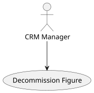
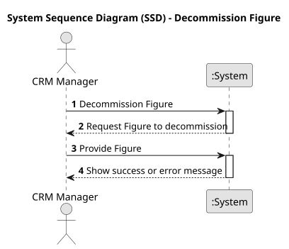
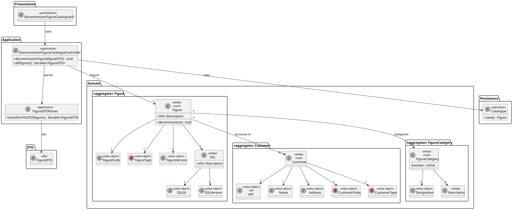
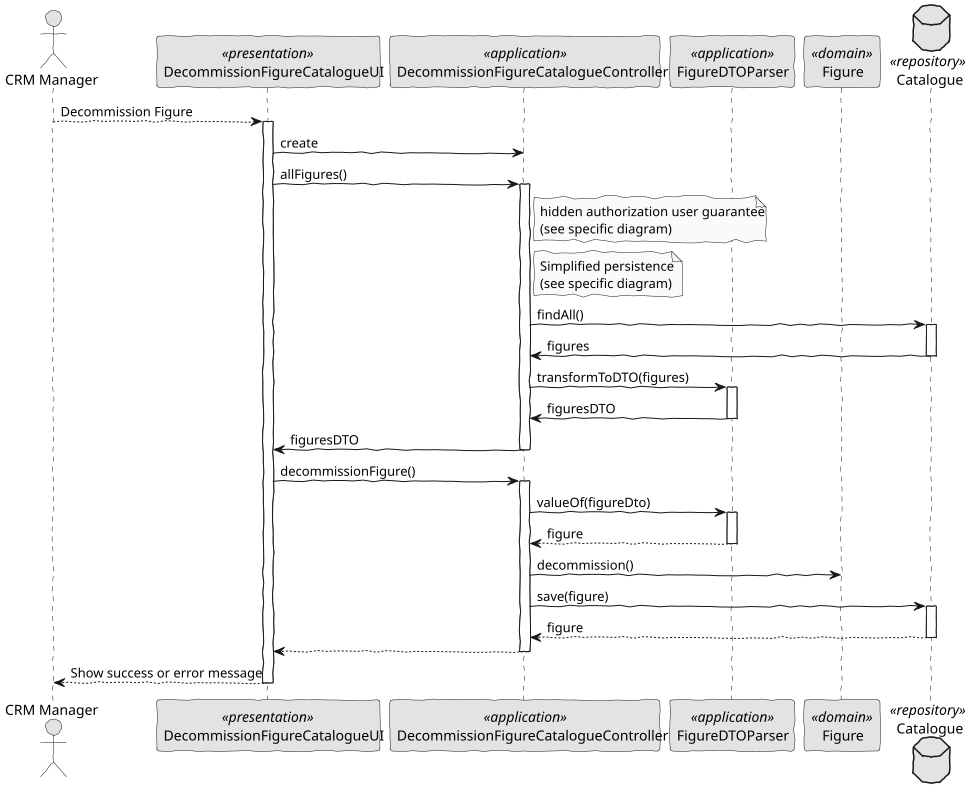

# US 234 - Decommission Figure

## 1. Context

*This task introduces the “Decommission Figure” capability for CRM Managers, enabling them to retire outdated or deprecated figures from active use. Retired figures remain in the system for audit and historical reporting but are excluded from all new show-creation workflows.*

### 1.1 List of issues

**Analysis:**
- Determine how to represent “inactive” status on the Figure entity without physically deleting data.
- Define where and how to record an optional decommissioning reason.
- Identify all UI contexts and APIs that must filter out inactive figures.

**Design:**
- Sketch UI for browsing figures and triggering decommission, including confirmation dialog and optional comment field.
- Plan soft-delete implementation in the data model (e.g., active: boolean, decommissionReason: String, decommissionedAt: Date).
- Update API contract to accept decommission commands and return historical details.

**Implement:**
- Add “Decommission” button in the figure-management UI visible only to CRM Managers.
- Implement backend service to mark a figure inactive, set decommissionedAt and store the reason.
- Modify repository queries and catalogue endpoints to exclude inactive figures from all new-use listings.
- Ensure historical views (past proposals, executed shows) still load decommissioned figures.

**Test:**
- Unit-test that FigureService.decommission(…) toggles the active flag and records metadata.
- Integration-test UI flow: browse → confirm decommission → verify figure no longer appears in selection lists.
- Validate that decommissioned figures still appear in read-only historical contexts.
- Test that new proposals cannot include inactive figures, and appropriate error or exclusion applies.

## 2. Requirements

**US 234:** As a CRM Manager, I want to decommission a figure from the catalogue so that it will not be used anymore.

**Acceptance Criteria:**

- *US234.1:* CRM Managers can view all figures (active and inactive) in an administrative list and choose one to decommission.
- *US234.2:* Upon confirmation, the selected figure is marked inactive and removed from all show-creation and proposal selection interfaces.
- *US234.3:* Inactive (decommissioned) figures continue to appear in historical records and past proposals/shows.
- *US234.4:* A confirmation step, with “Confirm” and “Cancel,” protects against accidental decommissions.
- *US234.5:* Decommissioned figures cannot be selected or added to any new show request or proposal.
- *US234.6:* Optionally, the manager can enter a decommissioning reason, which is stored for audit.

**Dependencies/References:**

* Builds on the existing Figure domain model and catalogue services.
* Relates to proposal-history and show-execution modules for historical display.
* Utilizes shared UI components for confirmation dialogs and audit-log entry.

## 3. Analysis

### 3.1. Use Case Diagram



### 3.2. Domain Model

The domain model encompasses entities such as Figure, FigureCode, FigureType, FigureVersion, DSL, Customer, and FigureCategory. The Figure entity is central, associated with a unique code, type, version, and linked to a specific DSL. It may also be associated with a customer and categorized under a figure category. The model supports the decommissioning feature by allowing a figure to be marked as inactive without deletion, preserving its associations for audit and historical purposes.


### 3.3. Sequence System Diagrams (SSD)

The sequence diagrams depict the flow of interactions for decommissioning a figure. The CRM Manager interacts with the DecommissionFigureCatalogueUI, which invokes the DecommissionFigureCatalogueController. The controller utilizes the FigureDTOParser to transform the DTO into a domain object, then calls the decommission() method on the Figure entity. The updated figure is saved via the Catalogue repository. This sequence ensures that only authorized users can deactivate figures, maintaining system integrity and data consistency.



## 4. Design

### 4.1. Class Diagram (CD)

The class diagram outlines the structure of the system components involved in the decommissioning process. In the presentation layer, DecommissionFigureCatalogueUI handles user interactions. The application layer includes DecommissionFigureCatalogueController and FigureDTOParser, managing business logic and data transformation. The domain layer features entities like Figure, FigureCode, FigureType, FigureVersion, DSL, Customer, and FigureCategory, each with specific attributes and relationships. The persistence layer comprises the Catalogue repository, responsible for data storage and retrieval.



### 4.2. Sequence Diagram (SD)

The sequence diagram illustrates the process of decommissioning a figure:

- The CRM Manager initiates the action via the UI.
- The UI calls the controller's decommissionFigure() method.
- The controller parses the DTO to obtain the Figure entity.
- The decommission() method is invoked on the Figure, updating its status.
- The modified figure is saved back to the repository.

This flow ensures that decommissioning is executed securely and efficiently, with proper authorization and data handling.



### 4.3. Applied Patterns

- Soft Delete Pattern: Implemented by introducing an active boolean flag in the Figure entity to indicate its status. This approach allows for the logical deletion of figures without physically removing them from the database, preserving historical data for auditing and reporting purposes.
- Role-Based Access Control (RBAC): Ensures that only users with the CRM_MANAGER role can perform decommissioning actions, maintaining system security and integrity.
- Data Transfer Object (DTO) Pattern: Utilized to transfer data between the UI and backend, encapsulating the Figure entity's data in a FigureDTO.

### 4.4. Acceptance Tests

```
@Test
    void ensureFigureCanBeDecommissioned() {
        final var figure = new Figure(VALID_DESCRIPTION, VALID_DSL, VALID_CODE, VALID_TYPE, VALID_VERSION, VALID_CUSTOMER, VALID_CATEGORY, VALID_KEYWORDS);
        figure.decommission();
        assertThrows(IllegalStateException.class, figure::decommission);
    }


    @Test
    void ensureInactiveFigureCannotBeDecommissioned() {
        final var figure = new Figure(VALID_DESCRIPTION, VALID_DSL, VALID_CODE, VALID_TYPE, VALID_VERSION, VALID_CUSTOMER, VALID_CATEGORY, VALID_KEYWORDS);
        figure.decommission();

        IllegalStateException exception = assertThrows(IllegalStateException.class, () -> {
            figure.decommission();
        });

        assertEquals("Cannot decommission an inactive figure", exception.getMessage());
    }
````

## 5. Implementation

```
public class DecommissionFigureCatalogueController {

    private final Catalogue repo;
    private final AuthorizationService authz;

    public DecommissionFigureCatalogueController() {
        this.repo = PersistenceContext.repositories().catalogue();
        this.authz = AuthzRegistry.authorizationService();
    }

    public void decommissionFigure(FigureDTO figureDTO) {
        authz.ensureAuthenticatedUserHasAnyOf(ShodroneRoles.POWER_USER, ShodroneRoles.CRM_MANAGER);
        Figure figure = new FigureDTOParser(repo).valueOf(figureDTO);
        figure.decommission();
        repo.save(figure);
    }

    public Iterable<FigureDTO> allFigures() {
        authz.ensureAuthenticatedUserHasAnyOf(ShodroneRoles.POWER_USER, ShodroneRoles.CRM_MANAGER);
        final Iterable<Figure> figures = repo.findAll();
        return FigureDTOParser.transformToDTO(figures);
    }

}
````

## 6. Integration/Demonstration

- UI Integration: The DecommissionFigureCatalogueUI provides an interface for CRM Managers to view all figures and initiate the decommissioning process. It includes confirmation dialogs and optional fields for entering decommissioning reasons.
- Backend Integration: The DecommissionFigureCatalogueController handles requests from the UI, interacts with the Catalogue repository to update figure statuses, and ensures that only authorized users can perform decommissioning actions.
- Data Persistence: The Catalogue repository manages the persistence of Figure entities, updating the active status and storing decommissioning metadata as needed.

## 7. Observations

The decommissioning feature enhances the figure management system by allowing CRM Managers to retire outdated figures without data loss. This approach maintains historical integrity while preventing the use of obsolete figures in new workflows. The implementation ensures secure, auditable, and user-friendly decommissioning, aligning with best practices in system design and data management.