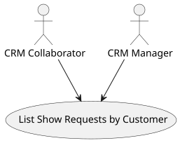
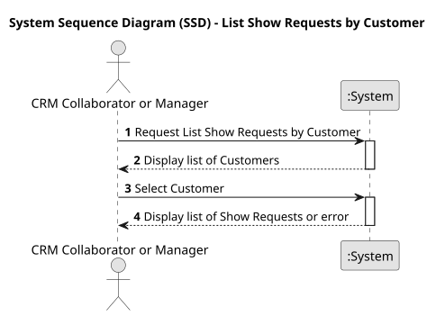
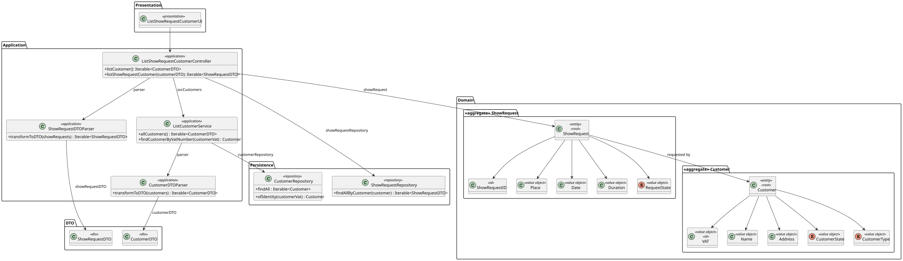
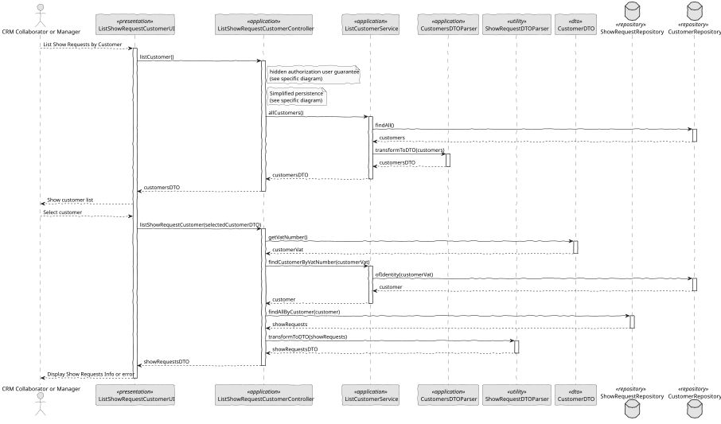

# US 235 - List Show Requests of customer

## 1. Context

*This task involves implementing the feature described in the user story where CRM Managers and CRM Collaborators can view all show requests of a specific client. This is the first implementation of this feature and is critical for enabling effective client management and tracking within the system.*

### 1.1 List of issues

**Analysis:**
- Identify the required data fields for displaying show requests.
- Determine the access control mechanism to restrict the feature to CRM roles.

**Design:**
- Create wireframes for the list interface, including sorting and filtering options.
- Plan the data flow from the backend to the UI.

**Implement:**
- Develop the UI for viewing and interacting with the list of show requests.
- Implement backend logic to fetch and provide the required data.
- Add sorting and filtering capabilities to the interface.

**Test:**
- Verify role-based access control is enforced.
- Validate correct retrieval and display of show request details.
- Test edge cases, such as no show requests or incomplete data.

## 2. Requirements

**US 235:** As a CRM Manager or CRM Collaborator, I want to list all show requests of a client, including their current status.

**Acceptance Criteria:**

- *US235.1:* CRM users (Manager or Collaborator) can select or search for a client and view their associated show requests.
- *US235.2:* The list displays key details: request ID, submission date, requested show date, location, and current status.
- *US235.3:* The status reflects the current stage of each request in the system’s workflow.
- *US235.4:* The list supports sorting or filtering (e.g., by status or date).
- *US235.5:* If the client has no requests, a clear message is shown.
- *US235.6:* Only users with the appropriate roles (CRM Manager/Collaborator) can access this information.

**Dependencies/References:**

* This feature relies on the user authentication and authorization module to enforce role-based access.
* Backend APIs for fetching show request data must be functional and documented.

## 3. Analysis

### 3.1. Use Case Diagram



### 3.2. Domain Model

The domain revolves around the ShowRequest aggregate, which holds place, date, duration and a state value object (ShowRequestState: PendingEvaluation, ProposalSubmitted, Approved, Rejected). Each ShowRequest links to a Customer. Data is loaded via ShowRequestRepository and CustomerRepository. In this use case, only read methods (place(), date(), duration(), state()) are used, preserving domain integrity.


### 3.3. Sequence System Diagrams (SSD)

When the CRM user requests “List Show Requests,” the system prompts for a customer, checks authorization, fetches all ShowRequest entities for that customer from the repository, and returns them. If none exist, it immediately returns a “no show requests” message; otherwise, it hands the collection back to the UI for display.



## 4. Design

### 4.1. Class Diagram (CD)

Key classes and their responsibilities:
- ListShowRequestCustomerUI (<<presentation>>): prompts CRM user, displays list or empty message.
- ListShowRequestCustomerController (<<application>>): enforces authorization and delegates to services/repositories.
- AuthzRegistry / AuthorizationService: ensures only CRM Manager/Collaborator (and Power User) can list.
- ListCustomerService / CustomerRepository: fetches all customers.
- ShowRequestRepository (<<repository>>): retrieves ShowRequest by Customer.
- ShowRequest (<<aggregate>>): read-only for this use case.
- Customer, ShowRequestState as domain types.



### 4.2. Sequence Diagram (SD)

When the UI requests the customer list, the controller checks the user’s CRM role, fetches all customers from the service and returns them to the UI. After the user selects one, the UI calls listShowRequestCustomer, the controller revalidates roles, retrieves all show requests for that customer from the repository, and sends them back. The UI then prints each request or, if none exist, shows “There are no show requests for this customer.”



### 4.3. Applied Patterns

- MVC: clear separation of presentation, application logic, and domain.
- Repository Pattern: abstract persistence of customers and show requests.
- Domain-Driven Design: ShowRequest encapsulates state and identity.
- Authorization Guard: centralized via AuthorizationService.
- Select Widget: reusable UI component for choosing a customer.
- Extension Point: supports future sorting/filtering.

## 5. Implementation

```
public class ListShowRequestCustomerController {

    private final AuthorizationService authz;
    private final ShowRequestRepository showRequestRepository;
    private final ListCustomerService svcCustomers;

    public ListShowRequestCustomerController() {
        this.authz = AuthzRegistry.authorizationService();
        this.showRequestRepository = PersistenceContext.repositories().showRequests();
        this.svcCustomers = new ListCustomerService();
    }

    public Iterable<ShowRequestDTO> listShowRequestCustomer(CustomerDTO customerDTO) {
        authz.ensureAuthenticatedUserHasAnyOf(ShodroneRoles.POWER_USER, ShodroneRoles.CRM_COLLABORATOR, ShodroneRoles.CRM_MANAGER);

        final Customer customer = svcCustomers.findCustomerByVatNumber(customerDTO.getVatNumber());
        final Iterable<ShowRequest> showRequests = showRequestRepository.findAllByCustomer(customer);
        return ShowRequestDTOParser.transformToDTO(showRequests);
    }

    public Iterable<CustomerDTO> listCustomer() {
        return svcCustomers.allCustomers();
    }
}
````

```
public class ListCustomerService {

    private final CustomerRepository customerRepository = PersistenceContext.repositories().customers();

    public Iterable<CustomerDTO> allCustomers() {
        final Iterable<Customer> customers = customerRepository.findAll();
        return CustomerDTOParser.transformToDTO(customers);
    }

    public Customer findCustomerByVatNumber(final String vatNumber) {
        return customerRepository.ofIdentity(VAT.valueOf(vatNumber))
                .orElseThrow(() -> new IllegalArgumentException("Unknown customer: " + vatNumber));
    }

}
````

## 6. Integration/Demonstration

- Launch the system using ./run-backoffice.
- Log in with a CRM Manager, CRM Collaborator, or Power User account.
- From the main menu, select List Show Requests by Customer.
- If no customers are registered, observe the message “There are no customers.”
- Otherwise, choose a customer from the displayed list.
- If the selected customer has show requests, verify each is printed with ID, place, date, duration, and state.
- If the customer has no requests, confirm the message “There are no show requests for this customer.”
- Attempt access with a non-CRM role to ensure authorization is correctly enforced.

## 7. Observations

This read‐only feature gives CRM staff quick visibility into a client’s requests, keeps domain logic isolated, and simplifies testing. Centralized authorization ensures only allowed roles can list requests, and the clear separation of layers supports easy future enhancements (e.g., pagination or filtering).