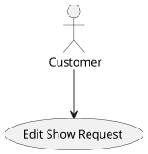
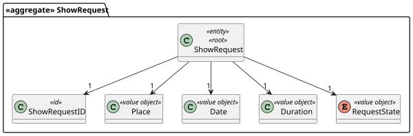
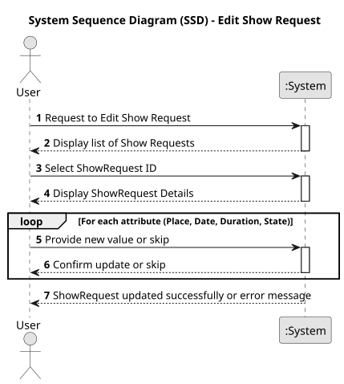
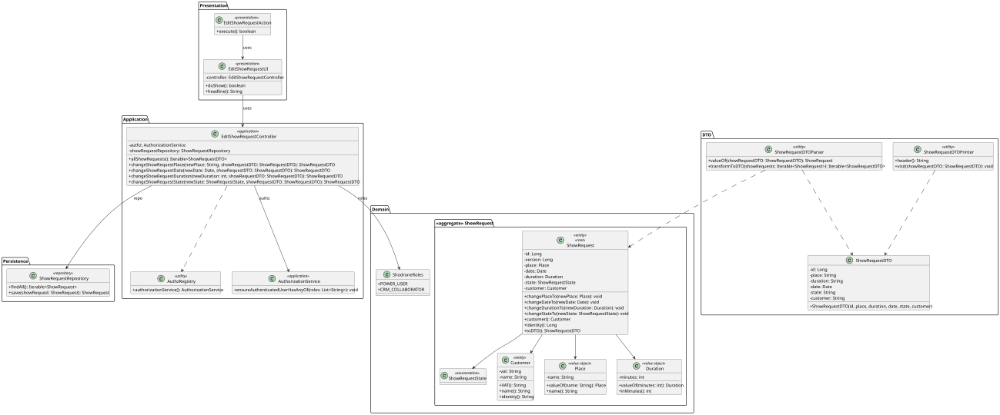
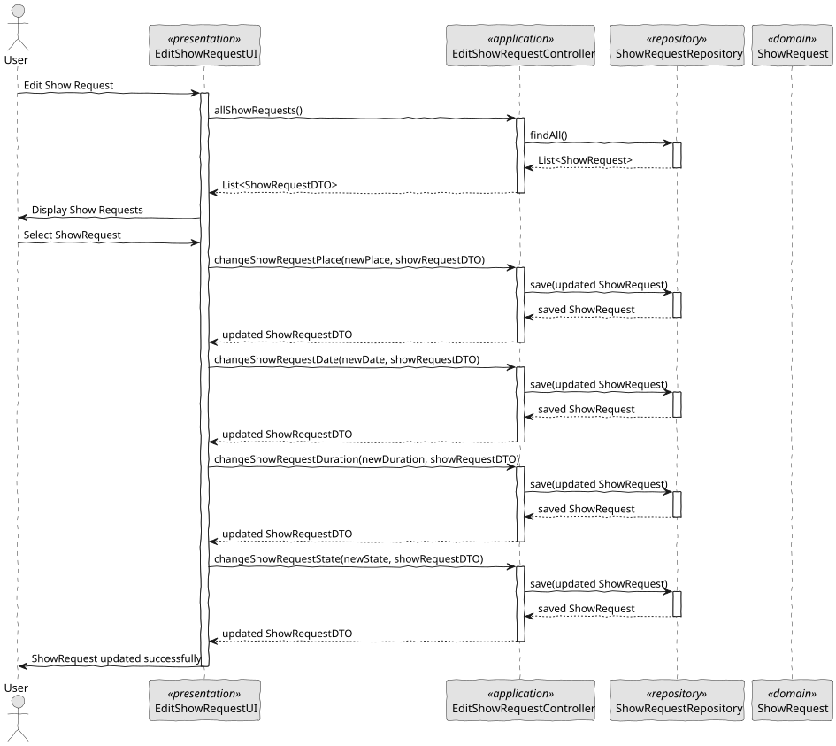

# US 236 - Edit Show Requests

## 1. Context

*This task involves implementing the feature described in the user story where a CRM Collaborator can edit the details of a show request, provided that no proposal is linked to the request. This feature supports flexibility during the initial stages of client engagement while maintaining data integrity once a proposal is associated.*

### 1.1 List of issues

**Analysis:**
- Determine which fields can be edited and define validation rules.
- Identify the conditions under which a show request becomes locked for editing.

**Design:**
- Create wireframes for the edit interface.
- Plan data flow for fetching existing request details, validating edits, and saving changes.

**Implement:**
- Develop the UI for editing show requests.
- Implement backend logic to enforce editing restrictions.
- Add input validation and error handling mechanisms.

**Test:**
- Validate that edits are only allowed for requests without proposals.
- Test error scenarios such as invalid input and unauthorized attempts to edit locked requests.
- Verify logging of all changes for audit purposes.

## 2. Requirements

**US 236:** As a CRM Collaborator, I want to edit a show request of a client, but only if no proposal is linked to the request.

**Acceptance Criteria:**

- *US236.1:* CRM Collaborators can access and modify the details of a show request only if it is not yet associated with a proposal.
- *US236.2:* If a proposal exists for a request, the edit functionality is disabled or hidden, and an appropriate message is displayed.
- *US236.3:* Editable fields include: requested date, location, number of drones, special notes, and other relevant fields defined by the domain.
- *US236.4:* All changes are validated before saving (e.g., valid date, required fields).
- *US236.5:* A success message is shown after a successful update.
- *US236.6:* All edits are logged for audit purposes.

**Dependencies/References:**

* Requires integration with the proposal management module to determine whether a request is linked to a proposal.
* Relies on authentication and authorization mechanisms to restrict editing to CRM Collaborators.

## 3. Analysis

### 3.1. Use Case Diagram



### 3.2. Domain Model

The domain model includes the ShowRequest aggregate, composed of value objects such as place, date, number of drones, and special notes, along with a reference to a Customer. The presence of a linked ShowProposal determines whether the request can be edited. The ShowRequest entity contains state validation and update methods, and is persisted through the ShowRequestRepository. The Customer and ShowProposal entities are referenced but managed externally.



### 3.3. Sequence System Diagrams (SSD)

Presents the detailed dynamic behavior of the system during the editing of a show request. It includes the interactions between UI, Controller, Domain services, and Repositories, capturing the retrieval and update flow of a ShowRequest, validation of its editability, field modification, and audit logging.



## 4. Design

### 4.1. Class Diagram (CD)

The class diagram defines the structure and responsibilities of the main classes involved in the Edit Show Request use case:
- EditShowRequestUI: Provides the interface for CRM Collaborators to input modifications.
- EditShowRequestController: Coordinates user actions and application logic.
- ShowRequest: Domain entity with methods to check if it is editable and to apply changes to date, place, number of drones, and notes.
- ShowRequestRepository: Responsible for fetching and persisting updates to ShowRequest.
- AuthorizationService: Ensures that only CRM Collaborators can perform edits.
- AuditLogService (optional): Logs each successful modification for audit purposes.
- ShowProposal: Its presence prevents editing.



### 4.2. Sequence Diagram (SD)

Presents the detailed dynamic behavior of the system during the editing of a show request. It includes the interactions between UI, Controller, Domain services, and Repositories, capturing the retrieval of a ShowRequest, verification of editability, update of editable fields, validation, persistence of changes, and audit logging.



### 4.3. Applied Patterns

- MVC (Model-View-Controller): Clear separation between interface, logic, and domain model.
- Repository Pattern: Abstracts persistence logic of ShowRequest.
- Domain-Driven Design (DDD): Business rules and state validation encapsulated in ShowRequest.
- Audit Logging: Ensures traceability of edits through a logging mechanism.
- Authorization Check: Ensures only valid users access editing features.
- Guard Clause: Prevents edits if the show request has an associated proposal.

### 4.4. Acceptance Tests

```
@Test
    void ensureValidShowRequestIsCreated() {
        final var showRequest = new ShowRequest(VALID_PLACE, VALID_DATE, VALID_DURATION, VALID_STATE, VALID_CUSTOMER);
        assertNotNull(showRequest);
        assertEquals(VALID_PLACE.toString(), showRequest.toDTO().getPlace().toString());
        assertEquals(VALID_DATE.toString(), showRequest.toDTO().getDate().toString());
        assertEquals(VALID_DURATION.toString(), showRequest.toDTO().getDuration().toString());
        assertEquals(VALID_STATE.toString(), showRequest.toDTO().getState().toString());
        assertEquals(VALID_CUSTOMER.identity().toString(), showRequest.toDTO().getCustomer().toString());
    }

    @Test
    void ensureAllParametersAreRequired() {
        assertThrows(IllegalArgumentException.class, () -> new ShowRequest(null, VALID_DATE, VALID_DURATION, VALID_STATE, VALID_CUSTOMER));
        assertThrows(IllegalArgumentException.class, () -> new ShowRequest(VALID_PLACE, null, VALID_DURATION, VALID_STATE, VALID_CUSTOMER));
        assertThrows(IllegalArgumentException.class, () -> new ShowRequest(VALID_PLACE, VALID_DATE, null, VALID_STATE, VALID_CUSTOMER));
        assertThrows(IllegalArgumentException.class, () -> new ShowRequest(VALID_PLACE, VALID_DATE, VALID_DURATION, null, VALID_CUSTOMER));
        assertThrows(IllegalArgumentException.class, () -> new ShowRequest(VALID_PLACE, VALID_DATE, VALID_DURATION, VALID_STATE, null));
    }
````

## 5. Implementation

```
public class EditShowRequestController {

    private final AuthorizationService authz;
    private final ShowRequestRepository showRequestRepository;

    public EditShowRequestController() {
        this.authz = AuthzRegistry.authorizationService();
        this.showRequestRepository = PersistenceContext.repositories().showRequests();
    }

    public ShowRequestDTO changeShowRequestPlace(final String newPlace, ShowRequestDTO showRequestDTO) {
        authz.ensureAuthenticatedUserHasAnyOf(ShodroneRoles.POWER_USER, ShodroneRoles.CRM_COLLABORATOR);

        ShowRequest showRequest = new ShowRequestDTOParser(showRequestRepository).valueOf(showRequestDTO);
        showRequest.changePlaceTo(Place.valueOf(newPlace));
        return showRequestRepository.save(showRequest).toDTO();
    }

    public ShowRequestDTO changeShowRequestDate(final Date newDate, ShowRequestDTO showRequestDTO) {
        authz.ensureAuthenticatedUserHasAnyOf(ShodroneRoles.POWER_USER, ShodroneRoles.CRM_COLLABORATOR);

        ShowRequest showRequest = new ShowRequestDTOParser(showRequestRepository).valueOf(showRequestDTO);
        showRequest.changeDateTo(newDate);
        return showRequestRepository.save(showRequest).toDTO();
    }

    public ShowRequestDTO changeShowRequestDuration(final int newDuration, ShowRequestDTO showRequestDTO) {
        authz.ensureAuthenticatedUserHasAnyOf(ShodroneRoles.POWER_USER, ShodroneRoles.CRM_COLLABORATOR);

        ShowRequest showRequest = new ShowRequestDTOParser(showRequestRepository).valueOf(showRequestDTO);
        showRequest.changeDurationTo(Duration.valueOf(newDuration));
        return showRequestRepository.save(showRequest).toDTO();
    }

    public ShowRequestDTO changeShowRequestState(final ShowRequestState newState, ShowRequestDTO showRequestDTO) {
        authz.ensureAuthenticatedUserHasAnyOf(ShodroneRoles.POWER_USER, ShodroneRoles.CRM_COLLABORATOR);

        ShowRequest showRequest = new ShowRequestDTOParser(showRequestRepository).valueOf(showRequestDTO);
        showRequest.changeStateTo(newState);
        return showRequestRepository.save(showRequest).toDTO();
    }

    public Iterable<ShowRequestDTO> allShowRequests() {
        final Iterable<ShowRequest> showRequests = showRequestRepository.findAll();
        return ShowRequestDTOParser.transformToDTO(showRequests);
    }
}
````

## 6. Integration/Demonstration

- Launch system using ./run-backoffice.
- Log in with a CRM Collaborator or Power User account.
- Navigate to an existing show request.
- If no proposal exists, click Edit and modify the fields.
- If a proposal exists, the Edit option is disabled or accompanied by a message.
- Save changes and observe success confirmation.
- Check logs for audit entry (optional in demo).

## 7. Observations

This feature enhances flexibility by allowing changes to show requests during the negotiation phase with clients. It safeguards consistency by locking editing once a proposal is made, thus aligning with domain integrity rules. Proper feedback mechanisms ensure a user-friendly experience, and audit trails guarantee traceability of actions.