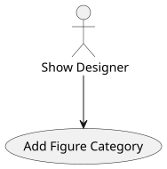
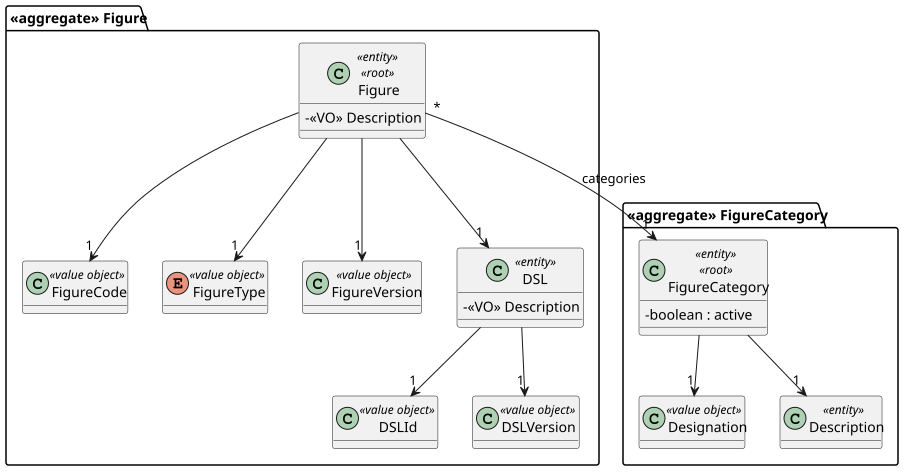
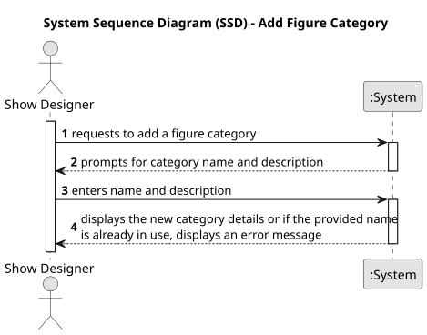
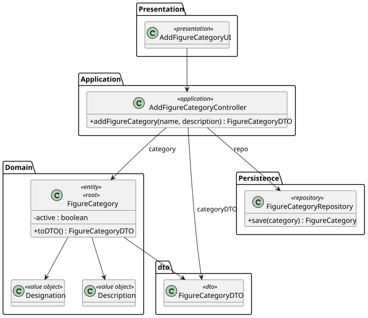
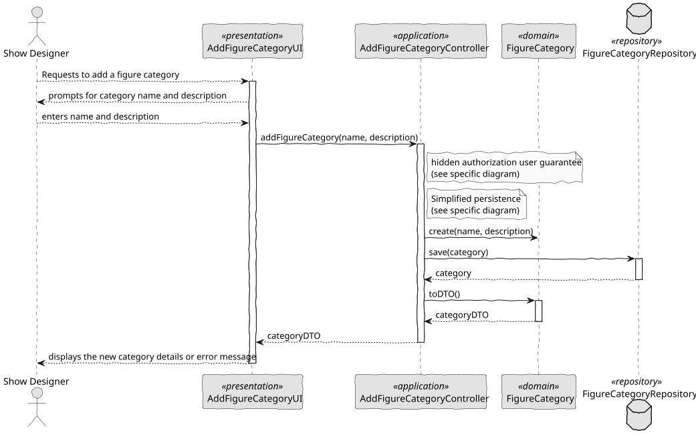

# US 245 - Add figure category

## 1. Context

*This task enables Show Designers to extend the figure classification system by adding new categories. Proper category management underpins catalogue organization, improves search/filter accuracy, and ensures consistency across all figure-related workflows.*

### 1.1 List of issues

**Analysis:**
- Determine the minimal domain model for FigureCategory (e.g., id, name).
- Specify validation rules: non-empty name, case-insensitive uniqueness.

**Design:**
- Draft a simple “Add Category” UI form with a text input for the category name and submit/cancel buttons.
- Define API contract: POST /api/categories with { name } payload, returns the created category or error.

**Implement:**
- Build the front-end form (accessible only to Show Designers).
- Add server-side logic in CategoryService.createCategory(name) that normalizes the name (e.g., to lower case) and checks for existing entries.
- Persist new categories in CategoryRepository.

**Test:**
- Unit-test the uniqueness check: attempts to create “Animals” after “animals” must fail.
- Integration-test the full HTTP flow: submission of valid and duplicate names.
- UI-test that success shows the new category in drop-downs and error displays appropriate messag

## 2. Requirements

**US 245:** As a Show Designer, I want to add a figure category to the figure category catalogue. The category name must be unique (not case sensitive).

**Acceptance Criteria:**

- *US245.1:* Show Designers can open an “Add Category” form.
- *US245.2:* The system enforces name uniqueness without regard to case (e.g., “Animals” ≡ “animals”).
- *US245.3:* Duplicate submission yields a clear error: “Category ‘X’ already exists.”
- *US245.4:* On success, the new category appears immediately in the category list or drop-down.
- *US245.5:* All downstream workflows (e.g., figure creation) include the newly added category.

**Dependencies/References:**

* Relies on the existing FigureCategory domain entity and CategoryRepository.
* Integrates with the figure-creation UI and its category dropdown component.
* Uses common validation utilities for string normalization.
* Follows the API conventions defined in the system’s developer guide.

-----

## 3. Analysis

### 3.1. Use Case Diagram



### 3.2. Domain Model

The domain model includes the FigureCategory entity (with the boolean attribute active) and the required value objects Designation and Description. Each Figure is mandatorily associated with a FigureCategory and has the value objects FigureCode, FigureType, FigureVersion, and a reference to DSL. The model enforces case-insensitive uniqueness of Designation and a mandatory relationship between figures and categories.



### 3.3. Sequence System Diagrams (SSD)

Shows the main interactions between the user and the system during the addition of a new category.



## 4. Design

### 4.1. Class Diagram (CD)

The following class diagrams define the structure and responsibilities of the classes involved in the use cases.
The classes include FigureCategory, Designation, Description, FigureCategoryRepository, AddFigureCategoryController, AddFigureCategoryUI, AddFigureCategoryAction, FigureCategoryDTO, FigureCategoryDTOParser e FigureCategoryDTOPrinter.



### 4.2. Sequence Diagram (SD)

Presents the detailed dynamic behavior of the system when a user adds a new figure category.



### 4.3. Applied Patterns

- MVC (Model-View-Controller): Separates user interface, application logic, and domain model.
- Repository Pattern: Used to abstract persistence logic in FigureCategoryRepository.
- Domain-Driven Design (DDD): Aggregates like Figure ensure consistency and encapsulate business rules.
- Authorization Check: Applied before critical operations through AuthorizationService.
- DTO (Data Transfer Object): Used to transfer data between layers in a decoupled way.


### 4.4. Acceptance Tests

*A significant part of the implementation uses native features of the framework, which already has comprehensive tests.
Therefore, we did not develop additional automatic tests for acceptance criteria covered by the framework,
focusing our efforts on testing only the integrations and customizations specific to our application.*

**Test 1:** *Valid category creation*

**Refers to Acceptance Criteria:** US245.1, US245.2

```
    @Test
    void ensureValidFigureCategoryIsCreated() {
        FigureCategory category = new FigureCategory(validName, validDescription);
        assertNotNull(category);
        assertEquals(validName, category.identity());
        assertTrue(category.isActive());
    }
```

**Test 2:** *Category creation with null name or description is rejected*

**Refers to Acceptance Criteria:** US245.2

```
    @Test
    void ensureCreationFailsWithNullNameOrDescription() {
        assertThrows(IllegalArgumentException.class, () -> new FigureCategory(null, validDescription));
        assertThrows(IllegalArgumentException.class, () -> new FigureCategory(validName, null));
    }
```

**Test 3:** *Conversion to DTO returns correct values*

**Refers to Acceptance Criteria:** US245.4

```
    @Test
    void ensureToDTOReturnsCorrectValues() {
        FigureCategory category = new FigureCategory(validName, validDescription);
        FigureCategoryDTO dto = category.toDTO();

        assertEquals(validName.toString(), dto.getName());
        assertEquals(validDescription.toString(), dto.getDescription());
        assertTrue(dto.getClass().equals(FigureCategoryDTO.class));
    }
```


## 5. Implementation

```
public class AddFigureCategoryController {

    private final AuthorizationService authz = AuthzRegistry.authorizationService();
    private final FigureCategoryRepository repo = PersistenceContext.repositories().figureCategories();

    public FigureCategoryDTO addFigureCategory(String name, String description) {
        authz.ensureAuthenticatedUserHasAnyOf(ShodroneRoles.POWER_USER, ShodroneRoles.SHOW_DESIGNER);

        FigureCategory figureCategory = new FigureCategory(
            Designation.valueOf(name.toLowerCase()),
            Description.valueOf(description)
        );
        return repo.save(figureCategory).toDTO();
    }
}
````


## 6. Integration/Demonstration

- To test the bootstrap process, simply run the script: *./run-bootstrap*
- To manually add a figure category, you must run the script *./run-backoffice*, log in with a user who is an Show Designer,
  and click on the Add Figure Category option.

## 7. Observations

This feature allows Show Designers to dynamically manage figure categories, 
ensuring organization and flexibility in the catalogue. Uniqueness validation 
is case-insensitive, preventing logical duplicates. Integration with the rest 
of the system is immediate, as new categories become available for all dependent 
operations.

