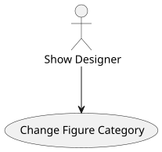
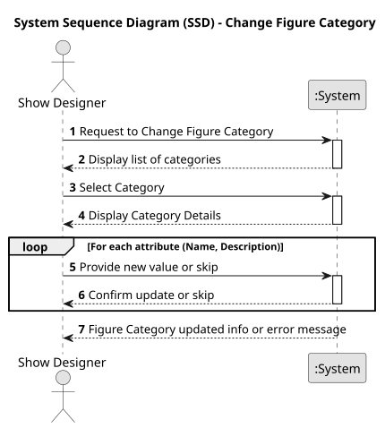
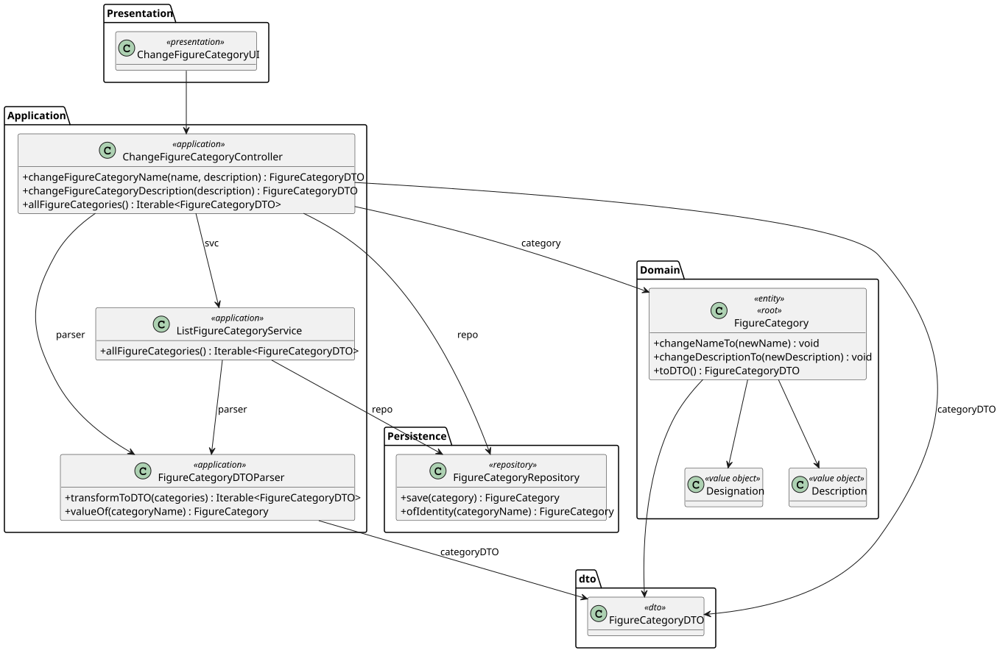
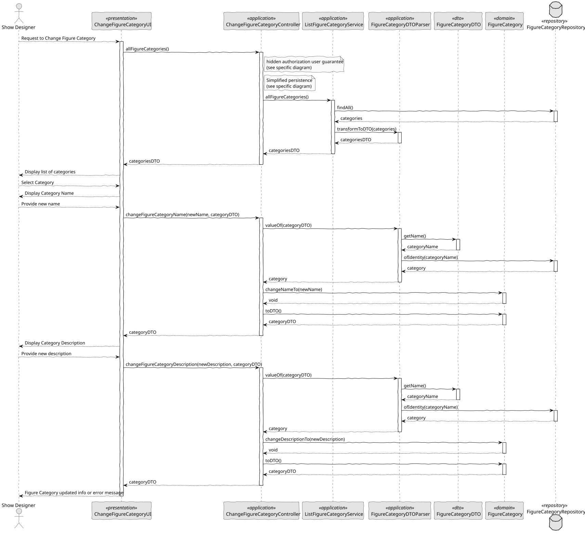

# US 246 - Edit figure category

## 1. Context

This task enables Show Designers to correct or refine category names in the figure category catalogue. It builds on the “Add Category” feature and maintains catalogue consistency by enforcing case-insensitive uniqueness while preserving existing figure associations.

### 1.1 List of issues

*Analysis:*
- Identify the FigureCategory fields that can be edited (name).
- Ensure uniqueness validation logic matches creation rules (case-insensitive).

*Design:*
- Sketch UI for browsing categories, selecting one, and editing its name.
- Define the API endpoint for update: PUT /api/categories/{id} with { name } payload.

*Implement:*
- Build the UI list of categories with an “Edit” action.
- Create the edit form pre-populated with the current name.
- In CategoryService.updateCategory(id, newName), normalize and check for duplicates before persisting.
- Preserve existing associations by only updating the name field.

*Test:*
- Unit-test that attempting to rename “Animals” to “animals” fails.
- Integration-test the full edit flow: load, change to a unique name, save, and verify.
- Verify that figures linked to the category remain correctly associated.

## 2. Requirements

*US 246:* As a Show Designer, I want to edit an existing figure category in the figure category catalogue.

*Acceptance Criteria:*

- US246.1: Show Designers can view and select an existing category to edit.
- US246.2: The edit form allows updating the category name and enforces case-insensitive uniqueness.
- US246.3: If the new name duplicates another (any casing), the system rejects the change with an error.
- US246.4: All figures already linked to the category retain their association after the rename.
- US246.5: The updated name appears everywhere categories are displayed or selected immediately after saving.

*Dependencies/References:*

* Dependence on the registration of the category figure.

-----

## 3. Analysis

### 3.1. Use Case Diagram

### 3.2. Domain Model

The domain model includes the FigureCategory entity and the required value objects Designation and Description. Each Figure is mandatorily associated with a FigureCategory and has the value objects FigureCode, FigureType, FigureVersion, and a reference to DSL. The model enforces case-insensitive uniqueness of Designation and a mandatory relationship between figures and categories.

### 3.3. Sequence System Diagrams (SSD)

Shows the main interactions between the user and the system during the updated of a category.

## 4. Design

### 4.1. Class Diagram (CD)

The following class diagrams define the structure and responsibilities of the classes involved in the use cases.

### 4.2. Sequence Diagram (SD)

Presents the detailed dynamic behavior of the system when a user edit a figure category.

### 4.3. Applied Patterns

- MVC (Model-View-Controller): Separates user interface, application logic, and domain model.
- Repository Pattern: Used to abstract persistence logic in FigureCategoryRepository.
- Domain-Driven Design (DDD): Aggregates like Figure ensure consistency and encapsulate business rules.
- Authorization Check: Applied before critical operations through AuthorizationService.
- DTO (Data Transfer Object): Used to transfer data between layers in a decoupled way.

### 4.4. Acceptance Tests

*A significant part of the implementation uses native features of the framework, which already has comprehensive tests.
Therefore, we did not develop additional automatic tests for acceptance criteria covered by the framework,
focusing our efforts on testing only the integrations and customizations specific to our application.*

*Test 1:* Valid name change

    @Test
    void ensureChangeNameToWorks() {
        FigureCategory category = new FigureCategory(validName, validDescription);
        Designation newName = Designation.valueOf("NewName");

        category.changeNameTo(newName);
        assertEquals(newName, category.identity());
    }

*Test 2:* Valid change description

    @Test
    void ensureChangeDescriptionToWorks() {
        FigureCategory category = new FigureCategory(validName, validDescription);
        Description newDescription = Description.valueOf("New description");

        category.changeDescriptionTo(newDescription);
        // No getter for description, but we can check via toDTO
        assertEquals(newDescription.toString(), category.toDTO().getDescription());
    }

*Test 3:* Invalid changed

    @Test
    void ensureChangeNameAndDescriptionThrowsOnNull() {
        FigureCategory category = new FigureCategory(validName, validDescription);

        assertThrows(IllegalArgumentException.class, () -> category.changeNameTo(null));
        assertThrows(IllegalArgumentException.class, () -> category.changeDescriptionTo(null));
    }

## 5. Implementation

    public FigureCategoryDTO changeFigureCategoryName(final String newName, FigureCategoryDTO categoryDTO) {
        authz.ensureAuthenticatedUserHasAnyOf(ShodroneRoles.POWER_USER, ShodroneRoles.SHOW_DESIGNER);

        FigureCategory category = new FigureCategoryDTOParser(repo).valueOf(categoryDTO);
        category.changeNameTo(Designation.valueOf(newName));

        return repo.save(category).toDTO();
    }

    public FigureCategoryDTO changeFigureCategoryDescription(final String newDescription, FigureCategoryDTO categoryDTO) {
        authz.ensureAuthenticatedUserHasAnyOf(ShodroneRoles.POWER_USER, ShodroneRoles.SHOW_DESIGNER);

        FigureCategory category = new FigureCategoryDTOParser(repo).valueOf(categoryDTO);
        category.changeDescriptionTo(Description.valueOf(newDescription));

        return repo.save(category).toDTO();
    }

    public Iterable<FigureCategoryDTO> allFigureCategories() {
        return categoryService.allFigureCategories();
    }
`

## 6. Integration/Demonstration

- To test the bootstrap process, simply run the script: ./run-bootstrap
- To manually add a figure category, you must run the script ./run-backoffice, log in with a user who is an Show Designer,
  and click on the Edit Figure Category option.

## 7. Observations

This feature allows Show Designers to dynamically manage figure categories,
ensuring organization and flexibility in the catalogue. Uniqueness validation
is case-insensitive, preventing logical duplicates. Integration with the rest
of the system is immediate, as new categories become available for all dependent
operations.

