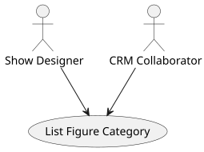
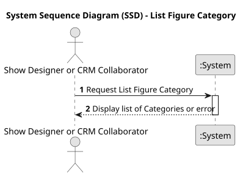
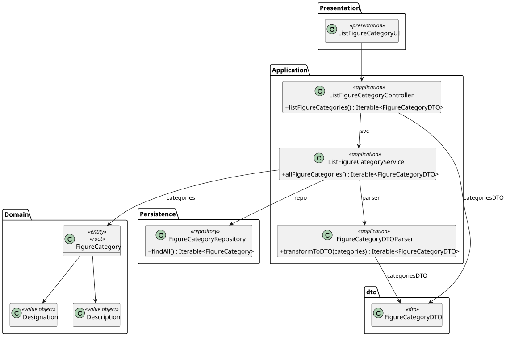
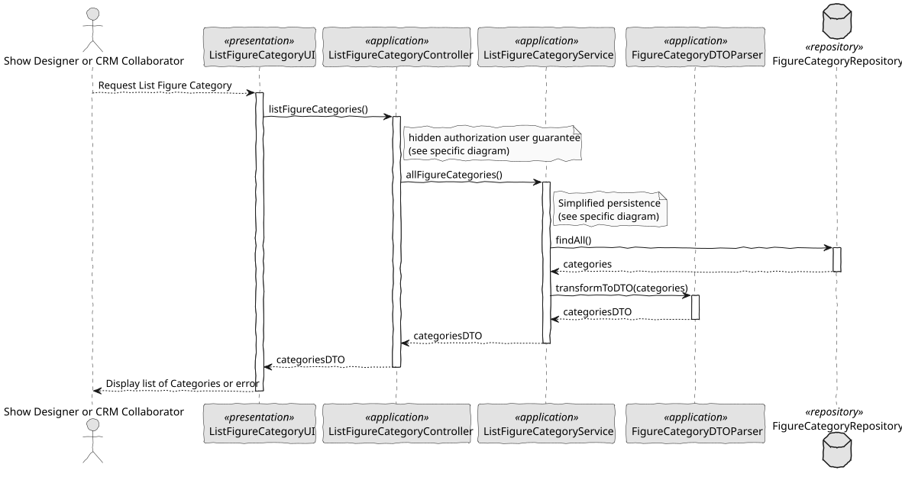

# US 247 - List figure categories

## 1. Context

This task implements the “List Figure Categories” feature, enabling Show Designers and CRM Collaborators to get a comprehensive view of all categories in the system along with their active/inactive status. It supports catalogue management and selection workflows by making category availability explicit.

### 1.1 List of issues

*Analysis:*
- Identify which fields to display (name, status).
- Determine default ordering (alphabetical) and optional filters (by status).
- Decide how to visually distinguish inactive entries.

*Design:*
- Sketch a simple table or list view showing category name and status column.
- Specify sorting controls (e.g., click on header) and a status filter dropdown.

*Implement:*
- Build a backend endpoint GET /api/categories that returns all categories with their active flag.
- Develop a UI component (table or list) that consumes this endpoint, displays name and status, and supports sorting/filtering.
- Apply styling (e.g., greyed-out row or “Inactive” label) for inactive categories.
- Enforce role-based access so only Show Designers and CRM Collaborators can reach this view.

*Test:*
- Unit-test the service layer to ensure all categories, active and inactive, are returned.
- Integration-test the endpoint for correct JSON shape and ordering.
- UI-test that the list renders correctly, inactive categories are marked, sorting and filtering work, and unauthorized users are blocked.

## 2. Requirements

*US 247:* As a Show Designer or CRM Collaborator, I want to list all figure categories in the catalogue. The category status information should be provided.

*Acceptance Criteria:*

- US247.1: Show Designers and CRM Collaborators can access the category‐listing interface.
- US247.2: Each entry displays the category name and its status (Active or Inactive).
- US247.3: The list is ordered alphabetically by default, with optional sorting or filtering (e.g., filter by status).
- US247.4: Inactive categories are visually distinguishable (greyed out or labeled “Inactive”).
- US247.5: Role‐based access restricts this view to Show Designers and CRM Collaborators only.

*Dependencies/References:*

* Dependence on the registration of the category figure.

-----

## 3. Analysis

### 3.1. Use Case Diagram

### 3.2. Domain Model

The domain model includes the FigureCategory entity (with the boolean attribute active) and the required value objects Designation and Description. Each Figure is mandatorily associated with a FigureCategory and has the value objects FigureCode, FigureType, FigureVersion, and a reference to DSL. The model enforces case-insensitive uniqueness of Designation and a mandatory relationship between figures and categories.

### 3.3. Sequence System Diagrams (SSD)

Shows the main interactions between the user and the system during the show list categories.

## 4. Design

### 4.1. Class Diagram (CD)

The following class diagrams define the structure and responsibilities of the classes involved in the use cases.

### 4.2. Sequence Diagram (SD)

Presents the detailed dynamic behavior of the system when a list of figure categories.

### 4.3. Applied Patterns

- MVC (Model-View-Controller): Separates user interface, application logic, and domain model.
- Repository Pattern: Used to abstract persistence logic in FigureCategoryRepository.
- Domain-Driven Design (DDD): Aggregates like Figure ensure consistency and encapsulate business rules.
- Authorization Check: Applied before critical operations through AuthorizationService.
- DTO (Data Transfer Object): Used to transfer data between layers in a decoupled way.

### 4.4. Acceptance Tests

*A significant part of the implementation uses native features of the framework, which already has comprehensive tests.
Therefore, we did not develop additional automatic tests for acceptance criteria covered by the framework,
focusing our efforts on testing only the integrations and customizations specific to our application.*

*Test 1:* Conversion to DTO returns correct values

    @Test
    void ensureToDTOReturnsCorrectValues() {
        FigureCategory category = new FigureCategory(validName, validDescription);
        FigureCategoryDTO dto = category.toDTO();

        assertEquals(validName.toString(), dto.getName());
        assertEquals(validDescription.toString(), dto.getDescription());
        assertTrue(dto.getClass().equals(FigureCategoryDTO.class));
    }

## 5. Implementation

    public Iterable<FigureCategoryDTO> listFigureCategories() {
        authz.ensureAuthenticatedUserHasAnyOf(ShodroneRoles.POWER_USER, ShodroneRoles.SHOW_DESIGNER, ShodroneRoles.CRM_COLLABORATOR);
        return categoryService.allFigureCategories();
    }
`

    public Iterable<FigureCategoryDTO> allFigureCategories() {
        final Iterable<FigureCategory> categories = repo.findAll();
        return FigureCategoryDTOParser.transformToDTO(categories);
    }
`

## 6. Integration/Demonstration

- To test the bootstrap process, simply run the script: ./run-bootstrap
- To manually add a figure category, you must run the script ./run-backoffice, log in with a user who is an Show Designer,
  and click on the List Figure Category option.

## 7. Observations

This feature allows Show Designers to dynamically manage figure categories,
ensuring organization and flexibility in the catalogue. Uniqueness validation
is case-insensitive, preventing logical duplicates. Integration with the rest
of the system is immediate, as new categories become available for all dependent
operations.

