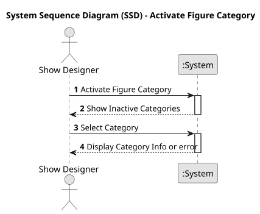
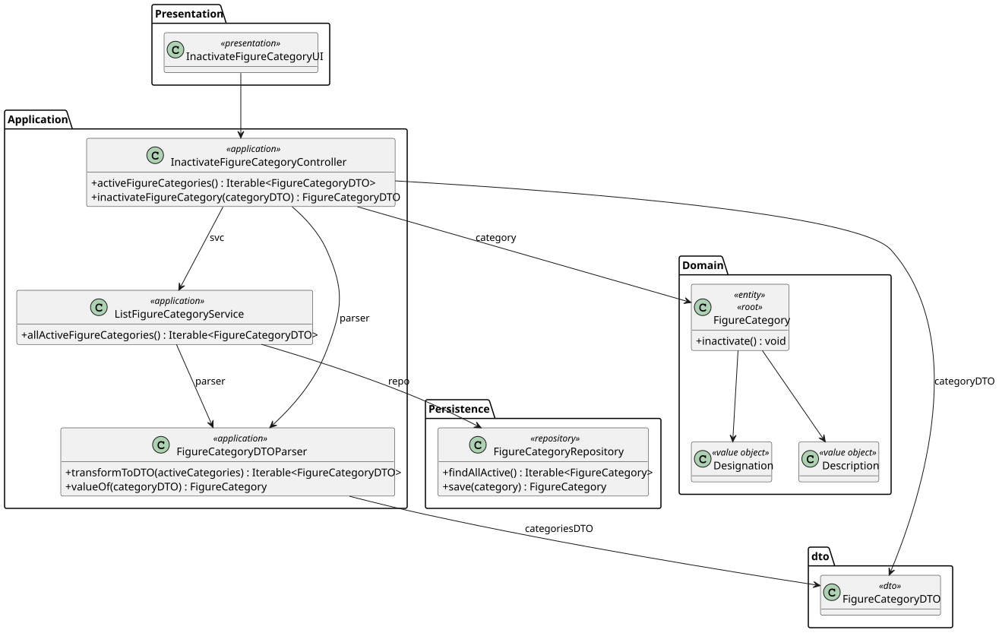
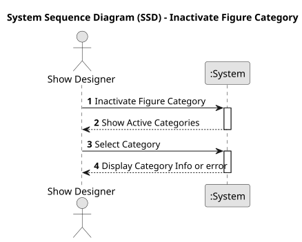
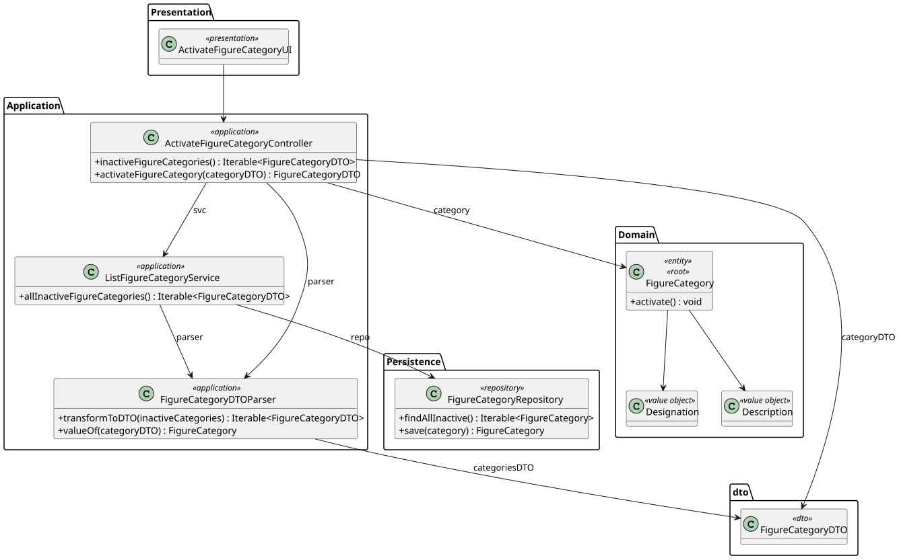
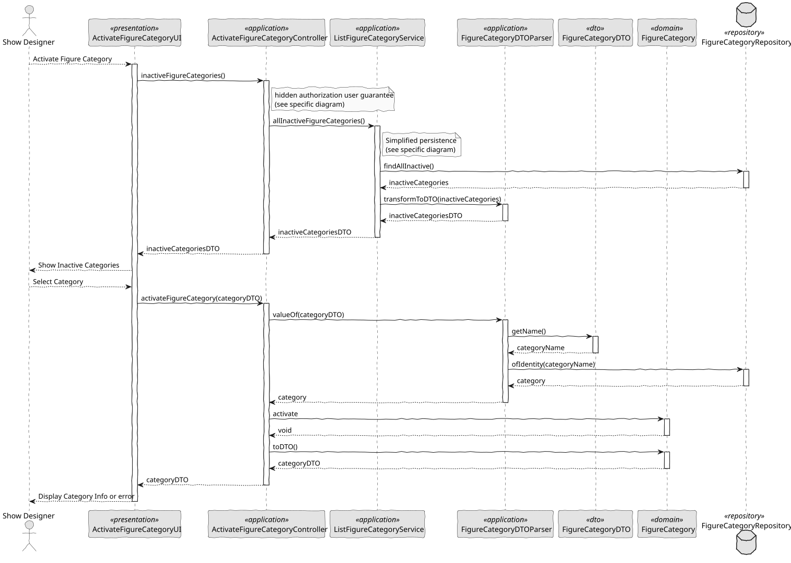
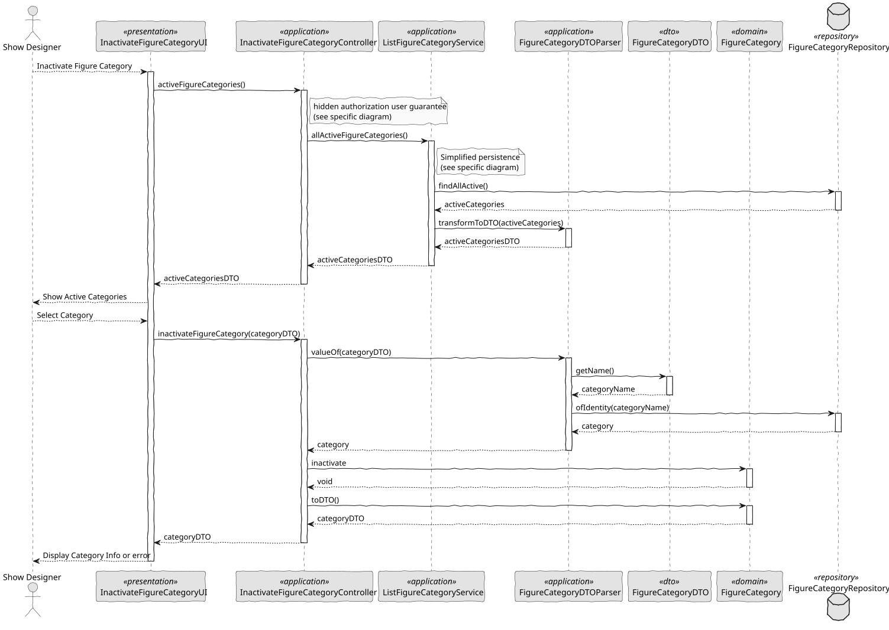

# US 248 - Inactivate/Activate a figure category

## 1. Context

This task adds the ability for Show Designers to toggle the active/inactive status of figure categories. Inactivating a category prevents its use in new figure definitions while preserving it for historical reporting; reactivating restores its availability. Clear status management keeps the catalogue aligned with current needs.

### 1.1 List of issues

*Analysis:*
- Determine how to represent status on FigureCategory (e.g., active: boolean).
- Identify all UI contexts and APIs that must reflect status changes.

*Design:*
- Sketch UI for the category‐list view with an “Activate/Deactivate” toggle or button.
- Define API endpoint: PATCH /api/categories/{id}/status with { active: boolean } payload.

*Implement:*
- Add toggle control in the category management UI, visible to Show Designers.
- Implement CategoryService.setActiveStatus(id, active) to update the flag and persist.
- Modify figure‐creation UI to filter out categories where active == false.

*Test:*
- Unit-test the service method to flip active and return updated category.
- Integration-test the PATCH endpoint for both activation and deactivation flows.
- UI-test that toggling updates the list immediately and that inactive categories are excluded from the new-figure form.

## 2. Requirements

*US 248:* As a Show Designer, I want to inactivate/activate an existing figure category in the figure category catalogue. Inactivated categories cannot be used in new figures.

*Acceptance Criteria:*

- US248.1: The category list UI shows each category’s current status (Active or Inactive).
- US248.2: Show Designers can toggle a category’s status between active and inactive via a button or switch.
- US248.3: Inactive categories are not available for selection when adding or editing figures.
- US248.4: Figures already associated with a category retain their links regardless of its status.
- US248.5: A confirmation or success message appears after status change.
- US248.6: Status changes reflect immediately in both the category list and the figure‐creation/editing form.

*Dependencies/References:*

* Dependence on the registration of the category figure.

-----

## 3. Analysis

### 3.1. Use Case Diagram

### 3.2. Domain Model

The domain model includes the FigureCategory entity (with the boolean attribute active) and the required value objects Designation and Description. Each Figure is mandatorily associated with a FigureCategory and has the value objects FigureCode, FigureType, FigureVersion, and a reference to DSL. The model enforces case-insensitive uniqueness of Designation and a mandatory relationship between figures and categories.

### 3.3. Sequence System Diagrams (SSD)

Shows the main interactions between the user and the system.

*Activate Category:* Interaction showing how an user activate a figure category.

*Inactivate Category:* Interaction showing how an user inactivate a figure category.

## 4. Design

### 4.1. Class Diagram (CD)

The following class diagrams define the structure and responsibilities of the classes involved in the use cases.

*Activate Category:*

*Inactivate Category:*

### 4.2. Sequence Diagram (SD)

*Activate Category:* Interaction showing how an user activate a figure category.

*Inactivate Category:* Interaction showing how an user inactivate a figure category.

### 4.3. Applied Patterns

- MVC (Model-View-Controller): Separates user interface, application logic, and domain model.
- Repository Pattern: Used to abstract persistence logic in FigureCategoryRepository.
- Domain-Driven Design (DDD): Aggregates like Figure ensure consistency and encapsulate business rules.
- Authorization Check: Applied before critical operations through AuthorizationService.
- DTO (Data Transfer Object): Used to transfer data between layers in a decoupled way.

### 4.4. Acceptance Tests

*A significant part of the implementation uses native features of the framework, which already has comprehensive tests.
Therefore, we did not develop additional automatic tests for acceptance criteria covered by the framework,
focusing our efforts on testing only the integrations and customizations specific to our application.*

*Test 1:* Inactivate category

    @Test
    void ensureInactivateWorksAndThrowsIfAlreadyInactive() {
        FigureCategory category = new FigureCategory(validName, validDescription);
        assertTrue(category.isActive());

        category.inactivate();
        assertFalse(category.isActive());

        // inactivate again should throw
        assertThrows(IllegalStateException.class, category::inactivate);
    }

*Test 2:* Activate category

    @Test
    void ensureActivateWorksAndThrowsIfAlreadyActive() {
        FigureCategory category = new FigureCategory(validName, validDescription);
        assertTrue(category.isActive());

        // activate when already active should throw
        assertThrows(IllegalStateException.class, category::activate);

        category.inactivate();
        assertFalse(category.isActive());

        category.activate();
        assertTrue(category.isActive());
    }

## 5. Implementation

    public Iterable<FigureCategoryDTO> inactiveFigureCategories() {
        authz.ensureAuthenticatedUserHasAnyOf(ShodroneRoles.POWER_USER, ShodroneRoles.SHOW_DESIGNER);
        return categoryService.allInactiveFigureCategories();
    }

    public FigureCategoryDTO activateFigureCategory(final FigureCategoryDTO categoryDTO) {
        authz.ensureAuthenticatedUserHasAnyOf(ShodroneRoles.POWER_USER, ShodroneRoles.SHOW_DESIGNER);

        FigureCategory category = new FigureCategoryDTOParser(repo).valueOf(categoryDTO);
        category.activate();
        return repo.save(category).toDTO();
    }
`

    public Iterable<FigureCategoryDTO> activeFigureCategories() {
        authz.ensureAuthenticatedUserHasAnyOf(ShodroneRoles.POWER_USER, ShodroneRoles.SHOW_DESIGNER);
        return categoryService.allActiveFigureCategories();
    }

    public FigureCategoryDTO inactivateFigureCategory(final FigureCategoryDTO categoryDTO) {
        authz.ensureAuthenticatedUserHasAnyOf(ShodroneRoles.POWER_USER, ShodroneRoles.SHOW_DESIGNER);

        FigureCategory category = new FigureCategoryDTOParser(repo).valueOf(categoryDTO);
        category.inactivate();
        return repo.save(category).toDTO();
    }
`

## 6. Integration/Demonstration

- To test the bootstrap process, simply run the script: ./run-bootstrap
- To manually add a figure category, you must run the script ./run-backoffice, log in with a user who is an Show Designer,
  and click on the Activate or Inactivate Figure Category option.

## 7. Observations

This feature allows Show Designers to dynamically manage figure categories,
ensuring organization and flexibility in the catalogue. Uniqueness validation
is case-insensitive, preventing logical duplicates. Integration with the rest
of the system is immediate, as new categories become available for all dependent
operations.

