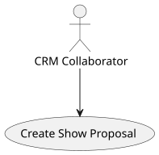
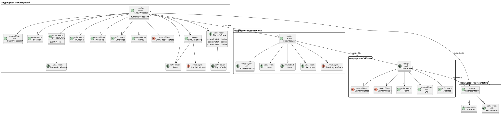
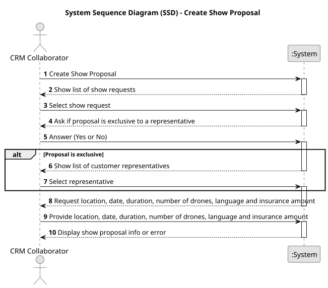
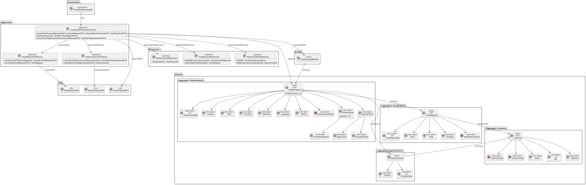
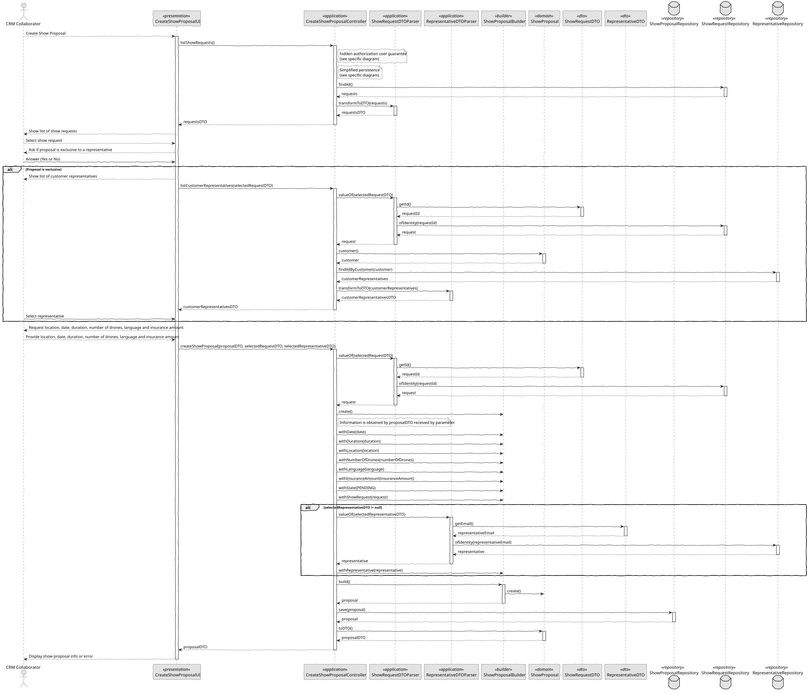

# US 310 - Create Show Proposal

## 1. Context

*This task involves implementing the feature described in the user story where a CRM Collaborator can initiate the creation of a show proposal. It marks the first implementation step towards managing show proposals within the system and lays the groundwork for customer feedback and further workflow steps like planning and scheduling. The proposal includes the total number of drones and must conform to a predefined structure.*

### 1.1 List of issues

**Analysis:**
- Identify required fields for the proposal form (e.g., number of drones, customer, template).
- Define the structure of the show proposal entity.
- Review and document the show proposal template constraints.

**Design:**
- Create wireframes for the proposal creation form.
- Design the data flow from form input to persistent storage.

**Implement:**
- Develop the backoffice form for creating a show proposal.
- Implement logic for validating and saving show proposals.

**Test:**
- Validate all required inputs
- Ensure correct persistence and retrieval of proposals.
- Test error handling for invalid or incomplete proposals.


## 2. Requirements

**US 310:**  As a CRM Collaborator, I want to start the process for creating a show proposal so that we can reply to the customer.

**Acceptance Criteria:**

- *US310.1:* The system must provide a backoffice form to create a new show proposal.
- *US310.2:* The proposal must include the total number of drones to be used in the show.
- *US310.3:* All figures in the proposal must use the full set of drones.
- *US310.4:* The proposal must comply with a predefined template.
- *US310.5:* The system must validate all inputs and ensure compliance with the template.
- *US310.6:* The proposal must be saved and made accessible for further steps.
- *US310.7:* The system must provide confirmation feedback upon successful creation.
- 
**Dependencies/References:**

* This feature integrates with show request management.
* References include the show template specification and design documentation.

## 3. Analysis

### 3.1. Use Case Diagram



### 3.2. Domain Model



### 3.3. Sequence System Diagrams (SSD)

Shows the main interactions between a CRM Collaborator and the system during a show proposal registration process.



## 4. Design

### 4.1. Class Diagram (CD)

The class diagram defines the structure and responsibilities of the main classes involved in the Create Show Proposal use case.



### 4.2. Sequence Diagram (SD)

Presents the detailed dynamic behavior of the system during the registration of a show proposal. It includes the interactions between UI, Controller, Service, and Repositories, capturing the creation flow of a ShowProposal, and system validation/authorization.



### 4.3. Applied Patterns

- MVC (Model-View-Controller): Separates user interface, application logic, and domain model.
- Repository Pattern: Used to abstract persistence logic in ShowProposalRepository.
- Domain-Driven Design (DDD): Aggregates like ShowProposal ensure consistency and encapsulate business rules.
- Authorization Check: Applied before critical operations through AuthorizationService.

### 4.4. Acceptance Tests

```
    @Test
    void ensureValidShowProposalIsCreated() {
        final var proposal = new ShowProposal(
                VALID_LOCATION,
                VALID_DATE,
                VALID_DURATION,
                VALID_DRONES,
                VALID_INSURANCE,
                VALID_STATE,
                VALID_SHOW_REQUEST,
                VALID_REPRESENTATIVE
        );
        assertNotNull(proposal);
        assertEquals(VALID_LOCATION.latitude(), proposal.toDTO().latitudeLocation());
        assertEquals(VALID_LOCATION.longitude(), proposal.toDTO().longitudeLocation());
        assertEquals(VALID_DATE, proposal.toDTO().date());
        assertEquals(VALID_DRONES, proposal.toDTO().numberOfDrones());
        assertEquals(VALID_INSURANCE.amountAsDouble(), proposal.toDTO().insuranceAmount());
        assertEquals(VALID_SHOW_REQUEST.identity(), proposal.toDTO().showRequestId());
        assertEquals(VALID_REPRESENTATIVE.identity().toString(), proposal.toDTO().representativeEmail());
    }

    @Test
    void ensureAllParametersAreRequired() {
        assertThrows(IllegalArgumentException.class, () -> new ShowProposal(null, VALID_DATE, VALID_DURATION, VALID_DRONES, VALID_INSURANCE, VALID_STATE, VALID_SHOW_REQUEST, VALID_REPRESENTATIVE));
        assertThrows(IllegalArgumentException.class, () -> new ShowProposal(VALID_LOCATION, null, VALID_DURATION, VALID_DRONES, VALID_INSURANCE, VALID_STATE, VALID_SHOW_REQUEST, VALID_REPRESENTATIVE));
        assertThrows(IllegalArgumentException.class, () -> new ShowProposal(VALID_LOCATION, VALID_DATE, null, VALID_DRONES, VALID_INSURANCE, VALID_STATE, VALID_SHOW_REQUEST, VALID_REPRESENTATIVE));
        assertThrows(IllegalArgumentException.class, () -> new ShowProposal(VALID_LOCATION, VALID_DATE, VALID_DURATION, VALID_DRONES, null, VALID_STATE, VALID_SHOW_REQUEST, VALID_REPRESENTATIVE));
        assertThrows(IllegalArgumentException.class, () -> new ShowProposal(VALID_LOCATION, VALID_DATE, VALID_DURATION, VALID_DRONES, VALID_INSURANCE, null, VALID_SHOW_REQUEST, VALID_REPRESENTATIVE));
        assertThrows(IllegalArgumentException.class, () -> new ShowProposal(VALID_LOCATION, VALID_DATE, VALID_DURATION, VALID_DRONES, VALID_INSURANCE, VALID_STATE, null, VALID_REPRESENTATIVE));
    }

    @Test
    void ensureNegativeDroneCountNotAllowed() {
        assertThrows(IllegalArgumentException.class, () -> new ShowProposal(
                VALID_LOCATION, VALID_DATE, VALID_DURATION, -1, VALID_INSURANCE, VALID_STATE, VALID_SHOW_REQUEST, VALID_REPRESENTATIVE));
    }

    @Test
    void ensureShowProposalCanBeCreatedWithoutRepresentative() {
        final var proposal = new ShowProposal(
                VALID_LOCATION,
                VALID_DATE,
                VALID_DURATION,
                VALID_DRONES,
                VALID_INSURANCE,
                VALID_STATE,
                VALID_SHOW_REQUEST,
                null // no representative assigned
        );

        assertNotNull(proposal);
        assertNull(proposal.toDTO().representativeEmail());
    }
````

## 5. Implementation

```
    public ShowProposalDTO createShowProposal(ShowProposalDTO proposalDTO, ShowRequestDTO selectedRequestDTO, RepresentativeDTO selectedRepresentativeDTO) {
        authz.ensureAuthenticatedUserHasAnyOf(ShodroneRoles.POWER_USER, ShodroneRoles.CRM_COLLABORATOR);

        final ShowRequest showRequest = new ShowRequestDTOParser(showRequestRepository).valueOf(selectedRequestDTO);

        ShowProposalBuilder showProposalBuilder = new ShowProposalBuilder().withDate(proposalDTO.date()).withDuration(proposalDTO.duration()).withState(ShowProposalState.PENDING).withLocation(proposalDTO.latitudeLocation(), proposalDTO.longitudeLocation())
                .withNumberOfDrones(proposalDTO.numberOfDrones()).withInsuranceAmount(proposalDTO.insuranceAmount()).withShowRequest(showRequest);

        if (selectedRepresentativeDTO != null) {
            final Representative representative = new RepresentativeDTOParser(representativeRepository).valueOf(selectedRepresentativeDTO);
            showProposalBuilder.withRepresentative(representative);
        }

        ShowProposal showProposal = showProposalBuilder.build();

        return showProposalRepository.save(showProposal).toDTO();
    }
````


## 6. Integration/Demonstration

- To test the bootstrap process, simply run the script: ./run-bootstrap
- To manually register a show proposal, you must run the script ./run-backoffice, log in with a user who has the role CRM Collaborator or Power User, and click on the Register Show Proposal option.

## 7. Observations

This feature enables structured proposal creation with compliance checks and reuse of show templates. It ensures that each proposal leverages the full drone capacity and aligns with system-wide business rules, setting the stage for further interactions such as scheduling or customer approval.