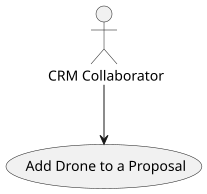
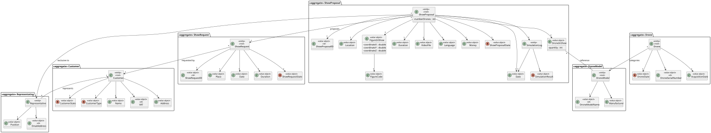
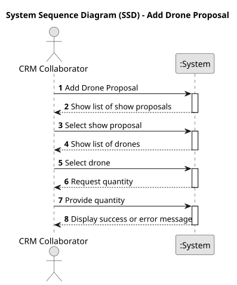
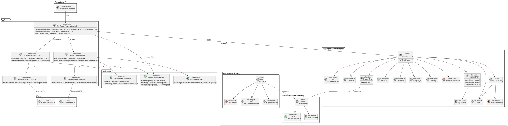
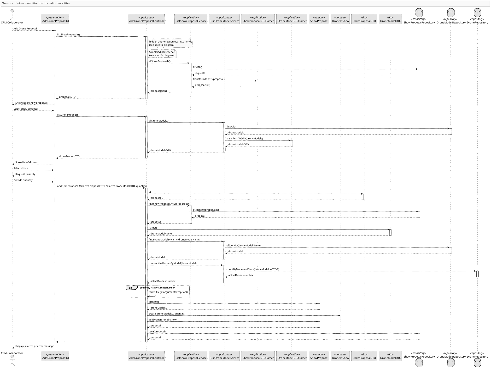

# US 311 - Add Drones to a Proposal

## 1. Context

*This task extends the creation of a show proposal by enabling a CRM Collaborator to configure the list of drone models used in the proposal. This ensures alignment between requested drone resources and available inventory, reinforcing consistency and operational feasibility.*

### 1.1 List of issues

**Analysis:**
- Define structure for associating drone models and their counts with a proposal.
- Analyze constraints based on available inventory of active drones.

**Design:**
- Update UI form to allow drone model selection and quantity.
- Design validations for inventory compatibility.

**Implement:**
- Add logic to validate proposal drone counts against inventory.
- Extend proposal creation process to support drone configurations.

**Test:**
- Validate that configured drones do not exceed active inventory.
- Ensure correct proposal persistence and retrieval.
- Test error handling when exceeding available drone count.

## 2. Requirements

**US 311:**  As a CRM Collaborator, I want to configure the list of drone models (number of drones and model) of a show proposal.

**Acceptance Criteria:**

- *US311.1:* The system must allow the CRM Collaborator to specify the number and model of drones used in the proposal.
- *US311.2:* The number of drones per model must not exceed the number of active drones of that model in inventory.
- *US311.3:* No need to check the availability of drones for the same date in other shows.
- *US311.4:* The configured list of drones must be persisted as part of the proposal.
- *US311.5:* The system must notify the user in case of exceeding inventory limits.

**Dependencies/References:**

* Extends the functionality of US310.
* Uses drone inventory management as data source.

## 3. Analysis

### 3.1. Use Case Diagram



### 3.2. Domain Model



### 3.3. Sequence System Diagrams (SSD)

Shows the main interactions between a CRM Collaborator and the system.



## 4. Design

### 4.1. Class Diagram (CD)

The class diagram defines the structure and responsibilities of the main classes involved in the Add Drone Proposal use case.



### 4.2. Sequence Diagram (SD)

Presents the detailed dynamic behavior of the system during the registration of a show proposal. It includes the interactions between UI, Controller, Service, and Repositories, capturing the creation flow of a ShowProposal, and system validation/authorization.



### 4.3. Applied Patterns

- MVC (Model-View-Controller): Separates user interface, application logic, and domain model.
- Repository Pattern: Used to abstract persistence logic in ShowProposalRepository.
- Domain-Driven Design (DDD): Aggregates like ShowProposal ensure consistency and encapsulate business rules.
- Authorization Check: Applied before critical operations through AuthorizationService.

### 4.4. Acceptance Tests

```
    @Test
    void ensureDroneIsAddedSuccessfully() {
        ShowProposal proposal = new ShowProposal(
                VALID_LOCATION, VALID_DATE, VALID_DURATION, VALID_DRONES, VALID_INSURANCE, VALID_STATE, VALID_SHOW_REQUEST, VALID_REPRESENTATIVE
        );

        DroneInShow drone1 = new DroneInShow("ModelX", 10);
        proposal.addDrone(drone1);

        assertTrue(proposal.toString().contains("ModelX"));
    }

    @Test
    void ensureDronesAreConfiguredCorrectly() {
        ShowProposal proposal = new ShowProposal(
                VALID_LOCATION, VALID_DATE, VALID_DURATION, VALID_DRONES, VALID_INSURANCE, VALID_STATE, VALID_SHOW_REQUEST, VALID_REPRESENTATIVE
        );

        DroneInShow drone1 = new DroneInShow("ModelA", 20);
        DroneInShow drone2 = new DroneInShow("ModelB", 25);

        Set<DroneInShow> droneSet = new HashSet<>();
        droneSet.add(drone1);
        droneSet.add(drone2);

        proposal.configureDrones(droneSet);

        assertTrue(proposal.toString().contains("ModelA"));
        assertTrue(proposal.toString().contains("ModelB"));
    }

    @Test
    void ensureConfigureDronesReplacesOldOnes() {
        ShowProposal proposal = new ShowProposal(
                VALID_LOCATION, VALID_DATE, VALID_DURATION, VALID_DRONES, VALID_INSURANCE, VALID_STATE, VALID_SHOW_REQUEST, VALID_REPRESENTATIVE
        );

        DroneInShow oldDrone = new DroneInShow("OldModel", 30);
        proposal.addDrone(oldDrone);

        DroneInShow newDrone = new DroneInShow("NewModel", 40);
        Set<DroneInShow> newDroneSet = new HashSet<>();
        newDroneSet.add(newDrone);

        proposal.configureDrones(newDroneSet);

        assertFalse(proposal.toString().contains("OldModel"));
        assertTrue(proposal.toString().contains("NewModel"));
    }

    @Test
    void ensureAddDroneThrowsIfNull() {
        ShowProposal proposal = new ShowProposal(
                VALID_LOCATION, VALID_DATE, VALID_DURATION, VALID_DRONES, VALID_INSURANCE, VALID_STATE, VALID_SHOW_REQUEST, VALID_REPRESENTATIVE
        );

        assertThrows(IllegalArgumentException.class, () -> proposal.addDrone(null));
    }

    @Test
    void ensureConfigureDronesThrowsIfNull() {
        ShowProposal proposal = new ShowProposal(
                VALID_LOCATION, VALID_DATE, VALID_DURATION, VALID_DRONES, VALID_INSURANCE, VALID_STATE, VALID_SHOW_REQUEST, VALID_REPRESENTATIVE
        );

        assertThrows(IllegalArgumentException.class, () -> proposal.configureDrones(null));
    }
````

## 5. Implementation

```
    public void addDroneProposal(final ShowProposalDTO selectedProposalDTO, final DroneModelDTO selectedDroneModelDTO, final int quantity) {
        authz.ensureAuthenticatedUserHasAnyOf(ShodroneRoles.POWER_USER, ShodroneRoles.CRM_COLLABORATOR);

        ShowProposal showProposal = proposalSvc.findShowProposalByID(selectedProposalDTO.id());
        DroneModel droneModel = droneSvc.findDroneModelByName(selectedDroneModelDTO.getName());

        long activeDronesNumber = droneSvc.countActiveDronesByModel(droneModel);
        if (quantity > activeDronesNumber) {
            throw new IllegalArgumentException("The requested quantity (" + quantity + ") exceeds the number of available active drones for this model (" + activeDronesNumber + ").");
        }

        showProposal.addDrone(new DroneInShow(droneModel.identity().toString(), quantity));

        showProposalRepository.save(showProposal);
    }

    public Iterable<ShowProposalDTO> listShowProposals() {
        return proposalSvc.allShowProposals();
    }

    public Iterable<DroneModelDTO> listDroneModels() {
        return droneSvc.allDroneModels();
    }
````

## 6. Integration/Demonstration

- To test the bootstrap process, simply run the script: ./run-bootstrap
- To manually add drone in proposal, you must run the script ./run-backoffice, log in with a user who has the role CRM Collaborator or Power User, and click on the Add Drone Proposal option.

## 7. Observations

This user story adds fine-grained drone configuration to the proposal system, ensuring only feasible configurations are submitted. It maintains system consistency and improves alignment with resource planning constraints.