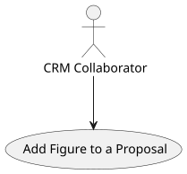
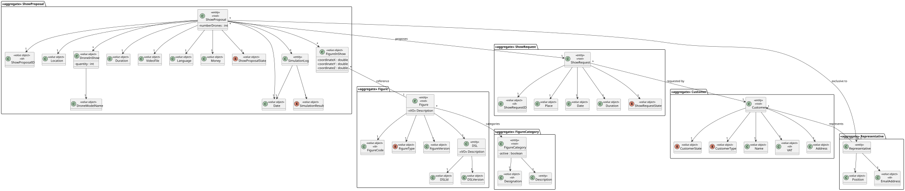
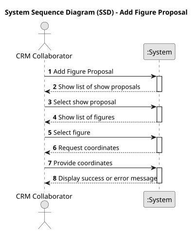
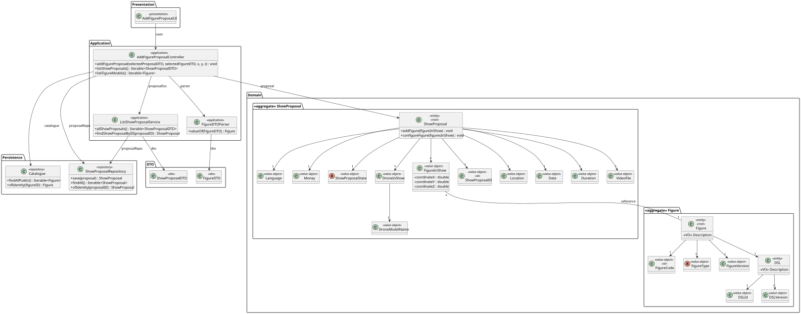
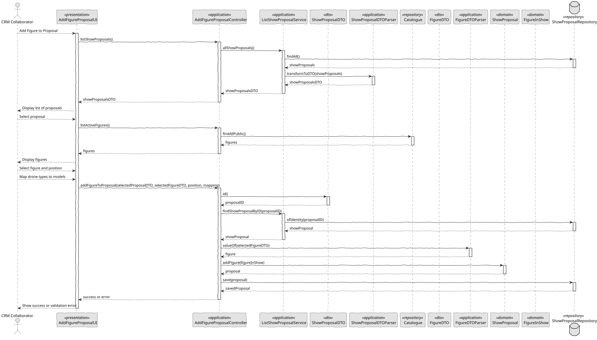

# US 312 - Add figures to a proposal

## 1. Context

This task extends the functionality of configuring a show proposal by allowing a CRM Collaborator to insert active figures into the show’s sequence. Each figure can appear more than once, provided it is not repeated consecutively. The user must also define a mapping between the drone types required by each figure and the drone models already selected for the proposal. This ensures that show content is valid, drone compatibility is guaranteed, and the sequence follows operational rules.

### 1.1 List of issues

Analysis:
- Identify how figures are structured and stored in a show proposal.
- Define rules and constraints for figure ordering and repetition.
- Analyze how drone type-to-model mappings must be validated.

Design:
- Design UI for selecting figures and defining their order.
- Design mechanism for drone type-to-model mapping per figure.
- Define error messages and validation flows.

Implement:
- Enable listing and selection of active figures.
- Prevent consecutive repetitions of the same figure.
- Support mapping between drone types and available models.
- Store the full figure sequence and mappings in the proposal.

Test:
- Verify multiple figures can be added, with no consecutive duplicates.
- Validate that only active figures are selectable.
- Ensure correct enforcement of figure-to-drone mapping logic.
- Test persistence and retrieval of the configured figure sequence.
- Handle invalid inputs with appropriate user feedback.

## 2. Requirements

**US 312:** As a CRM Collaborator, I want to add one of the available figures to a show proposal.

**Acceptance Criteria:**

- *US312.1:* The user can view and select from the list of active figures.
- *US312.2:* The same figure may be added multiple times to a proposal.
- *US312.3:* The system must prevent two identical figures from appearing in consecutive positions.
- *US312.4:* The user must define the mapping between each figure's required drone types and the actual drone models included in the proposal.
- *US312.5:* The configuration must be validated and saved successfully, preserving the correct order and mappings.

**Dependencies/References:**

* Extends the behavior introduced in US310 (initial proposal creation).
* Uses the list of active figures from the figure catalogue.
* Depends on drone configuration established in US311.

## 3. Analysis

### 3.1. Use Case Diagram



### 3.2. Domain Model



### 3.3. Sequence System Diagrams (SSD)

Shows the main interactions between a CRM Collaborator and the system.



## 4. Design

### 4.1. Class Diagram (CD)

The class diagram defines the structure and responsibilities of the main classes involved in the Add Figure Proposal use case.



### 4.2. Sequence Diagram (SD)

Presents the detailed dynamic behavior of the system during the addition of a figure to a show proposal. It includes the interactions between UI, Controller, Services, and Repositories, validating user input, transforming DTOs, and updating the domain aggregate.



### 4.3. Applied Patterns

- MVC (Model-View-Controller): The UI delegates to a controller which communicates with services and the domain model.
- Repository Pattern: Used for persistence of domain aggregates (e.g., ShowProposalRepository, FigureRepository).
- DTO Pattern: Used for transferring figure and proposal data from the domain to the UI.
- Domain-Driven Design (DDD): ShowProposal is the aggregate root that encapsulates behavior for adding figures.
- Authorization Check: Ensures only authorized collaborators can add figures to proposals.

### 4.4. Acceptance Tests

```
@Test
    void ensureFigureIsAddedSuccessfully() {
        ShowProposal proposal = new ShowProposal(
                VALID_LOCATION, VALID_DATE, VALID_DURATION, VALID_DRONES,
                VALID_INSURANCE, VALID_LANGUAGE, VALID_STATE,
                VALID_SHOW_REQUEST, VALID_REPRESENTATIVE
        );

        FigureInShow figure = new FigureInShow("FigureA", 10, 20, 30);
        proposal.addFigure(figure);

        assertTrue(proposal.toString().contains("FigureA"));
    }

    @Test
    void ensureFiguresAreConfiguredCorrectly() {
        ShowProposal proposal = new ShowProposal(
                VALID_LOCATION, VALID_DATE, VALID_DURATION, VALID_DRONES,
                VALID_INSURANCE, VALID_LANGUAGE, VALID_STATE,
                VALID_SHOW_REQUEST, VALID_REPRESENTATIVE
        );

        FigureInShow figure1 = new FigureInShow("FigureX", 1, 2, 3);
        FigureInShow figure2 = new FigureInShow("FigureY", 4, 5, 6);

        Set<FigureInShow> figures = new HashSet<>();
        figures.add(figure1);
        figures.add(figure2);

        proposal.configureFigure(figures);

        assertTrue(proposal.toString().contains("FigureX"));
        assertTrue(proposal.toString().contains("FigureY"));
    }

    @Test
    void ensureConfigureFiguresReplacesOldOnes() {
        ShowProposal proposal = new ShowProposal(
                VALID_LOCATION, VALID_DATE, VALID_DURATION, VALID_DRONES,
                VALID_INSURANCE, VALID_LANGUAGE, VALID_STATE,
                VALID_SHOW_REQUEST, VALID_REPRESENTATIVE
        );

        FigureInShow oldFigure = new FigureInShow("OldFigure", 0, 0, 0);
        proposal.addFigure(oldFigure);

        FigureInShow newFigure = new FigureInShow("NewFigure", 9, 9, 9);
        Set<FigureInShow> newFigures = new HashSet<>();
        newFigures.add(newFigure);

        proposal.configureFigure(newFigures);

        assertFalse(proposal.toString().contains("OldFigure"));
        assertTrue(proposal.toString().contains("NewFigure"));
    }

    @Test
    void ensureAddFigureThrowsIfNull() {
        ShowProposal proposal = new ShowProposal(
                VALID_LOCATION, VALID_DATE, VALID_DURATION, VALID_DRONES,
                VALID_INSURANCE, VALID_LANGUAGE, VALID_STATE,
                VALID_SHOW_REQUEST, VALID_REPRESENTATIVE
        );

        assertThrows(IllegalArgumentException.class, () -> proposal.addFigure(null));
    }

    @Test
    void ensureConfigureFigureThrowsIfNull() {
        ShowProposal proposal = new ShowProposal(
                VALID_LOCATION, VALID_DATE, VALID_DURATION, VALID_DRONES,
                VALID_INSURANCE, VALID_LANGUAGE, VALID_STATE,
                VALID_SHOW_REQUEST, VALID_REPRESENTATIVE
        );

        assertThrows(IllegalArgumentException.class, () -> proposal.configureFigure(null));
    }
````

## 5. Implementation

```
public class AddFigureProposalController {

    private final AuthorizationService authz;
    private final Catalogue catalogue;
    private final ListShowProposalService proposalSvc;
    private final ShowProposalRepository showProposalRepository;

    public AddFigureProposalController() {
        this.authz = AuthzRegistry.authorizationService();
        this.catalogue = PersistenceContext.repositories().catalogue();
        this.proposalSvc = new ListShowProposalService();
        this.showProposalRepository = PersistenceContext.repositories().showProposals();
    }

    public void addFigureProposal(final ShowProposalDTO selectedProposalDTO, final FigureDTO selectedFigureDTO, final double coordinateX, final double coordinateY, final double coordinateZ) {
        authz.ensureAuthenticatedUserHasAnyOf(ShodroneRoles.POWER_USER, ShodroneRoles.CRM_COLLABORATOR);

        ShowProposal showProposal = proposalSvc.findShowProposalByID(selectedProposalDTO.id());
        Figure figure = new FigureDTOParser(catalogue).valueOf(selectedFigureDTO);
        showProposal.addFigure(new FigureInShow(figure.identity().toString(), coordinateX, coordinateY, coordinateZ));
        showProposalRepository.save(showProposal);
    }

    public Iterable<ShowProposalDTO> listShowProposals() {
        return proposalSvc.allShowProposals();
    }

    public Iterable<Figure> listFigureModels() {
        return catalogue.findAllPublic();
    }

}
````

```
public void addFigure(final FigureInShow figure) {
        Preconditions.nonNull(figure);
        this.figures.removeIf(d -> d.figureCode().equals(figure.figureCode()));
        this.figures.add(figure);
    }

````

```
public void configureFigure(final Set<FigureInShow> newFigures) {
        Preconditions.nonNull(newFigures);
        this.figures.clear();
        this.figures.addAll(newFigures);
    }
````

## 6. Integration/Demonstration

- Run the application using ./run-backoffice.
- Authenticate as a CRM Collaborator or Power User.
- Access the option "Add Figure to Proposal" from the menu.
- Select a show proposal, choose a figure and provide its position.
- Submit to add the figure and see the success confirmation.

## 7. Observations

This user story introduces figure configuration to proposals, enhancing their visual complexity and precision. It supports spatial positioning of figures and helps users build richer show content. Business rules around position validity or conflicts can be extended in future iterations