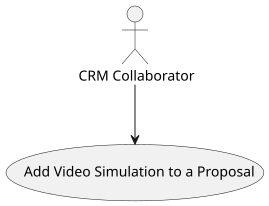
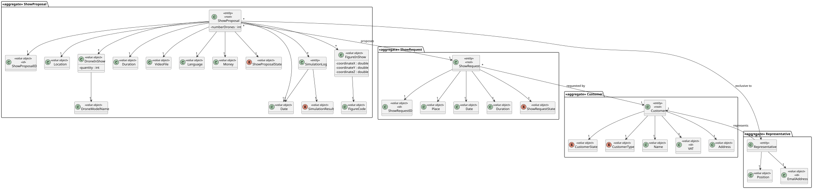
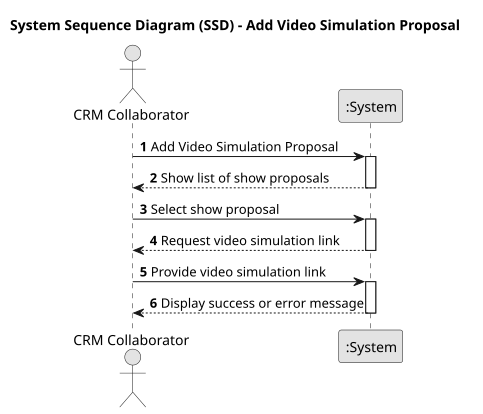
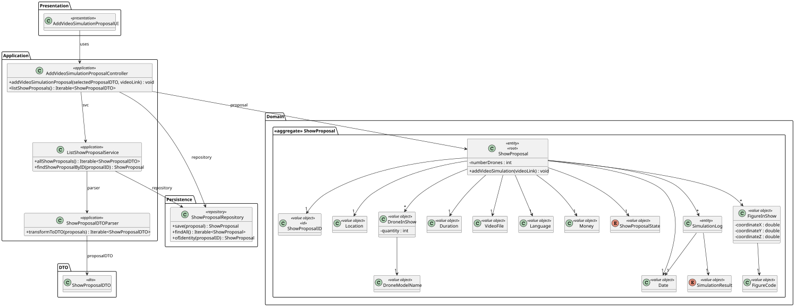
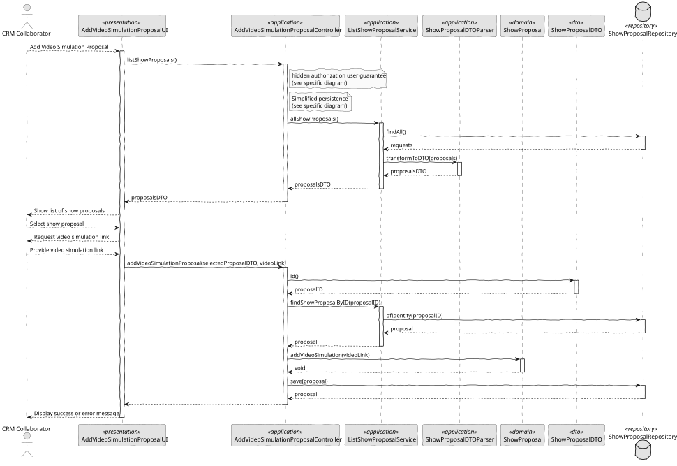

# US 315 - Add Video of Simulation to a Proposal

## 1. Context

*This task extends the creation of a show proposal by allowing a CRM Collaborator to attach a video of the simulated show. This enhances the customer's experience by providing a visual preview of the show before confirmation.*

### 1.1 List of issues

**Analysis:**
- Define a structure to associate a video link with a proposal.
- Validate the video URL format (e.g., must be a valid HTTP or HTTPS URL).

**Design:**
- Update the UI form to accept a video link input field.
- Design domain constraints to ensure only valid links are accepted.

**Implement:**
- Add support for persisting a video link in a ShowProposal.
- Implement business rules to reject invalid or null video links.

**Test:**
- Validate correct acceptance of valid video URLs.
- Ensure rejection of invalid or malformed URLs.
- Test persistence and retrieval of video links in a proposal.

## 2. Requirements

**US 315:** As a CRM Collaborator, I want to add a video of the simulated show so the customer can have a preview of the show.

**Acceptance Criteria:**

- *US315.1:* The system must allow the CRM Collaborator to insert a link to a video of the simulated show in a proposal.
- *US315.2:* The video link must be a valid HTTP or HTTPS URL.
- *US315.3:* The video must be stored as part of the proposal entity.
- *US315.4:* The system must reject null or malformed video links with an appropriate error message.

**Dependencies/References:**

* Extends the functionality of US310 (proposal creation).
* Introduces the value object VideoFile to handle video URLs.

## 3. Analysis

### 3.1. Use Case Diagram



### 3.2. Domain Model



### 3.3. Sequence System Diagrams (SSD)

Shows the main interactions between a CRM Collaborator and the system.



## 4. Design

### 4.1. Class Diagram (CD)

The class diagram defines the structure and responsibilities of the main classes involved in the Add Video Simulation Proposal use case.



### 4.2. Sequence Diagram (SD)

Presents the detailed dynamic behavior of the system during the add video in a show proposal. It includes the interactions between UI, Controller, Service, and Repositories, capturing the creation flow of a ShowProposal, and system validation/authorization.



### 4.3. Applied Patterns

- MVC (Model-View-Controller): Separates user interface, application logic, and domain model.
- Repository Pattern: Used to abstract persistence logic in ShowProposalRepository.
- Domain-Driven Design (DDD): Aggregates like ShowProposal ensure consistency and encapsulate business rules.
- Authorization Check: Applied before critical operations through AuthorizationService.

### 4.4. Acceptance Tests

```
    @Test
    void ensureValidHttpUrlIsAccepted() {
        final var video = new VideoFile(VALID_HTTP_URL);
        assertNotNull(video);
        assertEquals(VALID_HTTP_URL, video.toString());
    }

    @Test
    void ensureValidHttpsUrlIsAccepted() {
        final var video = new VideoFile(VALID_HTTPS_URL);
        assertNotNull(video);
        assertEquals(VALID_HTTPS_URL, video.toString());
    }

    @Test
    void ensureInvalidUrlsAreRejected() {
        assertThrows(IllegalArgumentException.class, () -> new VideoFile(INVALID_URL_NO_PROTOCOL));
        assertThrows(IllegalArgumentException.class, () -> new VideoFile(INVALID_URL_WITH_SPACE));
        assertThrows(IllegalArgumentException.class, () -> new VideoFile(EMPTY_URL));
        assertThrows(IllegalArgumentException.class, () -> new VideoFile(NULL_URL));
    }

    @Test
    void ensureValueOfCreatesEquivalentInstance() {
        final var video1 = new VideoFile(VALID_HTTPS_URL);
        final var video2 = VideoFile.valueOf(VALID_HTTPS_URL);
        assertEquals(video1, video2);
    }

    @Test
    void ensureToStringReturnsCorrectValue() {
        final var video = new VideoFile(VALID_HTTP_URL);
        assertEquals(VALID_HTTP_URL, video.toString());
    }
````
```
    @Test
    void ensureVideoSimulationIsAddedSuccessfully() {
        ShowProposal proposal = new ShowProposal(
                VALID_LOCATION, VALID_DATE, VALID_DURATION, VALID_DRONES, VALID_INSURANCE, VALID_STATE, VALID_SHOW_REQUEST, VALID_REPRESENTATIVE
        );

        VideoFile video = new VideoFile("https://youtube.com");
        proposal.addVideoSimulation(video);

        assertTrue(proposal.toString().contains("https://youtube.com"));
    }

    @Test
    void ensureAddVideoSimulationThrowsIfNull() {
        ShowProposal proposal = new ShowProposal(
                VALID_LOCATION, VALID_DATE, VALID_DURATION, VALID_DRONES, VALID_INSURANCE, VALID_STATE, VALID_SHOW_REQUEST, VALID_REPRESENTATIVE
        );

        assertThrows(IllegalArgumentException.class, () -> proposal.addVideoSimulation(null));
    }
````

## 5. Implementation

```
    public void addVideoSimulationProposal(final ShowProposalDTO selectedProposalDTO, String videoLink) {
        authz.ensureAuthenticatedUserHasAnyOf(ShodroneRoles.POWER_USER, ShodroneRoles.CRM_COLLABORATOR);

        ShowProposal showProposal = proposalSvc.findShowProposalByID(selectedProposalDTO.id());

        showProposal.addVideoSimulation(VideoFile.valueOf(videoLink));

        showProposalRepository.save(showProposal);
    }
````
```
    public void addVideoSimulation(final VideoFile video) {
        Preconditions.nonNull(video);
        this.videoSimulation = video;
    }
````

## 6. Integration/Demonstration

- To test the feature, run the application with CRM Collaborator credentials.
- Select a proposal and add a valid video link using the corresponding UI form.
- The system will validate and store the link as part of the proposal.

## 7. Observations

This user story improves the customer's ability to assess proposals by viewing a video preview of the simulated show. It introduces stricter validation for URLs and ensures proper encapsulation of video-related data via the VideoFile value object.