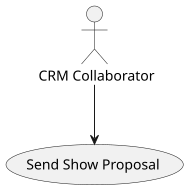
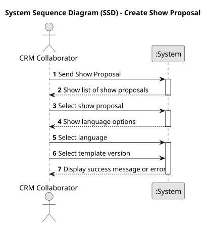
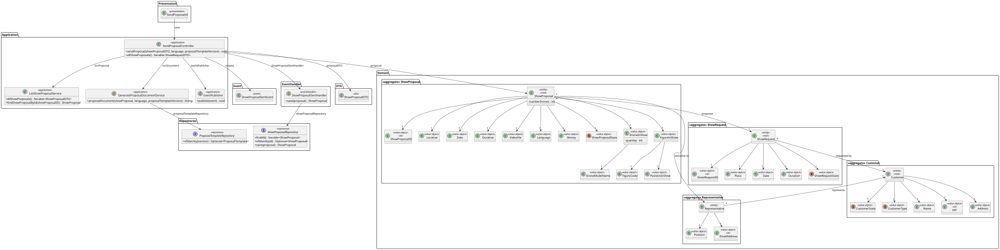
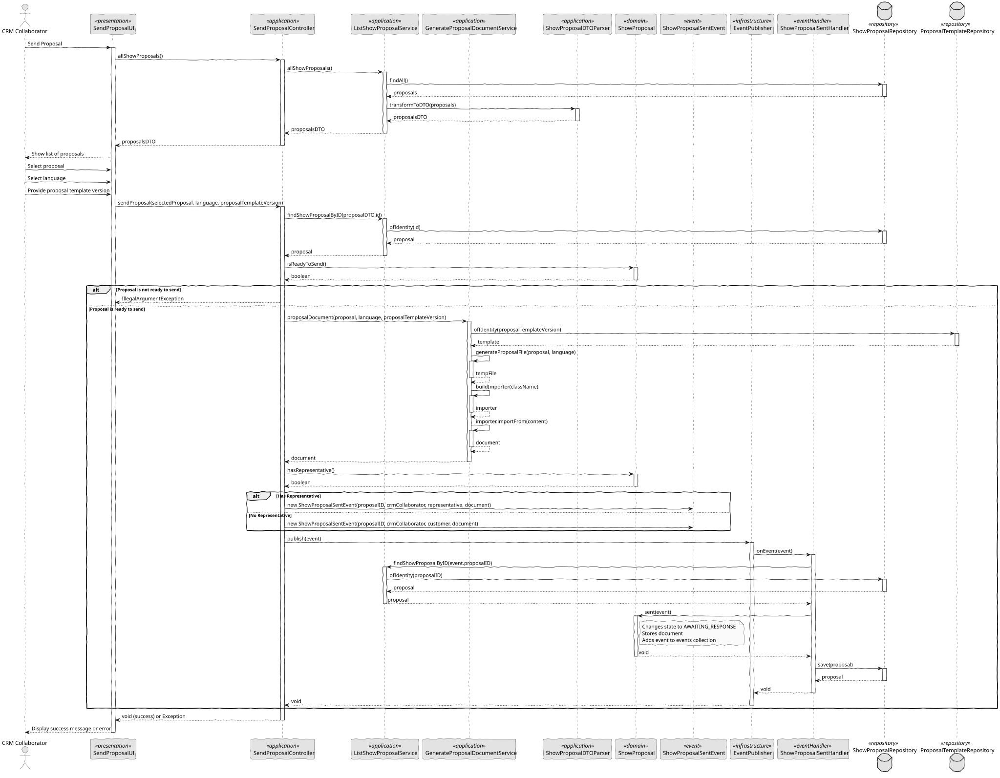

# US 316 - Send show proposal to the customer

## 1. Context

This user story aims to ensure that show proposals are sent to customers in a structured, validated, and professional format, only after the associated show has been successfully tested. It ensures that the generated proposals include all necessary details and comply with system-supported formats, reinforcing the reliability and professionalism of customer communications.

### 1.1 List of issues

Analysis:
- Validate that the show has passed all required tests before allowing the proposal to be sent.
- Define required proposal content and video preview integration.
- Ensure proper plugin and template usage.

Design:
- Define the interaction flow between the CRM Collaborator and the system.
- Design the proposal document structure.
- Design the UI for reviewing and sending the proposal.

Implement:
- Implement test status validation.
- Implement document generation using plugins.
- Implement sending process via the predefined communication channel.
- Implement the review and confirmation interface.

Test:
- Unit tests for validation logic.
- Unit and integration tests for document generation.
- Integration tests for sending mechanism.
- UI tests for the review and confirmation process.

## 2. Requirements

**US 316:** As a CRM Collaborator, I want to send the show proposal to the customer.

**Acceptance Criteria:**

- *US316.1:* The system allows sending only proposals whose associated shows have passed successful testing.
- *US316.2:* The proposal is generated using the correct system-supported format and approved plugin.
- *US316.3:* The proposal document includes all relevant show information and a link to a video preview.
- *US316.4:* The CRM Collaborator can review and approve the document before sending.
- *US316.5:* The customer receives the proposal via the predefined communication channel.
- *US316.6:* The system provides confirmation and logs the successful sending of the proposal.

**Dependencies/References:**

* Show Testing Module
* Proposal Template Plugins
* Communication Service (Email, Internal Messaging)

## 3. Analysis

### 3.1. Use Case Diagram

Illustrates the interaction between the CRM Collaborator and the system to send a show proposal.



### 3.2. Domain Model

Represents the entities involved, including Show, ShowProposal, ProposalTemplate, and CRM Collaborator.


### 3.3. Sequence System Diagrams (SSD)

Shows the main system interactions for sending a show proposal.



## 4. Design

### 4.1. Class Diagram (CD)

Defines the main classes involved in the process, such as SendShowProposalUI, SendShowProposalController, ShowProposalService, ShowRepository, and CommunicationService.



### 4.2. Sequence Diagram (SD)

Details the sequence of interactions from the CRM Collaborator’s initiation to the sending of the proposal.



### 4.3. Applied Patterns

- MVC (Model-View-Controller): To separate UI, application logic, and domain entities.
- Repository Pattern: Used to abstract persistence logic in Show and ShowProposal repositories.
- Domain-Driven Design (DDD): Aggregates like Show and ShowProposal encapsulate the core business rules, including test status verification.
- Plugin Pattern: For proposal document generation using registered and validated plugins.
- Service Layer: Encapsulates the business logic of sending proposals.

### 4.4. Acceptance Tests

```
@Test
    void ensureSentChangesStateToAwaitingResponse() {
        ShowProposal proposal = new ShowProposal(
                VALID_LOCATION, VALID_DATE, VALID_DURATION, VALID_DRONES,
                VALID_INSURANCE, VALID_STATE, VALID_SHOW_REQUEST, VALID_REPRESENTATIVE
        );

        ShowProposalSentEvent sentEvent = new ShowProposalSentEvent(1L, null, VALID_REPRESENTATIVE, "document.pdf");

        proposal.sent(sentEvent);

        assertEquals(ShowProposalState.AWAITING_RESPONSE, proposal.state());
    }

    @Test
    void ensureSentThrowsIfEventIsNull() {
        ShowProposal proposal = new ShowProposal(
                VALID_LOCATION, VALID_DATE, VALID_DURATION, VALID_DRONES,
                VALID_INSURANCE, VALID_STATE, VALID_SHOW_REQUEST, VALID_REPRESENTATIVE
        );

        assertThrows(NullPointerException.class, () -> proposal.sent(null));
    }
````

## 5. Implementation

```
public class SendProposalController {

    private final AuthorizationService authz = AuthzRegistry.authorizationService();
    private final ListShowProposalService proposalSvc = new ListShowProposalService();
    private final EventPublisher publisher = InProcessPubSub.publisher();
    private final GenerateProposalDocumentService documentSvc = new GenerateProposalDocumentService();

    public void sendProposal(ShowProposalDTO showProposalDTO, String language, String proposalTemplateVersion) throws IOException {
        authz.ensureAuthenticatedUserHasAnyOf(ShodroneRoles.POWER_USER, ShodroneRoles.CRM_COLLABORATOR);

        ShowProposal proposal = proposalSvc.findShowProposalByID(showProposalDTO.id());

        if (!proposal.isReadyToSend()) {
            throw new IllegalArgumentException("Proposal is not in a state to be sent.");
        }

        String document = documentSvc.proposalDocument(proposal, language, proposalTemplateVersion);

        SystemUser crmCollaborator = authz.session().get().authenticatedUser();

        ShowProposalSentEvent event;
        if (proposal.hasRepresentative()) {
            event = new ShowProposalSentEvent(proposal.identity(), crmCollaborator, proposal.representative(), document);
        } else {
            event = new ShowProposalSentEvent(proposal.identity(), crmCollaborator, proposal.showRequest().customer(), document);
        }

        publisher.publish(event);
    }

    public Iterable<ShowProposalDTO> allShowProposals() {
        authz.ensureAuthenticatedUserHasAnyOf(ShodroneRoles.POWER_USER, ShodroneRoles.CRM_COLLABORATOR);
        return proposalSvc.allShowProposals();
    }

}
````

## 6. Integration/Demonstration

- Run the bootstrap: ./run-bootstrap
- Login as CRM Collaborator in the UI: ./run-crm-app
- Access the list of show proposals, select a proposal with a successfully tested show.
- Review the auto-generated proposal document (includes show details and video preview link).
- Confirm to send the proposal.
- The system logs the sending, and the customer receives the proposal via the communication channel.

## 7. Observations

This user story ensures that only high-quality, validated proposals are sent to customers, contributing to increased trust and professionalism within the organization. The use of plugins for document generation provides flexibility and allows for easy adaptation to support new formats in the future. As potential improvements, it may be valuable to implement mechanisms to track customer interactions with the received proposal, such as recording when the document is opened or read, as well as automating the sending of reminders if no response is received within a defined timeframe.