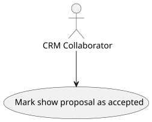
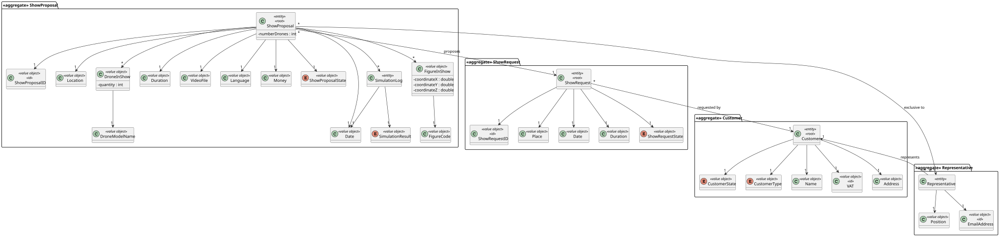
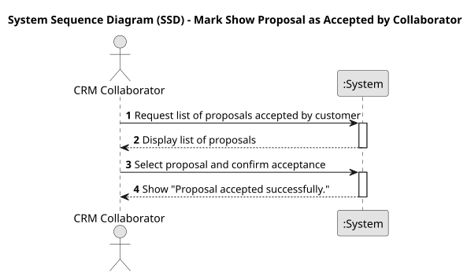
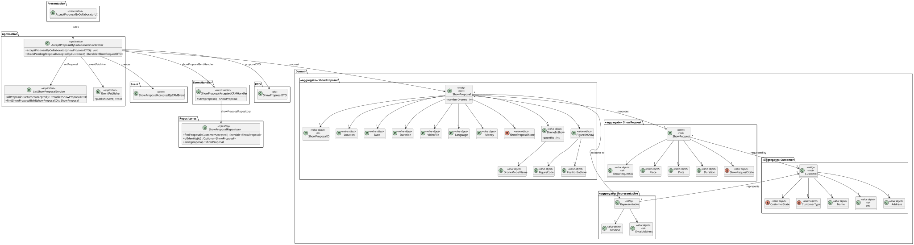
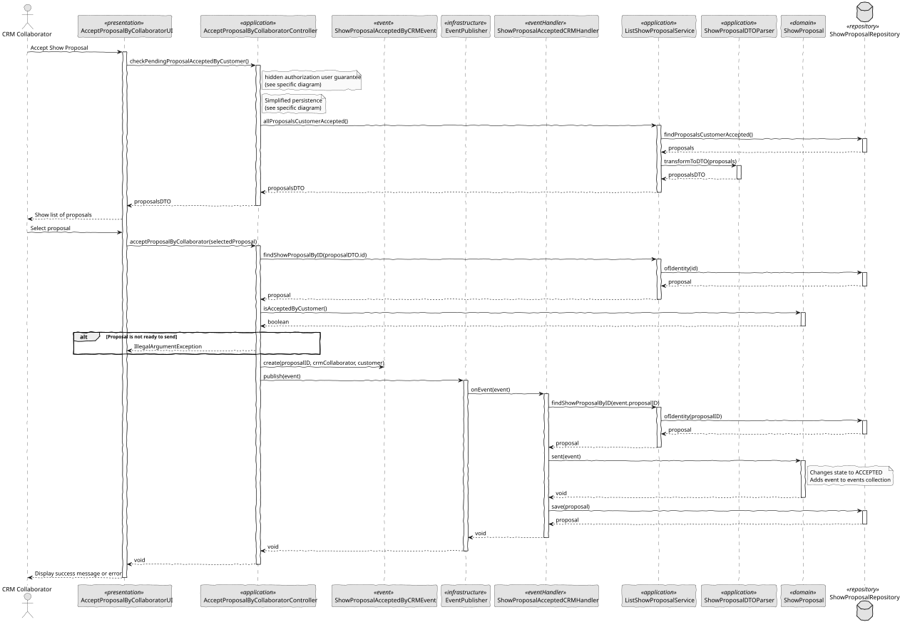

# US 317 - Mark show proposal as accepted

## 1. Context

This User Story ensures that, once a Customer Representative accepts a show proposal in the Customer App, the CRM Collaborator can view and confirm this status change in the internal platform. This confirmation allows the proposal to progress to the next phases, such as scheduling and resource allocation.

### 1.1 List of issues

Analysis:
- How to securely receive and process acceptance confirmations from the Customer App.
- How to ensure that only sent proposals can be marked as accepted.
- How to log the acceptance with an accurate timestamp for auditing purposes.

Design:
- Design an API or event-based mechanism to handle proposal acceptance notifications.
- Design a clear status representation in the internal platform.
- Decide how to notify the CRM Collaborator (e.g., notification panel, email).

Implement:
- Implement integration to receive acceptance confirmations from the Customer App.
- Update the proposal status in the internal system.
- Implement user notification for the CRM Collaborator.
- Log acceptance timestamp and responsible user.

Test:
- Test status update when valid acceptance is received.
- Test prevention of acceptance of proposals not eligible for update.
- Test notification delivery to the CRM Collaborator.
- Test proper logging of acceptance events.

## 2. Requirements

**US 317:** As a CRM Collaborator, I want to mark the proposal as accepted by the customer after it has been accepted by a Customer Representative in the Customer App.

**Acceptance Criteria:**

- *US317.1:* The system receives and registers the acceptance confirmation from the Customer App.
- *US317.2:* The proposal status is updated to "Accepted" in the internal platform.
- *US317.3:* The CRM Collaborator is notified of the customer's acceptance.
- *US317.4:* The acceptance timestamp is recorded for traceability.
- *US317.5:* Only proposals that have been sent and not yet accepted can be updated.
- *US317.6:* The feature is fully tested (unit, integration, and acceptance tests).

**Dependencies/References:**

* Customer App for acceptance confirmation.
* Proposal management system.
* CRM notification infrastructure.

## 3. Analysis

### 3.1. Use Case Diagram

The diagram shows the CRM Collaborator marking the proposal as accepted based on the acceptance notification from the Customer App.



### 3.2. Domain Model

The updated domain model includes the proposal status and the acceptance timestamp.



### 3.3. Sequence System Diagrams (SSD)

The system sequence diagram illustrates the acceptance process starting from the Customer App to the internal platform.



## 4. Design

### 4.1. Class Diagram (CD)

The class diagram includes the Proposal entity with the "status" and "acceptanceTimestamp" attributes, and the service responsible for updating the status.



### 4.2. Sequence Diagram (SD)

The sequence diagram details the interactions from the acceptance notification to the status update and notification to the CRM Collaborator.



### 4.3. Applied Patterns

- Observer/Event Pattern: To propagate acceptance events from the Customer App to the internal system.
- Repository Pattern: To manage persistence of the updated Proposal status.
- MVC Pattern: For the CRM platform interface and interaction management.

### 4.4. Acceptance Tests

```
@Test
    void ensureProposalIsAcceptedByCollaborator() {
        ShowProposal proposal = new ShowProposal(
                VALID_LOCATION, VALID_DATE, VALID_DURATION, VALID_DRONES,
                VALID_INSURANCE, VALID_STATE, VALID_SHOW_REQUEST, VALID_REPRESENTATIVE
        );

        ShowProposalAcceptedByCRMEvent sentEvent = new ShowProposalAcceptedByCRMEvent(1L, null, null);

        proposal.acceptedByCollaborator(sentEvent);

        assertEquals(ShowProposalState.ACCEPTED, proposal.state());
    }
````

## 5. Implementation

```
public class AcceptProposalByCollaboratorController {

    private final AuthorizationService authz = AuthzRegistry.authorizationService();
    private final ListShowProposalService svc = new ListShowProposalService();
    private final EventPublisher publisher = InProcessPubSub.publisher();

    public Iterable<ShowProposalDTO> checkPendingProposalAcceptedByCustomer() {
        authz.ensureAuthenticatedUserHasAnyOf(ShodroneRoles.CRM_COLLABORATOR);

        return svc.allProposalsCustomerAccepted();
    }

    public void acceptProposalByCollaborator(ShowProposalDTO showProposalDTO) {
        authz.ensureAuthenticatedUserHasAnyOf(ShodroneRoles.CRM_COLLABORATOR);

        ShowProposal proposal = svc.findShowProposalByID(showProposalDTO.id());

        if (!proposal.isAcceptedByCustomer()) {
            throw new IllegalStateException("Proposal is not in a state to be accepted by a collaborator.");
        }

        publisher.publish(new ShowProposalAcceptedByCRMEvent(proposal.identity(), proposal.showRequest().customer(), authz.session().get().authenticatedUser()));
    }
}
````

## 6. Integration/Demonstration

- Demonstration of a Customer Representative accepting a proposal in the Customer App.
- Immediate update of the proposal status in the CRM platform.
- Notification displayed to the CRM Collaborator.
- Timestamp visible in the proposal details for auditing.

## 7. Observations

This feature strengthens the synchronization between the Customer App and the CRM platform, ensuring real-time status updates. It is crucial to validate the proposal state before allowing acceptance to prevent inconsistent updates. Future enhancements may include email confirmations and additional status tracking.