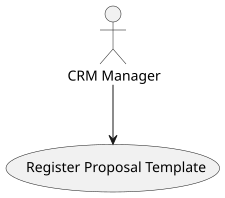
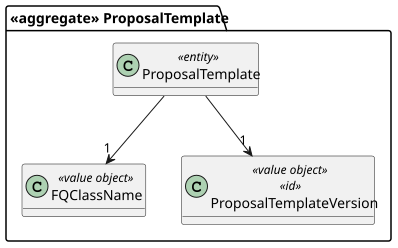
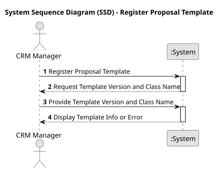
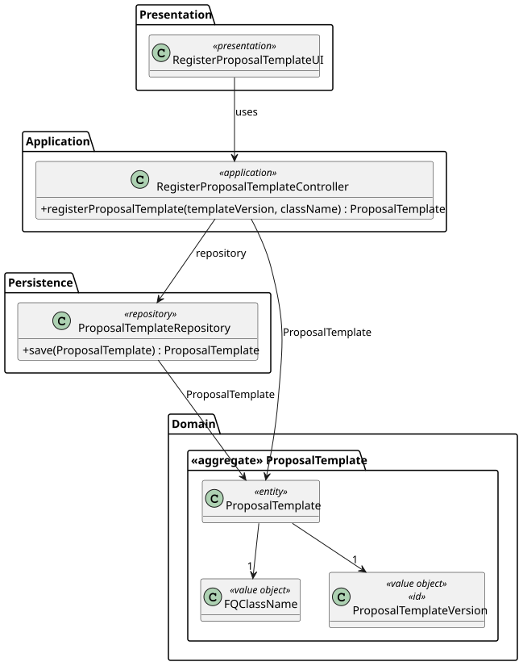
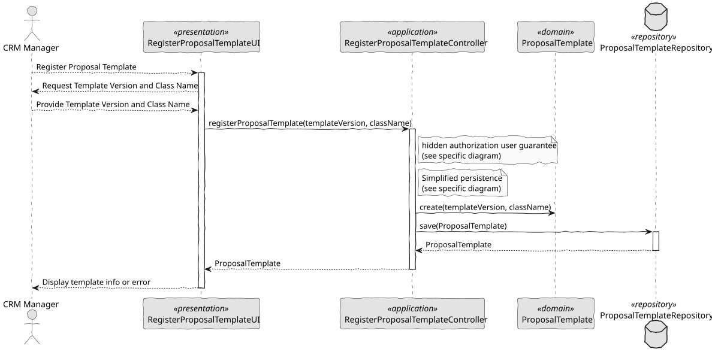

# US 318 - Templates for show proposals

## 1. Context

In order to ensure that all customer-facing proposal documents follow the organization's branding and communication standards, the system must support the configuration and management of document templates. This functionality will empower CRM Managers to control and standardize the formatting of proposals sent to customers.

### 1.1 List of issues

Analysis:
- Define the requirements and constraints for the template file format.
- Analyze the validation mechanism and how the plugin system should be integrated.
- Identify storage requirements for templates and associated metadata.
- Analyze security concerns regarding template upload (e.g., file type, file size, possible malicious files).

Design:
- Design UI for template upload, selection, and management.
- Define the architecture for the template validation process via plugins.
- Design the data model for storing templates and their validation status.
- Design the integration point where the selected template will be applied during proposal generation.

Implement:
- Develop the UI components for template management.
- Implement the service to handle template storage, retrieval, and deletion.
- Integrate the plugin-based validation mechanism.
- Ensure that only validated templates can be used in proposal generation.
- Implement the logic to apply the selected template to generated documents.

Test:
- Unit test the template validation process.
- Integration test the upload, selection, and document generation flow.
- UI/UX test the template management interface.
- Test edge cases, such as invalid templates, unsupported file types, and large file uploads.

## 2. Requirements

**US 318:** As a CRM Manager, I want to be able to configure the template that formats the document to be sent to the customer, so that proposals are aligned with branding and communication standards.

**Acceptance Criteria:**

- *US318.1:* The CRM Manager can upload or select a proposal template.
- *US318.2:* The system validates the uploaded or selected template using a pre-registered plugin.
- *US318.3:* Only templates that pass validation can be used to generate proposal documents.
- *US318.4:* The CRM Manager can view, edit, and delete the list of available templates.
- *US318.5:* The template selected by the CRM Manager is automatically applied when generating customer proposals.
- *US318.6:* Templates that fail validation are rejected and not stored or made available.

**Dependencies/References:**

* Plugin registry and validation framework (existing or to be developed).
* Existing proposal generation process.
* File storage service (local or external).
* CRM Manager authentication and role-based access control.

## 3. Analysis

### 3.1. Use Case Diagram

Illustrates the interaction between the CRM Manager and the system to manage templates for proposal documents.



### 3.2. Domain Model

Shows the relevant aggregates and entities involved in the management of proposal templates, including the Template entity, TemplateValidator, and associated metadata.



### 3.3. Sequence System Diagrams (SSD)

Shows the main interactions between a CRM Manager and the system for uploading, validating, managing, and applying proposal templates.



## 4. Design

### 4.1. Class Diagram (CD)

The class diagram defines the structure and responsibilities of the main classes involved in the "Manage Proposal Templates" use case.



### 4.2. Sequence Diagram (SD)

Details the sequence of interactions for uploading, validating, listing, and selecting proposal templates. It includes the interactions between the UI, Controller, Service, Validation Plugin, and Repository layers.



### 4.3. Applied Patterns

- MVC (Model-View-Controller): Separates user interface, application logic, and domain model for template management.
- Repository Pattern: Used to abstract persistence logic in the TemplateRepository.
- Domain-Driven Design (DDD): The Template aggregate ensures consistency and encapsulates business rules related to template validation and selection.
- Plugin Pattern: Ensures that template files are validated using a pre-registered external validation mechanism.
- Role-Based Access Control (RBAC): Ensures that only CRM Managers can manage proposal templates.

### 4.4. Acceptance Tests

```

````

## 5. Implementation

```
public class RegisterProposalTemplateController {

    private final AuthorizationService authorizationService = AuthzRegistry.authorizationService();
    private final ProposalTemplateRepository repository = PersistenceContext.repositories().proposalTemplates();;

    public ProposalTemplate registerProposalTemplate(final String proposalTemplateVersion, final String className) {
        authorizationService.ensureAuthenticatedUserHasAnyOf(ShodroneRoles.POWER_USER, ShodroneRoles.CRM_MANAGER);

        final var plugin = new ProposalTemplate(ProposalTemplateVersion.valueOf(proposalTemplateVersion), FQClassName.valueOf(className));
        return repository.save(plugin);
    }
}
````

## 6. Integration/Demonstration

- To manage templates, run the application using: ./run-crm-manager-app
- Log in as a CRM Manager and navigate to the Template Management section.
- Available operations:
  - Upload a new template file (only validated templates are stored and listed).
  - View the list of all available and validated templates.
  - Select a template to be applied in proposal generation.
  - Delete unwanted templates.
- The selected template is automatically used when generating proposals.
- Validation feedback is immediately displayed upon upload (accepted or rejected).

## 7. Observations

This user story improves proposal generation by enabling consistent formatting aligned with company branding and communication standards.
It enhances CRM Manager control over the documents sent to customers, ensuring quality and professional appearance.
The solution is modular and scalable, allowing the addition of new validation plugins, template versioning, and preview functionalities in future iterations.
The use of a validation mechanism guarantees that only compatible and safe templates are applied in proposal generation.