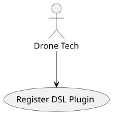
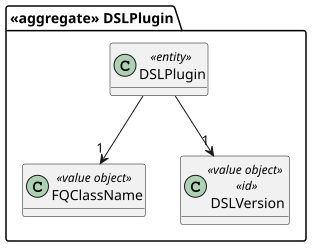
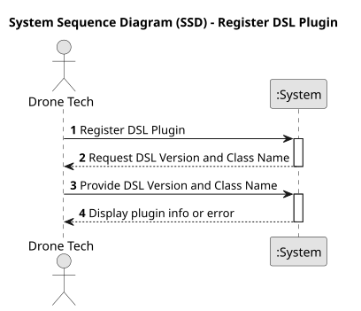
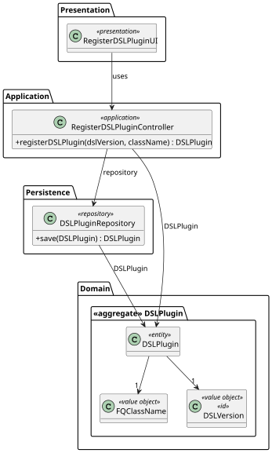
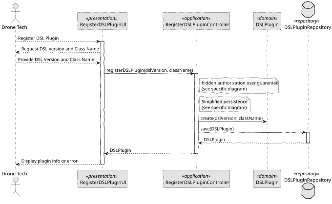

# US 340 - DSL Plugin Deployment

## 1. Context

*This task involves implementing a system for Drone Techs to deploy and configure plugins that will be used by the system to analyze drone show figures. The solution must allow for registration of new DSL plugins with their versions and class names, ensuring they can be properly integrated into the system's analysis pipeline.*

### 1.1 List of issues

**Analysis:**
- Identify required fields for plugin registration (DSL version, class name)
- Define the structure of the DSL plugin entity
- Review plugin integration requirements with the analysis system

**Design:**
- Create interface for plugin registration
- Design the data flow from registration to persistent storage

**Implement:**
- Develop the UI for registering DSL plugins
- Implement controller logic for validating and saving plugins
- Create repository for persistent storage

**Test:**
- Validate all required inputs
- Ensure correct persistence and retrieval of plugins
- Test error handling for invalid or duplicate plugins

## 2. Requirements

**US 340:** As a Drone Tech, I want to deploy and configure a plugin to be used by the system to analyze the figure.

**Acceptance Criteria:**

- *US340.1:* The system must provide an interface to register a new DSL plugin
- *US340.2:* The registration must include the DSL version and fully qualified class name
- *US340.3:* The system must validate the plugin information before registration
- *US340.4:* The plugin information must be persisted for future use
- *US340.5:* The system must prevent duplicate plugin versions
- *US340.6:* The system must provide confirmation feedback upon successful registration

**Dependencies/References:**

* Integration with the drone show analysis system
* References include the DSL specification and plugin development documentation

## 3. Analysis

### 3.1. Use Case Diagram



### 3.2. Domain Model



### 3.3. Sequence System Diagrams (SSD)

Shows the main interactions between a Drone Tech and the system during a DSL Plugin registration process.



## 4. Design

### 4.1. Class Diagram (CD)

The class diagram defines the structure and responsibilities of the main classes involved in the Register DSL Plugin use case.



### 4.2. Sequence Diagram (SD)

Presents the detailed dynamic behavior of the system during the registration of a DSL Plugin. It includes the interactions between UI, Controller, Service, and Repositories, capturing the creation flow of a DSLPlugin, and system validation/authorization.



### 4.3. Applied Patterns

- MVC (Model-View-Controller): Separates user interface, application logic, and domain model.
- Repository Pattern: Used to abstract persistence logic in DSLPluginRepository.
- Domain-Driven Design (DDD): Aggregates like DSLPlugin ensure consistency and encapsulate business rules.
- Authorization Check: Applied before critical operations through AuthorizationService.

### 4.4. Acceptance Tests

```
    @Test
    void ensureValidDSLPluginIsCreated() {
        final var dslPlugin = new DSLPlugin(VALID_DSL_VERSION, VALID_FQ_CLASS_NAME);
        assertNotNull(dslPlugin);
        assertEquals(VALID_DSL_VERSION, dslPlugin.identity());
        assertEquals(VALID_FQ_CLASS_NAME, dslPlugin.className());
    }

    @Test
    void ensureNullParametersAreRejected() {
        assertThrows(IllegalArgumentException.class,
                () -> new DSLPlugin(null, VALID_FQ_CLASS_NAME));
        assertThrows(IllegalArgumentException.class,
                () -> new DSLPlugin(VALID_DSL_VERSION, null));
    }

    @Test
    void ensureSameAsWorksCorrectly() {
        final var dslPlugin1 = new DSLPlugin(VALID_DSL_VERSION, VALID_FQ_CLASS_NAME);
        final var dslPlugin2 = new DSLPlugin(OTHER_DSL_VERSION, OTHER_FQ_CLASS_NAME);

        assertTrue(dslPlugin1.sameAs(dslPlugin1));
        assertFalse(dslPlugin1.sameAs(dslPlugin2));
    }

    @Test
    void ensureToStringContainsRelevantInfo() {
        final var dslPlugin = new DSLPlugin(VALID_DSL_VERSION, VALID_FQ_CLASS_NAME);
        final var toString = dslPlugin.toString();

        assertTrue(toString.contains(VALID_DSL_VERSION.toString()));
        assertTrue(toString.contains(VALID_FQ_CLASS_NAME.toString()));
    }

    @Test
    void ensureIdentityReturnsDSLVersion() {
        final var dslPlugin = new DSLPlugin(VALID_DSL_VERSION, VALID_FQ_CLASS_NAME);
        assertEquals(VALID_DSL_VERSION, dslPlugin.identity());
    }
````

## 5. Implementation

```
    public DSLPlugin registerDSLPlugin(final String dslVersion, final String className) {
        authorizationService.ensureAuthenticatedUserHasAnyOf(ShodroneRoles.POWER_USER, ShodroneRoles.DRONE_TECH);

        final var plugin = new DSLPlugin(DSLVersion.valueOf(dslVersion), FQClassName.valueOf(className));
        return repository.save(plugin);
    }
````

## 6. Integration/Demonstration

- To test the bootstrap process, simply run the script: ./run-bootstrap
- To manually register a dsl plugin, you must run the script ./run-backoffice, log in with a user who has the role Drone Tech or Power User, and click on the Register DSL Plugin option.

## 7. Observations

This feature enables Drone Techs to extend the system's analysis capabilities through plugins while maintaining version control and ensuring proper integration. The design allows for future expansion of plugin capabilities and version management.