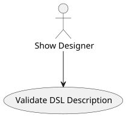
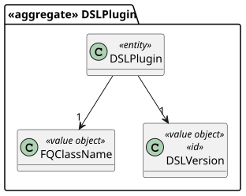
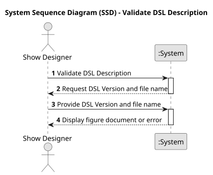
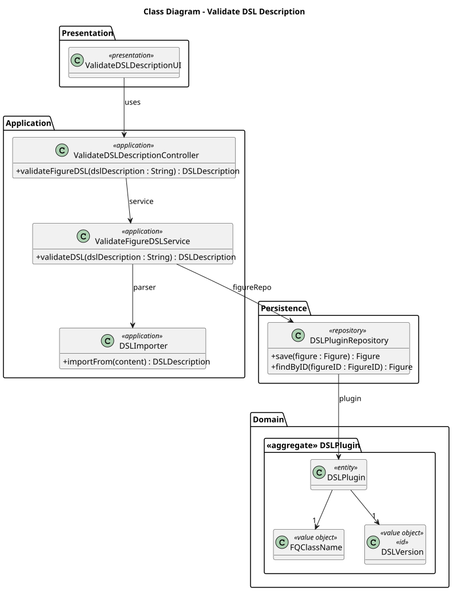
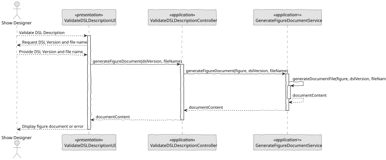

# US 341 - Validate figure description

## 1. Context

This user story is part of the system's efforts to ensure that all figures created and used in drone shows are syntactically correct and comply with the DSL (Domain-Specific Language) grammar. The validation step is crucial to prevent errors during show execution and improve the design workflow for show designers.

### 1.1 List of issues

Analysis:
- Analyze the DSL grammar rules and validation requirements.
- Define integration points within the figure registration workflow.

Design:
- Design the DSL validation component.
- Design the user interface for figure submission and syntax validation feedback.

Implement:
- Implement DSL parser and validation logic.
- Integrate validation into the figure registration process.
- Implement error reporting with detailed syntax feedback.

Test:
- Write unit tests for DSL parser and validation logic.
- Develop integration tests for the complete validation and registration workflow.

## 2. Requirements

**US 341:** As a Show Designer, I want to validate the syntax of the figure description (DSL), so that I can register the figure in the system.

**Acceptance Criteria:**

- *US341.1:* The system parses the DSL input and validates it against the defined syntax rules.
- *US341.2:* If the syntax is valid, the figure is marked as validated and ready for registration.
- *US341.3:* If the syntax is invalid, the system returns detailed error messages indicating the location and type of error.
- *US341.4:* Only validated figures can be registered into the system.
- *US341.5:* Figures cannot be reused in shows until successfully validated.
- *US341.6:* The user interface provides clear feedback regarding the validation result.

**Dependencies/References:**

* DSL grammar specification.
* DSL parser component.
* Figure registration use case.

## 3. Analysis

### 3.1. Use Case Diagram

Shows the interaction between the Show Designer and the system to validate the syntax of a figure description before it can be registered.



### 3.2. Domain Model

Represents the main entities involved in figure validation, including the Figure, DSLValidator, and ValidationResult.



### 3.3. Sequence System Diagrams (SSD)

Illustrates the sequence of messages between the Show Designer and the system when submitting a figure for validation.



## 4. Design

### 4.1. Class Diagram (CD)

Illustrates the core components involved in figure validation, including the UI, Controller, DSLValidator, and FigureRepository.



### 4.2. Sequence Diagram (SD)

Details the interactions between the UI, Controller, DSLValidator, and Repository during the figure validation process.



### 4.3. Applied Patterns

- Service Pattern: DSLValidator provides the validation logic as a domain service.
- Repository Pattern: FigureRepository is responsible for figure persistence.
- MVC Pattern: Separation between UI, Controller, and Domain components.

### 4.4. Acceptance Tests

```
@Test
    void ensureHashCodeIsConsistentForSameObject() {
        final var dslPlugin = new DSLPlugin(VALID_DSL_VERSION, VALID_FQ_CLASS_NAME);
        final int firstHashCode = dslPlugin.hashCode();
        final int secondHashCode = dslPlugin.hashCode();

        assertEquals(firstHashCode, secondHashCode,
                "HashCode should be consistent for the same object");
    }

    @Test
    void ensureSameAsReturnsFalseForDifferentTypes() {
        final var dslPlugin = new DSLPlugin(VALID_DSL_VERSION, VALID_FQ_CLASS_NAME);
        final String differentTypeObject = "Not a DSLPlugin";

        assertFalse(dslPlugin.sameAs(differentTypeObject),
                "sameAs should return false when comparing with different object types");
        assertFalse(dslPlugin.sameAs(null),
                "sameAs should return false when comparing with null");
    }
````

## 5. Implementation

```
public class ValidateDSLDescriptionController {

    private final AuthorizationService authz = AuthzRegistry.authorizationService();
    private final ImportDSLService dslSvc = new ImportDSLService();

    public DSLDescription validateDSL(final String dslVersion, final String filename) throws IOException {
        authz.ensureAuthenticatedUserHasAnyOf(ShodroneRoles.POWER_USER, ShodroneRoles.DRONE_TECH);
        return dslSvc.validateDSL(filename, dslVersion);
    }

}
````

## 6. Integration/Demonstration

- Demonstrate figure submission and validation through the UI.
- Show rejection of invalid DSLs with detailed error feedback.
- Confirm that only validated figures can be registered and used in shows.

## 7. Observations

This user story strengthens system reliability by ensuring that only syntactically correct figures are registered and used in shows. It improves user experience by providing detailed feedback for correction and avoids runtime errors during show execution. Future improvements may include providing a real-time DSL editor with live syntax validation and auto-suggestions."

cola isto no read me da US341