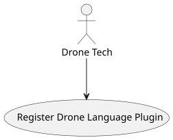
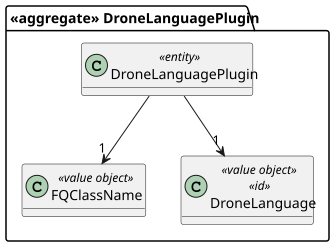
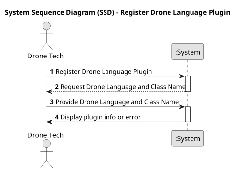
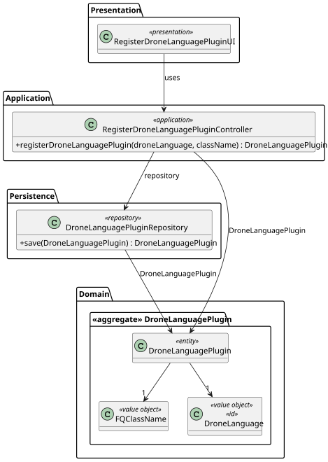
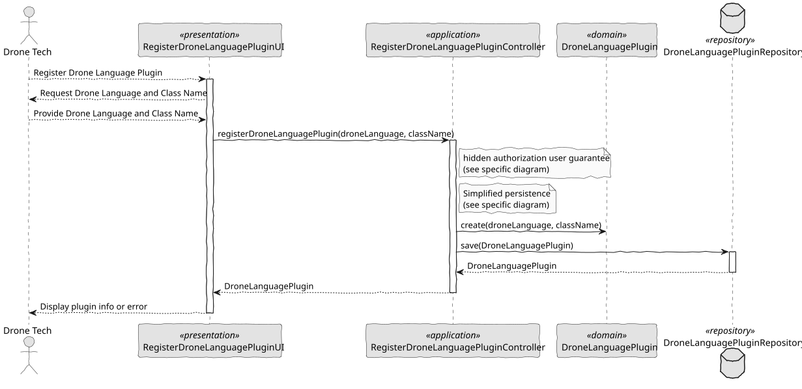

# US 345 - Drone language Plugin

## 1. Context

The system must support multiple drone programming languages used across heterogeneous drone fleets. To ensure flexibility and scalability, a plugin-based architecture will be adopted. This will allow Drone Techs to deploy and configure language-specific plugins responsible for analyzing and validating drone programs before execution.

### 1.1 List of issues

Analysis:
- Define a generic plugin interface for drone language validators.
- Identify how to associate drone programs with their respective validation plugins.
- Determine plugin lifecycle and configuration requirements.

Design:
- Design the plugin architecture and management mechanism.
- Specify how plugins are loaded, isolated, and invoked.
- Define the validation feedback structure.

Implement:
- Implement the plugin registration and configuration system.
- Develop the core drone program validation workflow.
- Build at least one functional drone language validation plugin.

Test:
- Test plugin deployment, registration, and configuration.
- Test validation success and failure scenarios.
- Ensure system stability when a plugin fails.

## 2. Requirements

**US 345:** As a Drone Tech, I want to deploy and configure a plugin to be used by the system to analyze/validate a drone program. There must be a plugin for each different drone language.

**Acceptance Criteria:**

- *US345.1:* The system allows registration and configuration of plugins for different drone languages.
- *US345.2:* Each plugin can validate drone programs written in its supported language.
- *US345.3:* The system provides detailed validation feedback (syntax errors, unsupported instructions).
- *US345.4:* Only validated drone programs can proceed to simulation or deployment.
- *US345.5:* Plugins are isolated to prevent system-wide failures if one plugin crashes.
- *US345.6:* New plugins can be easily added without affecting the system's core.

**Dependencies/References:**

* Existing drone program generation and execution workflows.
* Plugin architecture and configuration standards. 

## 3. Analysis

### 3.1. Use Case Diagram

Illustrates the interaction between the Drone Tech and the system for registering and using drone language plugins.



### 3.2. Domain Model

Defines the entities involved in managing and using drone language plugins.



### 3.3. Sequence System Diagrams (SSD)

Shows the interaction between the Drone Tech and the system during plugin registration and drone program validation.



## 4. Design

### 4.1. Class Diagram (CD)

Details the main classes involved in the plugin system and validation process.



### 4.2. Sequence Diagram (SD)

Describes the detailed flow of plugin deployment, configuration, and drone program validation.



### 4.3. Applied Patterns

- Plugin Architecture: Allows dynamic deployment and configuration of new drone language validators without changing the core system.
- Dependency Injection: Facilitates the registration and management of different plugin implementations.
- Factory Pattern: Used for instantiating specific drone language plugins based on configuration.
- Fail-Safe/Isolation Mechanism: Ensures that a failure in one plugin does not compromise the system.

### 4.4. Acceptance Tests

```
@Test
    void ensureValidDroneLanguagePluginIsCreated() {
        final var plugin = new DroneLanguagePlugin(VALID_VERSION, VALID_CLASS_NAME);
        assertNotNull(plugin);
        assertEquals(VALID_VERSION, plugin.identity());
        assertEquals(VALID_CLASS_NAME, plugin.className());
    }

    @Test
    void ensureNullParametersAreRejected() {
        assertThrows(IllegalArgumentException.class,
                () -> new DroneLanguagePlugin(null, VALID_CLASS_NAME));
        assertThrows(IllegalArgumentException.class,
                () -> new DroneLanguagePlugin(VALID_VERSION, null));
    }
````

## 5. Implementation

```
public class RegisterDroneLanguagePluginController {

    private final AuthorizationService authorizationService = AuthzRegistry.authorizationService();
    private final DroneLanguagePluginRepository repository = PersistenceContext.repositories().droneLanguagePlugins();;

    public DroneLanguagePlugin registerDroneLanguagePlugin(final String droneLanguageVersion, final String className) {
        authorizationService.ensureAuthenticatedUserHasAnyOf(ShodroneRoles.POWER_USER, ShodroneRoles.DRONE_TECH);

        final var plugin = new DroneLanguagePlugin(DroneLanguageVersion.valueOf(droneLanguageVersion), FQClassName.valueOf(className));
        return repository.save(plugin);
    }
}
````

## 6. Integration/Demonstration

- Launch the Drone Tech application using ./run-drone-tech-app.
- Register a new drone language plugin by providing the language version and the plugin class name.
- Load a drone program and select the corresponding validation plugin.
- Validate the drone program. The system provides immediate feedback:
  - If the program is valid, the user can proceed to simulation or deployment.
  - If the program is invalid, detailed error messages are displayed.
- Demonstrate system stability by deactivating or forcing an error in one plugin to ensure the system remains operational.

## 7. Observations

This user story introduces a scalable, modular plugin-based solution for validating drone programs in multiple languages, enhancing system safety and flexibility. Plugin isolation ensures system stability, as failures in one do not impact others. Future improvements may include a graphical plugin manager, automatic updates, and runtime compatibility checks.