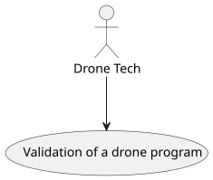
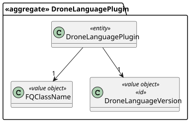
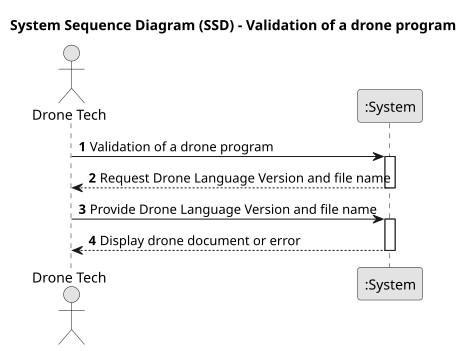
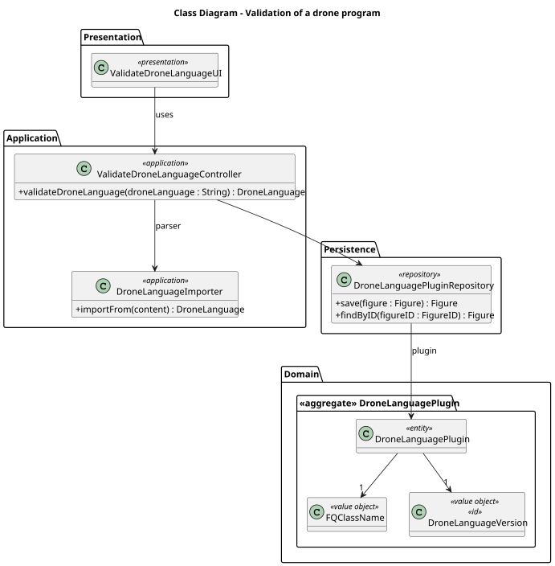
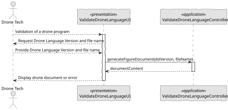

# US 346 - Validation of a drone program

## 1. Context

The Drone Tech team needs to ensure that drone programs are syntactically correct before executing simulations or real shows. This validation step prevents execution errors and ensures system reliability.

### 1.1 List of issues

Analysis:
- Identify how drone programs are currently stored and retrieved.
- Define how to access the programming language version of each drone model.
- Analyze existing grammar rules for each supported drone programming language.

Design:
- Design a validation service capable of supporting multiple drone languages.
- Specify detailed error reporting mechanisms for syntax validation.

Implement:
- Implement syntax validation for each supported drone language.
- Develop a UI component to display validation results and detailed errors.

Test:
- Test the validation feature with correct and incorrect drone programs.
- Ensure re-validation is possible after program updates.

## 2. Requirements

*US 346:* As a Drone Tech, I want to validate the syntax of the code for a specific drone in a given show/figure, so that I can later test the figure/show.

*Acceptance Criteria:*

- US346.1: The system validates the syntax of a drone program according to the drone model's programming language version.
- US346.2: Syntax errors are clearly reported with line and column information and a description of the issue.
- US346.3: The validation process supports all drone programming languages available in the system.
- US346.4: The user can re-validate the program after corrections.
- US346.5: Validated programs are marked as ready for simulation or testing.
- US346.6: The validation feedback is accessible via the user interface.

*Dependencies/References:*

* Drone programming languages and their versions.
* Grammar definitions for each supported drone language.
* Drone model definitions in the system.

## 3. Analysis

### 3.1. Use Case Diagram

The following diagram shows the interaction between the Drone Tech and the system in the process of drone program validation



### 3.2. Domain Model

The domain model presented below illustrates the main entities involved in the validation of a drone program. Each drone program is associated with a specific drone model, which defines the programming language and its version to be used during validation.



### 3.3. Sequence System Diagrams (SSD)

The sequence diagram below describes the system interactions for the validation of a drone program. It shows the sequence of messages exchanged between the Drone Tech, the system, and the syntax validator.



## 4. Design

### 4.1. Class Diagram (CD)

The following class diagram presents the main classes and their relationships. The Validator class is responsible for checking the syntax of the drone program and returning detailed results.



### 4.2. Sequence Diagram (SD)

The sequence diagram below details the validation workflow, starting from the Drone Tech’s request, moving through the validation logic, and ending with the display of the validation results.



### 4.3. Applied Patterns

- Drone programming languages and their versions.
- Grammar definitions for each supported drone language.
- Drone model definitions in the system.

### 4.4. Acceptance Tests

```
@Test
    void ensureValidDroneLanguagePluginIsCreated() {
        final var plugin = new DroneLanguagePlugin(VALID_VERSION, VALID_CLASS_NAME);
        assertNotNull(plugin);
        assertEquals(VALID_VERSION, plugin.identity());
        assertEquals(VALID_CLASS_NAME, plugin.className());
    }

    @Test
    void ensureNullParametersAreRejected() {
        assertThrows(IllegalArgumentException.class,
                () -> new DroneLanguagePlugin(null, VALID_CLASS_NAME));
        assertThrows(IllegalArgumentException.class,
                () -> new DroneLanguagePlugin(VALID_VERSION, null));
    }
````

## 5. Implementation


public class ValidateDroneLanguageController {

    private static final Logger LOGGER = LogManager.getLogger(ValidateDroneLanguageController.class);
    private final AuthorizationService authz = AuthzRegistry.authorizationService();
    private final DroneLanguagePluginRepository pluginRepository = PersistenceContext.repositories().droneLanguagePlugins();

    public DroneLanguage validateDroneLanguage(final String droneLanguageVersion, final String filename) throws IOException {
        authz.ensureAuthenticatedUserHasAnyOf(ShodroneRoles.POWER_USER, ShodroneRoles.DRONE_TECH);

        Optional<DroneLanguagePlugin> plugin = pluginRepository.ofIdentity(DroneLanguageVersion.valueOf(droneLanguageVersion));
        if (plugin.isEmpty()) {
            throw new IllegalArgumentException("No plugin registered for Drone Language version: " + droneLanguageVersion);
        }

        InputStream content = null;
        try {
            content = inputStreamFromResourceOrFile(filename);
            final var className = plugin.get().className().toString();
            final var importer = buildImporter(className);

            return importer.importFrom(content);

        } finally {
            if (content != null) {
                try {
                    content.close();
                } catch (final IOException e) {
                    LOGGER.error("Error closing the file {}", filename);
                }
            }
        }
    }

    private InputStream inputStreamFromResourceOrFile(String filename) throws FileNotFoundException {
        InputStream content;
        final var classLoader = this.getClass().getClassLoader();
        final var resource = classLoader.getResource(filename);
        if (resource != null) {
            final var file = new File(resource.getFile());
            content = new FileInputStream(file);
        } else {
            filename = "files/" + filename;
            content = new FileInputStream(filename);
        }
        return content;
    }

    private DroneLanguageImporter buildImporter(String className) {
        try {
            return (DroneLanguageImporter) Class.forName(className).getDeclaredConstructor().newInstance();
        } catch (ClassNotFoundException | IllegalAccessException | InstantiationException | IllegalArgumentException
                 | InvocationTargetException | NoSuchMethodException | SecurityException ex) {
            LOGGER.error("Unable to dynamically load the Plugin", ex);
            throw new IllegalStateException("Unable to dynamically load the Plugin: " + className, ex);
        }
    }

}
`

## 6. Integration/Demonstration

- Demonstrate validation of various drone programs.
- Show syntax error detection and correction cycles.
- Present UI feedback for both success and failure cases.

## 7. Observations

This validation process ensures that only syntactically correct drone programs can proceed to the simulation or execution phase, which significantly increases system safety and reliability. In the future, it would be beneficial to extend the validation to include semantic checks to detect logical errors beyond syntax issues. Additionally, the system could be enhanced to provide automatic suggestions for common syntax errors to help users correct their programs more quickly. Finally, it is important to optimize the validation process to handle large drone programs efficiently without causing noticeable delays.