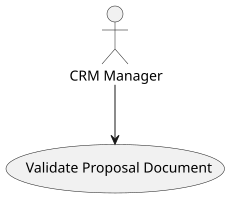
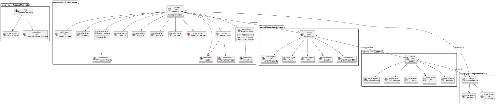
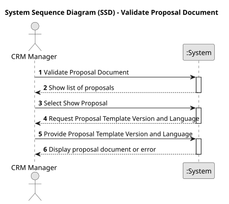
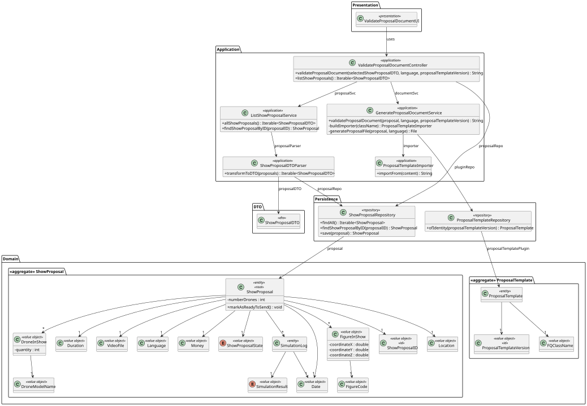
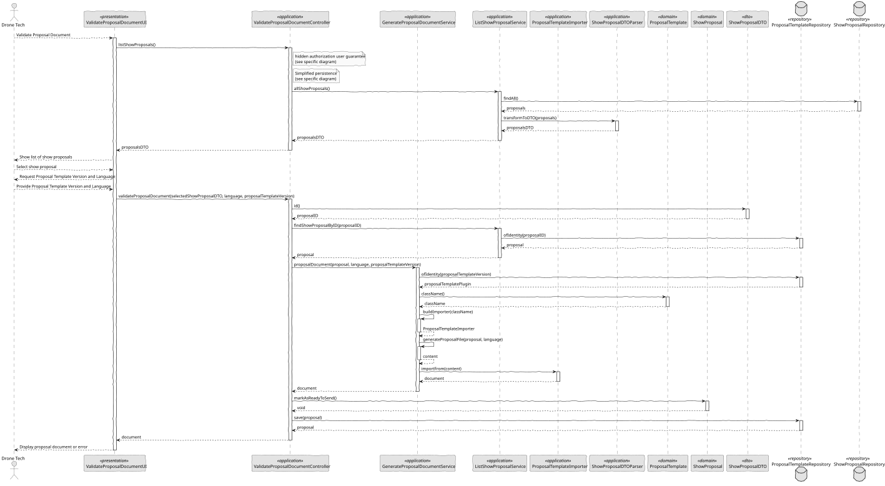

# US 347 - Proposal Generation

## 1. Context

*This task involves implementing a feature for CRM Managers to generate a proposal document based on a selected show proposal. The system should retrieve the appropriate template, process the show data, and return the generated document, while ensuring only authorized users can perform this operation.*

### 1.1 List of issues

**Analysis:**
- Identify inputs required for proposal generation (show proposal, language, template version)
- Analyze template management and plugin retrieval strategy
- Validate business rules for marking a proposal as ready to send

**Design:**
- Define method for retrieving and applying proposal templates
- Design flow for proposal document generation and post-processing

**Implement:**
- Implement service logic to generate and return the document
- Validate user permissions and proposal state
- Implement plugin-based template processing system

**Test:**
- Verify document generation with different templates/languages
- Validate unauthorized access is blocked
- Ensure proper error handling for missing templates or invalid proposals

## 2. Requirements

**US 347:** As a CRM Manager, I want the system to generate the proposal document for the show proposal.

**Acceptance Criteria:**

- *US347.1:* The system must allow CRM Managers to select a show proposal and generate its document
- *US347.2:* The user must select a language and a template version
- *US347.3:* The system must load the appropriate plugin to generate the document
- *US347.4:* The proposal must be marked as “ready to send” if not already
- *US347.5:* The system must prevent access to unauthorized users
- *US347.6:* The user receives the generated document in return

**Dependencies/References:**

* Integration with the proposal template plugin system
* Show proposal lifecycle and permission model
* Plugin management for proposal template versioning

## 3. Analysis

### 3.1. Use Case Diagram



### 3.2. Domain Model



### 3.3. Sequence System Diagrams (SSD)

Shows the interactions between a CRM Manager and the system for generating a proposal document.



## 4. Design

### 4.1. Class Diagram (CD)

Illustrates the main components involved in the proposal generation, including template handling and proposal state transition.



### 4.2. Sequence Diagram (SD)

Details the interactions between the UI, controller, services, and repositories during the proposal document generation process.



### 4.3. Applied Patterns

- MVC (Model-View-Controller): Separates user interface, application logic, and domain model.
- Repository Pattern: Encapsulates access to show proposals and templates
- Domain-Driven Design (DDD): Aggregates like ProposalTemplate ensure consistency and encapsulate business rules.
- Authorization Check: Applied before critical operations through AuthorizationService.

### 4.4. Acceptance Tests

```
    @Test
    void ensureValidProposalTemplateIsCreated() {
        final var template = new ProposalTemplate(VALID_VERSION, VALID_CLASS_NAME);
        assertNotNull(template);
        assertEquals(VALID_VERSION, template.identity());
        assertEquals(VALID_CLASS_NAME, template.className());
    }

    @Test
    void ensureNullParametersAreRejected() {
        assertThrows(IllegalArgumentException.class,
                () -> new ProposalTemplate(null, VALID_CLASS_NAME));
        assertThrows(IllegalArgumentException.class,
                () -> new ProposalTemplate(VALID_VERSION, null));
    }

    @Test
    void ensureSameAsWorksCorrectly() {
        final var template1 = new ProposalTemplate(VALID_VERSION, VALID_CLASS_NAME);
        final var template2 = new ProposalTemplate(OTHER_VERSION, OTHER_CLASS_NAME);

        assertTrue(template1.sameAs(template1));
        assertFalse(template1.sameAs(template2));
        assertFalse(template1.sameAs(null));
        assertFalse(template1.sameAs("not a template"));
    }

    @Test
    void ensureToStringContainsRelevantInfo() {
        final var template = new ProposalTemplate(VALID_VERSION, VALID_CLASS_NAME);
        final var toString = template.toString();

        assertTrue(toString.contains(VALID_VERSION.toString()));
        assertTrue(toString.contains(VALID_CLASS_NAME.toString()));
    }

    @Test
    void ensureIdentityReturnsCorrectVersion() {
        final var template = new ProposalTemplate(VALID_VERSION, VALID_CLASS_NAME);
        assertEquals(VALID_VERSION, template.identity());
    }
````

## 5. Implementation

```
    public String validateProposalDocument(ShowProposalDTO selectedShowProposalDTO, String language, String proposalTemplateVersion) throws IOException {
        authz.ensureAuthenticatedUserHasAnyOf(ShodroneRoles.POWER_USER, ShodroneRoles.CRM_MANAGER);

        ShowProposal showProposal = proposalSvc.findShowProposalByID(selectedShowProposalDTO.id());

        String document = documentSvc.proposalDocument(showProposal, language, proposalTemplateVersion);

        if (!showProposal.isReadyToSend()) {
            showProposal.markAsReadyToSend();
            repo.save(showProposal);
        }

        return document;
    }
````
```
    public String proposalDocument(ShowProposal showProposal, String language, String proposalTemplateVersion) throws IOException {
        authz.ensureAuthenticatedUserHasAnyOf(ShodroneRoles.POWER_USER, ShodroneRoles.CRM_MANAGER, ShodroneRoles.CRM_COLLABORATOR);

        Optional<ProposalTemplate> plugin = pluginRepository.ofIdentity(ProposalTemplateVersion.valueOf(proposalTemplateVersion));
        if (plugin.isEmpty()) {
            throw new IllegalArgumentException("No plugin registered for Proposal Template Version: " + proposalTemplateVersion);
        }

        File file = generateProposalFile(showProposal, language);

        InputStream content = null;
        try {
            content = new FileInputStream(file);
            final var className = plugin.get().className().toString();
            final var importer = buildImporter(className);

            String document = importer.importFrom(content);

            return document;

        } finally {
            if (content != null) {
                try {
                    content.close();
                } catch (final IOException e) {
                    LOGGER.error("Error closing the file {}", file.getAbsolutePath());
                }
            }
        }
    }
````

## 6. Integration/Demonstration

- To test proposal generation, run the system and log in with a CRM Manager role.
- Select an existing Show Proposal and choose a language and template version.
- Trigger proposal generation and verify the resulting document is returned and the proposal is marked as ready.

## 7. Observations

This functionality enables CRM Managers to produce standardized, template-based proposal documents efficiently, supporting multiple versions and languages through a plugin-based approach. The design is robust, with built-in versioning, access control, and extensibility via dynamic plugin resolution.