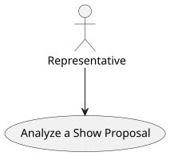
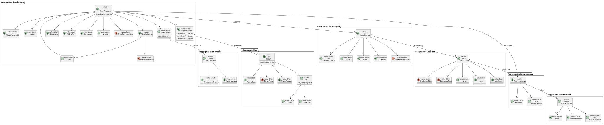
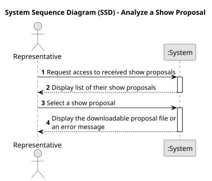
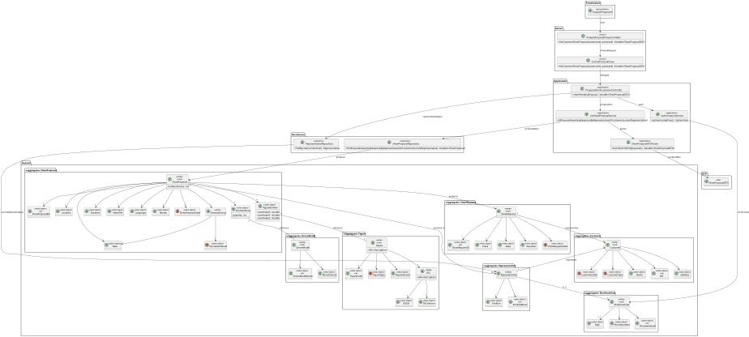
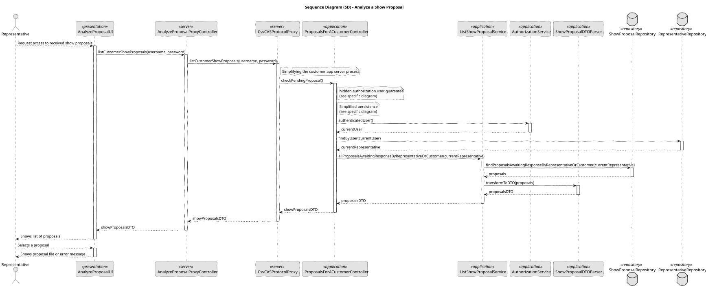

# US 370 - Analyse a proposal

## 1. Context

This User Story aims to enable Customer Representatives to access show proposals they received via link or code. This functionality enhances the accessibility and feedback process, allowing Customer Representatives to conveniently review proposals through the Customer App.

### 1.1 List of issues

Analysis:
- How to securely associate a proposal with a unique access code or link.
- How to ensure that expired or invalid codes are correctly handled.
- How to guarantee that all relevant proposal information (figures, drones, videos) is correctly displayed.

Design:
- Design a lightweight and intuitive UI for the input of the access code or direct link.
- Decide whether the code-based retrieval will support direct download or in-app viewing.
- Ensure security and proper validation of the access mechanism.

Implement:
- Implement code/link input UI in the Customer App.
- Implement secure retrieval of the proposal document via code/link.
- Develop error handling for invalid/expired codes.
- Ensure the proposal document is correctly rendered within the App.

Test:
- Test correct retrieval using valid codes/links.
- Test error handling for expired or invalid codes.
- Test the display of all proposal details (drones, figures, videos).
- Perform security tests to ensure codes/links cannot be exploited.

## 2. Requirements

**US 370:** As a Customer Representative, I want to have access to a show proposal of mine in the App. I received a link/code to download the file.

**Acceptance Criteria:**

- *US370.1:* The Customer App provides a field for the Customer Representative to input a proposal access code or link.
- *US370.2:* Upon code/link submission, the system securely retrieves the corresponding show proposal document.
- *US370.3:* The proposal document is displayed correctly with all details (show description, drones, figures, videos).
- *US370.4:* The system handles expired or invalid codes/links with clear, user-friendly error messages.
- *US370.5:* Only authorized proposals are accessible via the provided code/link.
- *US370.6:* The feature is tested end-to-end for both success and failure paths.

**Dependencies/References:**

* Customer App architecture.
* Proposal document storage and retrieval mechanisms.
* CRM or Drone Tech systems for code/link generation and distribution.
* Security guidelines for code/link-based access.

## 3. Analysis

### 3.1. Use Case Diagram

The following diagram presents the main interactions between the Customer Representative and the system, focusing on the process of retrieving and displaying a show proposal through a code or link.



### 3.2. Domain Model

The following domain model illustrates the core entities and their relationships involved in the process of accessing a show proposal using a code or link.



### 3.3. Sequence System Diagrams (SSD)

The following system sequence diagram represents the interaction flow between the Customer Representative and the system when accessing a show proposal.



## 4. Design

### 4.1. Class Diagram (CD)

The following class diagram shows the classes involved in this functionality, their responsibilities, and their relationships.



### 4.2. Sequence Diagram (SD)

The following sequence diagram details the interactions between the UI, controller, service, repository, and domain objects when a Customer Representative requests to access a show proposal.



### 4.3. Applied Patterns

- MVC Pattern: Used to separate presentation (UI), application (Controller, Service), and domain (Proposal).
- Repository Pattern: Used to abstract data access for the Proposal entity.
- DTO Pattern (optional): Can be used to transfer proposal document metadata if needed.

## 5. Implementation

```
public class AnalyzeProposalController {

    private final AuthorizationService authz = AuthzRegistry.authorizationService();
    private final RepresentativeRepository representativeRepository = PersistenceContext.repositories().representatives();
    private final ListShowProposalService svc = new ListShowProposalService();


    /**
     * Returns the proposals awaiting response for a given customer represented by the logged-in representative.
     */
    public Iterable<ShowProposalDTO> getProposalsForCustomerAwaitingResponse() {
        authz.ensureAuthenticatedUserHasAnyOf(ShodroneRoles.REPRESENTATIVE);

        SystemUser currentUser = authz.session().get().authenticatedUser();
        Representative representative = representativeRepository.findByUser(currentUser).get();

        return svc.allProposalsAwaitingResponseByRepresentativeOrCustomer(representative);
    }

}
````

## 6. Integration/Demonstration

- Demonstrated in the Customer App: entering a valid code/link successfully loads the proposal.
- Invalid and expired codes correctly trigger error messages.
- Proposal content (drones, figures, videos) correctly displayed in the App viewer.

## 7. Observations

This feature improves the accessibility of show proposals for Customer Representatives, allowing quick access via link or code. It is important to ensure that access codes are secure, unique, and time-limited. Clear error messages must guide the user when codes are invalid or expired. Future improvements may include access tracking and tighter CRM integration for added security.