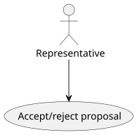
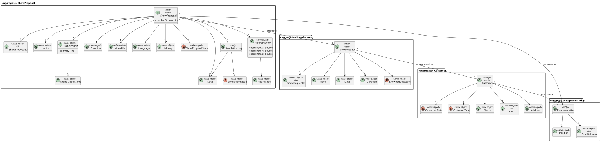
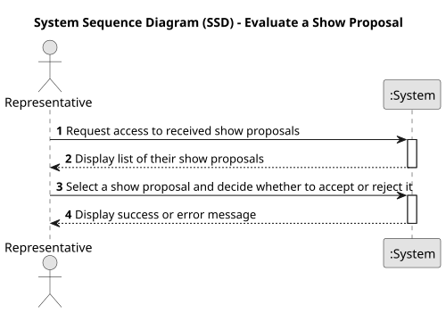
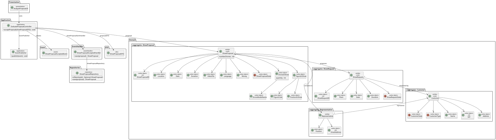
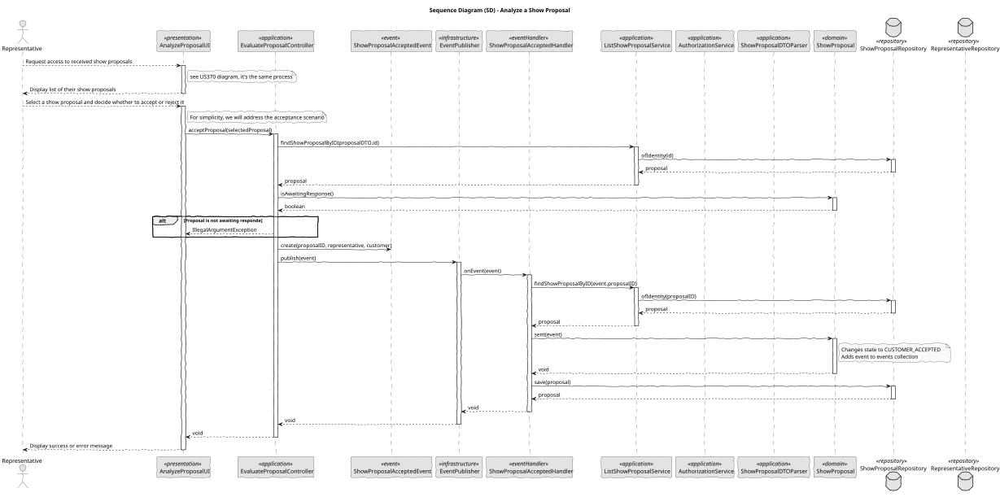

# US 371 - Accept/reject proposal

## 1. Context

This User Story provides Customers with the ability to accept or reject a show proposal directly in the Customer App. The process includes the option to provide feedback, and ensures that all relevant teams are notified of the Customer’s decision, enabling the next steps in the workflow.

### 1.1 List of issues

Analysis:
- How to capture and store the Customer’s decision (accept/reject) and feedback.
- How to ensure that the proposal status updates correctly and securely.
- How to send timely notifications to the CRM and Drone Tech teams.

Design:
- Design a simple, user-friendly interface with accept/reject options and a feedback input.
- Design the notification system to reach all relevant stakeholders.
- Ensure clear visual confirmation of submission to the Customer.

Implement:
- Implement the decision capture UI and feedback field.
- Implement logic to update the proposal status and store feedback.
- Implement the notification system for CRM and Drone Tech teams.

Test:
- Test status updates for both acceptance and rejection scenarios.
- Test optional feedback submission.
- Test notification delivery to all stakeholders.
- Test error handling for submission failures or invalid states.

## 2. Requirements

**US 371:** As a Customer, I want to accept/reject a proposal using the Customer App. I may provide feedback.

**Acceptance Criteria:**

- *US371.1:* The Customer App displays clear options to accept or reject a proposal.
- *US371.2:* The Customer can optionally submit feedback when making their decision.
- *US371.3:* The system updates the proposal status to "Accepted" or "Rejected" upon submission.
- *US371.4:* Notifications of the Customer’s decision and feedback are sent to CRM and Drone Tech teams.
- *US371.5:* The Customer receives a confirmation message after successful submission.
- *US371.6:* The feature is tested, stable, and fully documented.

**Dependencies/References:**

* Customer App framework and proposal management API.
* CRM and Drone Tech notification channels (in-app, email, or system notifications).
* Proposal entity and status tracking system.

## 3. Analysis

### 3.1. Use Case Diagram

This diagram shows the Customer interacting with the Customer App to accept or reject a proposal, triggering system updates and notifications to the CRM and Drone Tech teams.



### 3.2. Domain Model

The domain model includes the Proposal entity with status attributes and an optional feedback field. It also highlights relationships with the Customer, CRM, and Drone Tech teams.



### 3.3. Sequence System Diagrams (SSD)

The SSD illustrates the Customer’s decision process: selecting accept/reject, optionally providing feedback, updating the proposal status, and sending notifications to stakeholders.



## 4. Design

### 4.1. Class Diagram (CD)

The class diagram shows the main classes involved in accepting or rejecting a proposal. It highlights how the proposal status and customer feedback are managed and how notifications are sent to the relevant teams.



### 4.2. Sequence Diagram (SD)

The sequence diagram illustrates the interaction where the customer submits a decision and feedback. It shows the system updating the proposal status, storing feedback, sending notifications, and confirming the action to the customer.



### 4.3. Applied Patterns

- MVC Pattern: For clean separation between UI, business logic, and data.
- Observer/Event Pattern: To notify CRM and Drone Tech teams of status changes.
- Repository Pattern: For storing proposal status and feedback securely.

### 4.4. Acceptance Tests

```
@Test
    void ensureProposalIsAcceptedByCustomer() {
        ShowProposal proposal = new ShowProposal(
                VALID_LOCATION, VALID_DATE, VALID_DURATION, VALID_DRONES,
                VALID_INSURANCE, VALID_STATE, VALID_SHOW_REQUEST, VALID_REPRESENTATIVE
        );

        ShowProposalAcceptedEvent sentEvent = new ShowProposalAcceptedEvent(1L, null, null);

        proposal.acceptedByCustomer(sentEvent);

        assertEquals(ShowProposalState.CUSTOMER_ACCEPTED, proposal.state());
    }

    @Test
    void ensureProposalIsRejectedByCustomer() {
        ShowProposal proposal = new ShowProposal(
                VALID_LOCATION, VALID_DATE, VALID_DURATION, VALID_DRONES,
                VALID_INSURANCE, VALID_STATE, VALID_SHOW_REQUEST, VALID_REPRESENTATIVE
        );

        ShowProposalRejectedEvent sentEvent = new ShowProposalRejectedEvent(1L, null, null, "feedback");

        proposal.rejectedByCustomer(sentEvent);

        assertEquals(ShowProposalState.REJECTED, proposal.state());
    }

````

## 5. Implementation

```
public class EvaluateProposalController {

    private final AuthorizationService authz = AuthzRegistry.authorizationService();
    private final RepresentativeRepository representativeRepository = PersistenceContext.repositories().representatives();
    private final ListShowProposalService svc = new ListShowProposalService();
    private final EventPublisher publisher = InProcessPubSub.publisher();

    public boolean acceptProposal(Long showProposalID) {
        authz.ensureAuthenticatedUserHasAnyOf(ShodroneRoles.REPRESENTATIVE);

        SystemUser currentUser = authz.session().get().authenticatedUser();
        Representative representative = representativeRepository.findByUser(currentUser).get();

        ShowProposal proposal = svc.findShowProposalByID(showProposalID);

        if (!proposal.isAwaitingResponse()) {
            return false;
        }

        publisher.publish(new ShowProposalAcceptedEvent(proposal.identity(), proposal.showRequest().customer(), representative));

        return true;
    }

    public boolean rejectProposal(Long showProposalID, String feedback) {
        authz.ensureAuthenticatedUserHasAnyOf(ShodroneRoles.REPRESENTATIVE);

        SystemUser currentUser = authz.session().get().authenticatedUser();
        Representative representative = representativeRepository.findByUser(currentUser).get();

        ShowProposal proposal = svc.findShowProposalByID(showProposalID);

        if (!proposal.isAwaitingResponse()) {
            return false;
        }

        publisher.publish(new ShowProposalRejectedEvent(proposal.identity(), proposal.showRequest().customer(), representative, feedback));

        return true;
    }

}
````

## 6. Integration/Demonstration

- Demonstration of accepting and rejecting a proposal with and without feedback.
- Display of updated status in the system.
- Verification of notification delivery to CRM and Drone Tech teams.
- Confirmation message correctly shown to the Customer.

## 7. Observations

This feature empowers Customers to make decisions efficiently and provides valuable feedback for continuous improvement. It promotes seamless communication between the Customer, CRM, and Drone Tech teams. Future enhancements could include supporting multiple feedback types or integrating follow-up actions directly within the App.