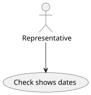
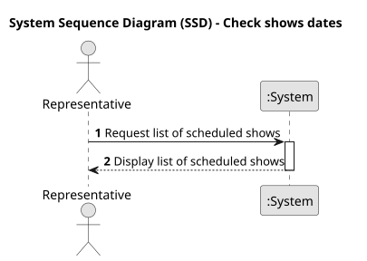
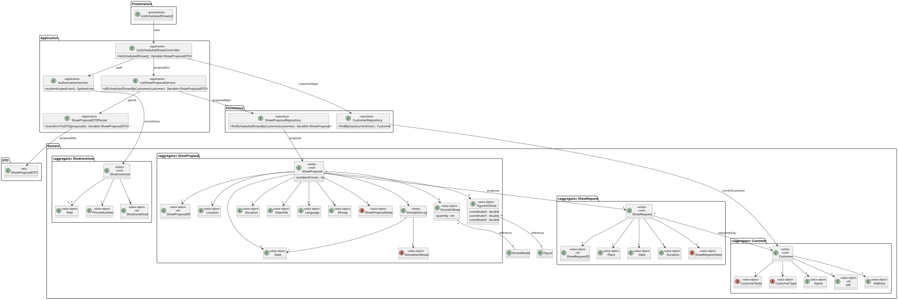
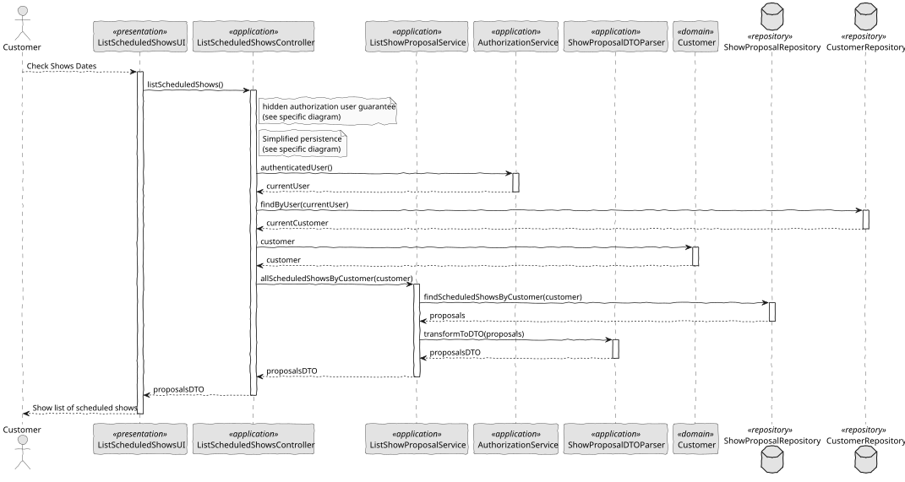

# US 372 - Check shows dates

## 1. Context

This user story aims to provide Customers with the ability to easily view their scheduled shows in the Customer App. The feature should present an organized list of shows with relevant information such as show name, date, location, and current status. It must also allow the Customer to access detailed views of each show.

### 1.1 List of issues

Analysis:
- Identify the information required for each show entry: name, date, location, and status.
- Define the filtering and sorting criteria (e.g., upcoming shows first, ability to view past/cancelled shows).
- Determine navigation flow from the show list to show detail view.
- Analyze potential data sources and ensure correct retrieval of shows for the logged-in Customer.

Design:
- Design the UI layout for the scheduled shows list.
- Design filtering and sorting components (e.g., toggle to show past shows).
- Define the navigation structure from the list to the show details page.

Implement:
- Develop API endpoints (if necessary) to retrieve the list of scheduled shows for the logged-in Customer.
- Implement UI components to display the list with show name, date, location, and status.
- Implement sorting logic to display nearest upcoming shows first.
- Implement filtering logic to hide past or cancelled shows by default.
- Enable navigation to the detailed show view.

Test:
- Unit tests for API and business logic (retrieving, filtering, sorting shows).
- UI tests to verify correct display of show information.
- Functional tests to verify filtering, sorting, and navigation behavior.
- Acceptance tests to ensure all criteria are met.

## 2. Requirements

**US 372:** As a Customer, I want to list my scheduled shows

**Acceptance Criteria:**

- *US372.1:* The system displays a list of all shows scheduled for the logged-in Customer.
- *US372.2:* Each show entry includes the show name, scheduled date, location, and current status.
- *US372.3:* The list is sorted by date, showing the nearest upcoming shows first.
- *US372.4:* The Customer can view show details by selecting an entry from the list.
- *US372.5:* Shows that are cancelled or completed are clearly marked or filtered out by default.
- *US372.6:* The Customer has an option to view past and cancelled shows if desired.

**Dependencies/References:**

* Customer App show listing module.
* Show management API.
* User authentication system to retrieve the correct Customer context.
* Navigation framework for linking show list to show detail view.

## 3. Analysis

### 3.1. Use Case Diagram

Illustrates the interaction between the Customer and the system to list scheduled shows.



### 3.2. Domain Model

Shows the relevant aggregates and entities involved in the process of listing scheduled shows, including the Customer and Show entities.


### 3.3. Sequence System Diagrams (SSD)

Shows the main interactions between a Customer and the system for listing scheduled shows.



## 4. Design

### 4.1. Class Diagram (CD)

The class diagram defines the structure and responsibilities of the main classes involved in the "List Scheduled Shows" use case.



### 4.2. Sequence Diagram (SD)

Details the sequence of interactions for retrieving the scheduled shows for the logged-in Customer. It includes the interactions between the UI, Controller, Service, and Repository layers, capturing the filtering and sorting of shows.



### 4.3. Applied Patterns

- MVC (Model-View-Controller): Separates user interface, application logic, and domain model.
- Repository Pattern: Used to abstract persistence logic in ShowRepository.
- Domain-Driven Design (DDD): Aggregates like Show ensure consistency and encapsulate business rules related to show scheduling, filtering, and status management.


## 5. Implementation

```
public class ListScheduledShowsController {

    private final AuthorizationService authz = AuthzRegistry.authorizationService();
    private final RepresentativeRepository representativeRepository = PersistenceContext.repositories().representatives();
    private final ListShowProposalService svc = new ListShowProposalService();

    public Iterable<ShowProposalDTO> listScheduledShowsByCustomer() {
        authz.ensureAuthenticatedUserHasAnyOf(ShodroneRoles.REPRESENTATIVE);

        SystemUser currentUser = authz.session().get().authenticatedUser();
        Representative representative = representativeRepository.findByUser(currentUser).get();

        return svc.allScheduledShowsByCustomer(representative.customer());
    }

}
````

## 6. Integration/Demonstration

- To test the bootstrap process, simply run the script: ./run-bootstrap
- To manually view scheduled shows, run the script ./run-customer-app, log in as a Customer, and navigate to the "My Scheduled Shows" option.
- The list of shows is displayed with the name, date, location, and status, sorted by nearest upcoming shows.
- The Customer can select a show entry to view detailed information.

## 7. Observations

This user story improves the customer experience by providing a clear and accessible overview of their scheduled shows. It promotes better planning, engagement, and transparency.
The solution is modular and scalable, allowing for easy extension (e.g., adding search, advanced filters, or additional show attributes) in future iterations.
The filtering and sorting mechanisms ensure that Customers quickly find the most relevant and timely information.