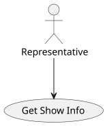
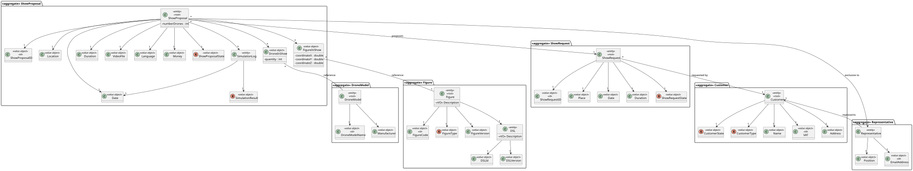
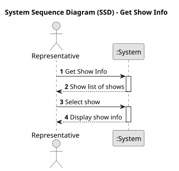
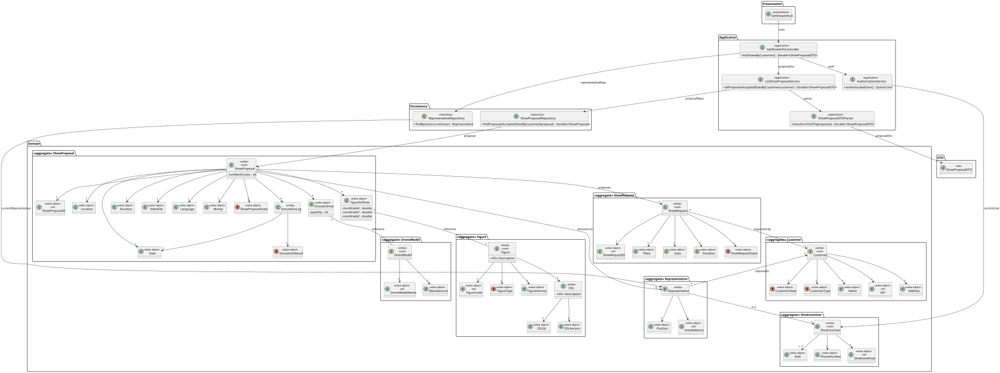
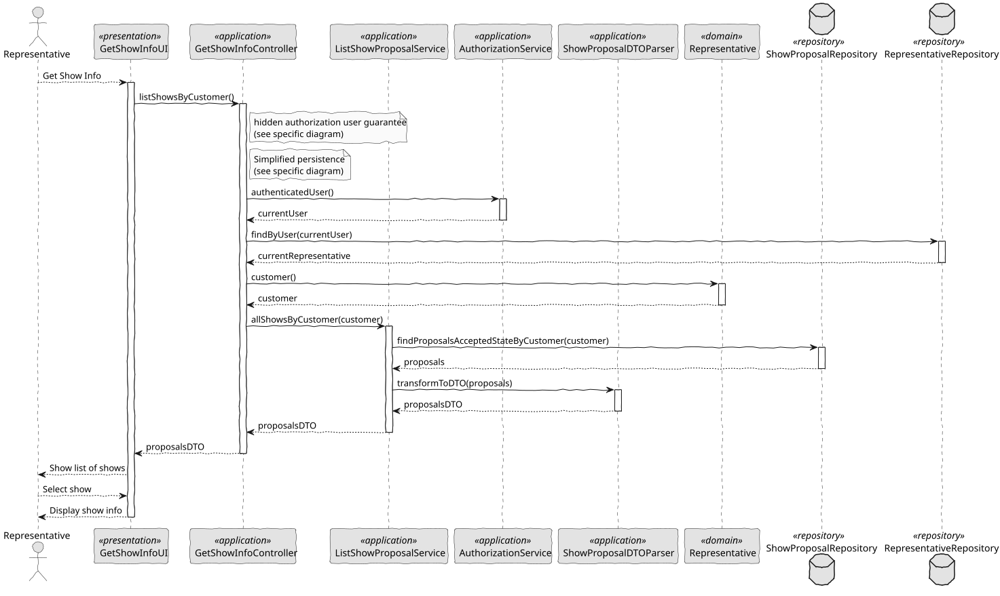

# US 373 - Get Show Info

## 1. Context

*This task extends the customer experience by enabling access to detailed information about scheduled or past shows. Customers will be able to see all the relevant data associated with a show, such as drone models, figures, duration, and more, reinforcing transparency and enhancing service quality.*

### 1.1 List of issues

**Analysis:**
- Define which information elements are relevant for the show details (e.g., drone models, figures, duration).
- Identify data sources and relations for retrieving historical and scheduled show data.

**Design:**
- Design the data transfer structure (DTO) to encapsulate all necessary show information.
- Define a UI response structure for presenting the show details to the customer.

**Implement:**
- Implement service logic to retrieve full show information.
- Map domain objects to the appropriate DTO for the response layer.

**Test:**
- Validate that correct data is returned for both scheduled and past shows.
- Ensure robustness against missing or incomplete data.
- Confirm performance for expected query volume.

## 2. Requirements

**US 373:** As a Customer, I want to get the details of a show (scheduled or in the past), including the drone models, figures, duration, etc.

**Acceptance Criteria:**

- *US373.1:* The system must return the full details of a given show when requested by a Customer.
- *US373.2:* The response must include the list of drone models used in the show.
- *US373.3:* The response must include the list of figures performed and the overall duration.
- *US373.4:* It must support both shows scheduled for the future and already completed shows.
- *US373.5:* Access control must ensure only authorized Customers can view relevant shows.

**Dependencies/References:**

* This functionality builds on the existing show scheduling and registration mechanisms.
* Uses drone model registry and show figure definition modules.

## 3. Analysis

### 3.1. Use Case Diagram



### 3.2. Domain Model



### 3.3. Sequence System Diagrams (SSD)

Shows the main interactions between a Customer and the system.



## 4. Design

### 4.1. Class Diagram (CD)

The class diagram defines the structure and responsibilities of the main classes involved in the Get Show Info use case.



### 4.2. Sequence Diagram (SD)

Details the sequence of interactions for retrieving show information. It includes the interactions between UI, Controller, Service, and Repositories, capturing the creation flow of a ShowProposal, and system validation/authorization.



### 4.3. Applied Patterns

- MVC (Model-View-Controller): Separates user interface, application logic, and domain model.
- Repository Pattern: Used to abstract persistence logic in ShowProposalRepository.
- Domain-Driven Design (DDD): Aggregates like ShowProposal ensure consistency and encapsulate business rules.
- Authorization Check: Applied before critical operations through AuthorizationService.

## 5. Implementation

```
    public Iterable<ShowProposalDTO> listShowsByCustomer() {
        authz.ensureAuthenticatedUserHasAnyOf(ShodroneRoles.REPRESENTATIVE);

        SystemUser currentUser = authz.session().get().authenticatedUser();
        Representative representative = representativeRepository.findByUser(currentUser).get();

        return svc.allProposalsAcceptedStateByCustomer(representative.customer());
    }
````

## 6. Integration/Demonstration

- To test the bootstrap process, simply run the script: ./run-bootstrap
- To manually get show info, you must run the script ./run-backoffice or ./run-customer-app, log in with a user who has the role Representative, and click on the Get Show Info option.

## 7. Observations

This user story enhances the customer experience by providing access to rich show information. It supports informed engagement and better transparency of the services rendered. The modular design ensures it can scale as more show attributes are added in future updates.