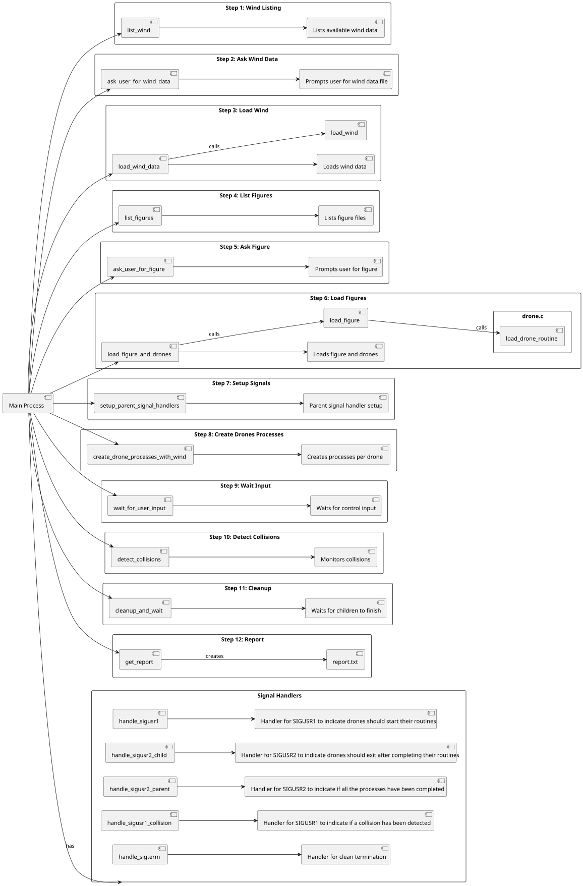

# Drone Simulation System

Este projeto implementa um sistema de simulação de drones para figuras aéreas coreografadas, com foco em sincronização, deteção de colisões, comunicação entre processos e adaptação a fatores ambientais.

## 📦 Diagrama de Componentes

O diagrama está centralizado no Main Process (simulação) e está dividido em 12 Steps que explicam a lógica por detrás de toda a simulação.
<br>
Cada Step começa por ter o nome da função que realiza a tarefa e depois tem associado, resumidamente, o que faz em concreto.
<br>
Para álem dos 12 Steps, também inclui os handlers que utilizamos, também associados a uma breve explicação do que cada um faz.



## ✈️ Exemplo de Script de Movimento de Drone

Este é um exemplo de script de movimento de um drone:

````
20 30 0
20 31 3
20 32 1
20 30 0
28 34 3
````

Este script indica as posições (x, y e z) do drone em 6 instancias de tempo diferentes.
<br>

## 📋 Descrição da Abordagem Seguida em Cada Caso de Uso (US)

### US261 - Iniciar simulação de uma figura

- Função: Inicialização do processo de simulação: Listar as figuras disponíveis; perguntar ao utilizador o nome da figura no qual quer carregar; carregar essa figura e os seus respetivos drones; iniciar um processo para cada drone e carregar os seus movimentos.
- Pipes (pipes[MAX_DRONES]): utilizados na comunicação entre cada drone (Parent -> Child) para passar a informação importada dos ficheiros.
- Structs: Position e Drone utilizadas para armazenar as informações de cada drone(Position: x, y, z; Drone: id, name, Position, duration).
- Conteúdo: utilizadas dentro do main as seguintes funções: (list_figures; load_figure _and_drones, create_drones_processes). Também, mas fora do main: load_drone_routine; load_figure).

### US262 - Capturar e processar movimentos dos drones

- Função: Capturar e processar os movimentos dos drones.
- Pipe (pos_pipes[MAX_DRONES]): utilizado para passar as posições dos drones de cada Child process para o Parent (Child -> Parent).
- Conteúdo: Introdução de uma matrix 3D (matrix[x][y][z]) utilizada para manter as posições dos drones.

### US263 - Detetar colisões entre drones em tempo real

- Função: Detetar colisões de drones em tempo real.
- Sinais: introdução de vários sinais utilizados para diferenciar quando a aplicação é terminada devido a colisões; a pedido do utilizador ou quando os drones acabam os seus movimentos. Para cada acontecimento é dado print duma mensagem na consola para efeitos de log e para notificar o utilizados o que está a acontecer.
- Conteúdo: função detect_coliisions que vai detetar as colisões em tempo real; handlers dos sinais: handle_sigusr1; handle_sigusr2_child; handle_sigusr2_parent; handle_sigusr1_collision; handle_sigterm.

### US264 - Sincronizar execução com passos de tempo

- Funções: Criação/melhoramento de funções para garantir que a simulação avanca passo a passo.

### US265 - Gerar relatório da simulação

- Função: Criação de uma função para gerar o relatório.
- Struct: Criação de novas Struct (EstadoDrone e Collision) para armazenar dados importantes para a realização do relatório.
- Relatório (report.txt): Criado pelo processo principal ao terminar a simulação.
- Conteúdo: Número de drones; ID, Nome e rotina de cada drone; Informação sobre colisões; Informação se a Figura passa ou não na simulação.

### US266 - Fatores ambientais 

- Scripts: Introdução de novos scripts, com informações ambientais (ex: velocidade/direção do vento).
- Struct: Criação de nova Struct (Wind) para armazenar os valores do vento.
- Funções: Criação de novas funções para ler/guardar/processar dados do vento.

<br>

## 🤝 Autoavaliação do Compromisso dos Elementos do Grupo

|     Aluno      | Compromisso (%) |
|:--------------:|:---------------:|
| Igor Coutinho  |       100       |
|  Daniel Silva  |       100       |
| Rafael Barbosa |       100       |
|  David Vieira  |       100       |
|   Rui Vieira   |       100       |