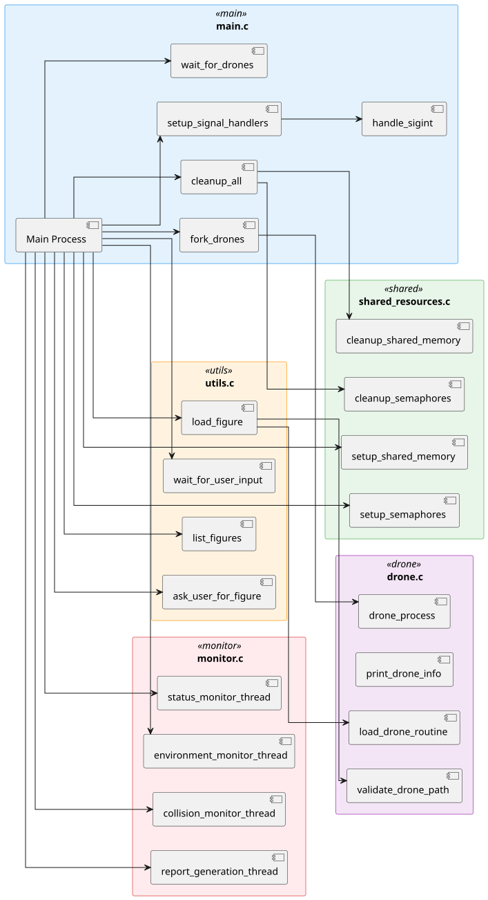

# Drone Simulation System

Este projeto implementa um sistema de simulação de drones para figuras aéreas coreografadas, com foco em sincronização, deteção de colisões, comunicação entre processos e adaptação a fatores ambientais.

## 📦 Diagrama de Componentes

Este diagrama está centrado no Main Process, que orquestra toda a simulação de drones, e organiza os vários módulos (.c) do projeto em componentes visuais distintos.

Cada bloco representa um ficheiro-fonte e inclui as funções ou threads associadas.
As conexões representam fluxos de chamada ou dependência direta entre funções, permitindo compreender o encadeamento lógico da simulação.

### 🔹 Organização Modular
O sistema está dividido em 5 grandes áreas de responsabilidade:

### 🟦 main.c
Controla a execução principal da simulação. Lança processos e threads, configura recursos e trata sinais.

- **[Main Process]**: ponto de entrada da simulação

- **[fork_drones]**, **[setup_signal_handlers]**, **[cleanup_all]**, entre outros passos fundamentais

### 🟨 utils.c
Responsável por interações com o utilizador e carregamento da figura de simulação.

- **[list_figures]**, **[ask_user_for_figure]**, **[load_figure]**, **[wait_for_user_input]**

🔎 Nota: load_figure faz chamadas a funções de drone.c, mas está visualmente e logicamente agrupado aqui para manter a coesão do utilitário.

### 🟪 drone.c
Funções relacionadas com drones individuais.

- **[load_drone_routine]**, **[validate_drone_path]**, **[drone_process]**, entre outras

Usado pelos processos filhos da simulação

### 🟩 shared_resources.c
Gestão de memória partilhada e semáforos.

**[setup_shared_memory]**, **[cleanup_shared_memory]**

**[setup_semaphores]**, **[cleanup_semaphores]**

Reutilizado por vários componentes para sincronização e controlo de concorrência

### 🟥 monitor.c
Contém as threads de monitorização que acompanham o estado da simulação em tempo real.

**[collision_monitor_thread]**

**[status_monitor_thread]**

**[report_generation_thread]**

**[environment_monitor_thread]**

### 🧭 Fluxos de Ligação
O **[Main Process]** chama diretamente a maioria das funções de inicialização, configuração e monitorização.

O **[load_figure]** liga-se a funções de drone.c, como **[load_drone_routine]** e **[validate_drone_path]**, mas permanece no bloco utils.c para manter a organização visual e lógica.

As linhas entre blocos representam chamadas entre funções de ficheiros distintos, o que facilita a análise de dependências e o entendimento do fluxo do programa.

### 🔒 Organização Visual
Cada grupo é apresentado como um bloco colorido distinto, facilitando a identificação dos domínios funcionais de cada componente.

A disposição é horizontal, e o uso de cores claras e bordas definidas melhora a leitura e evita sobreposição visual entre elementos e conexões.
<br><br><br>


## ✈️ Exemplo de Script de Movimento de Drone

Este é um exemplo de script de movimento de um drone:

````
20 30 0
20 31 3
20 32 1
20 30 0
28 34 3
````

Este script indica as posições (x, y e z) do drone em 6 instancias de tempo diferentes.
<br>

## 📋 Descrição da Abordagem Seguida em Cada Caso de Uso (US)

### US361 - Inicializar ambiente híbrido de simulação com memória partilhada

- **Função:** Inicialização do processo de simulação: Listar as figuras disponíveis; perguntar ao utilizador o nome da figura no qual quer carregar; carregar essa figura e os seus respetivos drones; iniciar um processo para cada drone e carregar os seus movimentos.
- **Pipes (pipes[MAX_DRONES]):** utilizados na comunicação entre cada drone (Parent -> Child) para passar a informação importada dos ficheiros.
- **Structs:** `Position` e `Drone` utilizadas para armazenar as informações de cada drone (`Position`: x, y, z; `Drone`: id, name, Position, duration).
- **Conteúdo:** utilizadas dentro do main as seguintes funções: (`list_figures`, `load_figure_and_drones`, `create_drones_processes`). Também, mas fora do main: `load_drone_routine`, `load_figure`.

### US362 - Implementar threads específicas para funções no processo principal

- **Função:** Capturar e processar os movimentos dos drones.
- **Pipe (pos_pipes[MAX_DRONES]):** utilizado para passar as posições dos drones de cada Child process para o Parent (Child -> Parent).
- **Conteúdo:** Introdução de uma matriz 3D (`matrix[x][y][z]`) utilizada para manter as posições dos drones.

### US363 - Notificar a thread de relatório via variáveis de condição em caso de colisão

- **Função:** Detetar colisões de drones em tempo real.
- **Sinais:** introdução de vários sinais utilizados para diferenciar quando a aplicação é terminada devido a colisões; a pedido do utilizador; ou quando os drones acabam os seus movimentos. Para cada acontecimento é dado print de uma mensagem na consola para efeitos de log e para notificar o utilizador sobre o estado atual.
- **Conteúdo:** função `detect_collisions` que vai detetar as colisões em tempo real; handlers dos sinais: `handle_sigusr1`, `handle_sigusr2_child`, `handle_sigusr2_parent`, `handle_sigusr1_collision`, `handle_sigterm`.

### US364 - Garantir a sincronização passo a passo da simulação

- **Funções**: Criação/melhoramento de funções para garantir que a simulação avanca passo a passo.

### US365 - Gerar e armazenar o relatório final da simulação

- **Função**: Criação de uma thread para gerar o relatório da simulação.
- **Struct**: Acição de uma struct DroneExecutionHistory que serve para guardar as posições dos drone sem cada instante de tempo.
- **Relatório (drone_simulation_report.txt)**: Preenchido pela thread de relatório.
- **Conteúdo**: Número de drones; ID, Nome e rotina de cada drone; Informação detalhada sobre colisões; Informação se a Figura passa ou não na simulação.

### US366 - Integrar influências ambientais na simulação

- **Funções**: Criação de uma thread que gera valores de direção e velocidade do vento aleatoriamente ao longo da simulação.
- **Struct**: Adição de Wind na struct SharedMemory, que é utilizada para armazenar a direção e velocidade do vento.

<br>

## 🤝 Autoavaliação do Compromisso dos Elementos do Grupo

|     Aluno      | Compromisso (%) |
|:--------------:|:---------------:|
| Igor Coutinho  |       20        |
|  Daniel Silva  |       20        |
| Rafael Barbosa |       20        |
|  David Vieira  |       20        |
|   Rui Vieira   |       20        |